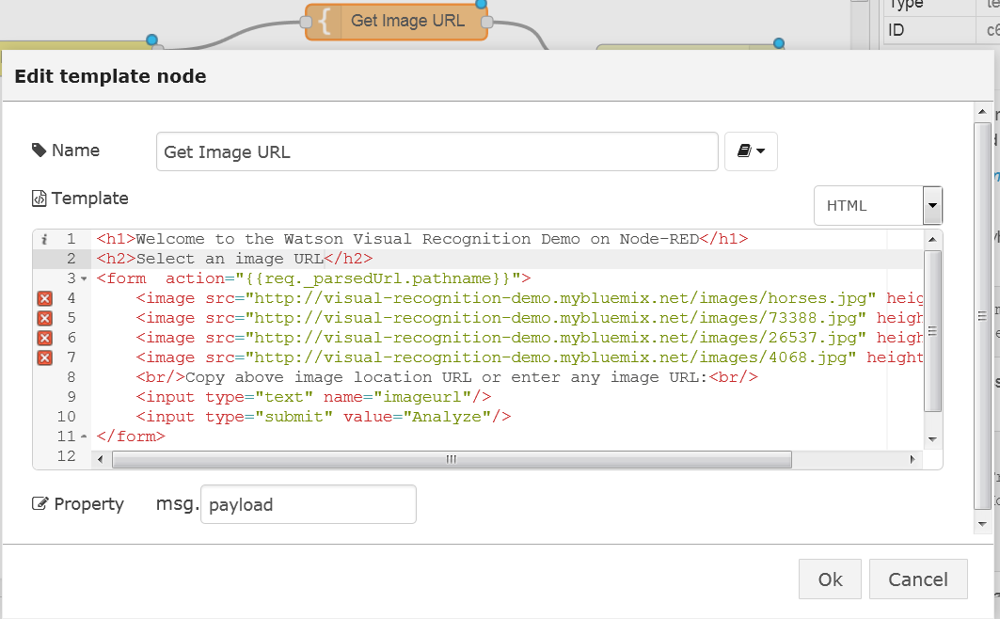
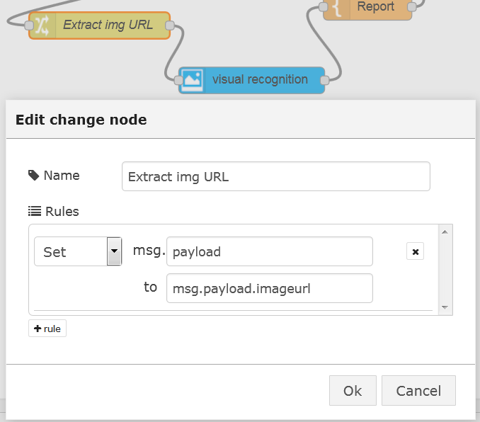
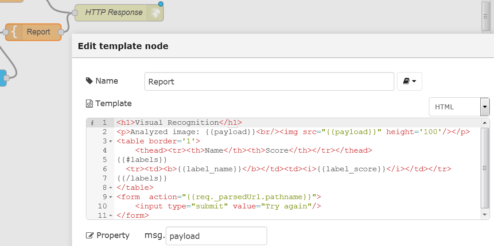

# Watson-Node-Red-examples

A collection of examples on how to use the Watson nodes in Node-RED.

These Watson nodes are used:

- Language Identification
- Language Translation
- Personality insights
- Speech to Text
- Text to Speech
- Tradeoff Analytics
- Visual Recognition


First you need an instance of Node-RED with Watson services. Therefore you need a Bluemix account. You can get that here: http://www.bluemix.net.

Once you are in Bluemix, go to Catalog and then go to the boilerplate section and select Node-RED Starter, in the next screen, give your application a name and click create.

You need to add the services you want to use to your application. Go to the dashboard and click on your application, then click on Add a Service or API. In the following screen select the service you want to use, and finally click on use. Wait for a moment to restart the application. When the application is started you can click on the URL to open Node-RED.

Another way of using Node-RED is installing it locally, which can be done by following this:

Check out http://nodered.org/docs/getting-started/ for full instructions on getting started.

    sudo npm install -g node-red
    node-red
    Open http://localhost:1880
    
You have to install the Watson Nodes, which is described here: http://flows.nodered.org/node/node-red-bluemix-nodes
and you have to make the services available in Bluemix.

DESCRIBE THAT

Note that Node-RED in BlueMix will behave slightly differently than Node-RED stand-alone:

1. The sets of available nodes differ, BlueMix has extra nodes for DB access, but does not expose the `File` nodes.
2. Node-RED in bluemix stores its persistent data (flows, libraries, credentials) in the co-installed Cloudant database named
`nodered`. When using a Cloudant node with Node-RED on BlueMix, the list of available instances is automatically listed.
3. Node-RED in BlueMix has built-in credential management, so you don't have to worry about exposing your services authentication data, they will be filled-in automatically from the sevices' credentialds defined for the application in BlueMix.
4. Additional nodes in Node-RED on BlueMix are installed through cf and a specific procedure since there is no direct access to the npm package manager.
## Language Identification

The Language Identification enables you to quickly identify the language text is written in.

This service can identify many languages: Arabic; Chinese (Simplified); Chinese (Traditional); Cyrillic; Danish; Dutch; English; Farsi; Finnish; French; German; Greek; Hebrew; Hindi; Icelandic; Italian; Japanese; Korean; Norwegian (Bokmal); Norwegian (Nynorsk); Portuguese; Spanish; Swedish; Turkish; Urdu. 


In this example some random text  is injected, identified by the Watson Language Indentification service and put the result to the Debug tab. In the following screenshots you can see how the nodes are configured.

In the following screenshots you can see how the nodes are configured.

The inject node: 


You can use any text for this.

The Language Identification node does not need any configuration

And this is the output:


You can also copy the code for the flow here and import it from clipboard into Node-RED:


## Language Translation

The Language Translation service enables you to translate text from one language to another.
These languages are supported:

- The News domain - targeted at news articles and transcripts, it translates English to and from French, Spanish, Portuguese or Arabic.
- The Conversational domain - targeted at conversational colloquialisms, it translates English to and from French, Spanish, Portuguese or Arabic.
- The Patent domain - targeted at technical and legal terminology, it translates Spanish, Portuguese, Chinese, or Korean to English.


In this example some random text (in English in this case) is injected, translated (to French) and put the result to the Debug tab. In the following screenshots you can see how the nodes are configured.

The inject node: 


You can use any text for this. I put Node-RED in double quotes, otherwise it would be translated as well.

The translation node:


The output from the debug node: 


You can also copy the code for the flow here and import it from clipboard into Node-RED:


....Work in progress...More to come in a moment...

#Personality Insights

The IBM Watson Personality Insights service uses linguistic analytics to infer cognitive and social characteristics, including Big Five, Values, and Needs, from communications that the user makes available, such as email, text messages, tweets, forum posts, and more, go to https://www.ibm.com/smarterplanet/us/en/ibmwatson/developercloud/personality-insights.html for a full description and demo

The objective is to send the Personality Insights node the same data as for the demo (https://watson-pi-demo.mybluemix.net/) and to show the JSON object and its values match those of the demo

Create a new application using the Node-RED starter boilerplate option in Bluemix

Click on the icon of the application

Pick “Add a Service or API” and click the Personality Insights node under Watson section.  Make sure your Application is listed and click on Use.  Click on Restage.

Drag an inject node to the palette.

Drag the personality insights node to the palette.

Drag a debug node to the palette.

Join them as shown below


Double-click the debug node and replace ‘payload’ to ‘insights’. Also change “to” to “debug tab and console”

Double-click the inject node and change Payload to string.  Go to https://github.com/NodeREDWatson/Watson-Node-Red-Samples/blob/master/files/Personality%20Insights/Personal%20Insights%20input%20text.txt and open the file and pasts the text to the blank field below the Payload field (this is the same text that is used in the demo).

Open a command line on your laptop and login to Bluemix with your username/password.  Navigate to the organisation and space to where your application is located.

Type **cf logs app_name**

where **app_name** is the name of your application.  Return to the Node-RED palette.

Click the Deploy button

Click on the debug tab to the top right of the palette.

Click the button next to the inject node.  

You will see an output in the debug tab starting with '{ [msg.insights] : object }' followed by the JSON object.  NOTE : you will not be able to see the full object


Go back to the command prompt and see that the full object has been shown. 


Compare the items in the JSON object to those of the demo for Message Insights - you can see that the values shown are the same (or very similar).

##  Watson Visual Recognition
### Overview
The Watson  Visual Recognition service allows to analyse the contents of an image and produce a series of text classifiers with a confidence index.

### Node-RED Watson Visual Recognition node
The Node-RED  node provides a very easy wrapper node that takes an image URL or binary stream as input, and produces a set of image labels as output.

### Basic Watson Visual Recognition Flow
In this exercise, we will show how to simply generate the labels from an image URL.

The flow will present a simple Web page with a text field where to input the image's URL, then submit it to Watson Visual Recognition, and output the labels that have been found on the reply Web page.

The nodes required to build this flow are:

 - A  node, configured with a `/reco` URL
 - A  node which will test for the presence of the `imageurl` query parameter:
   
 - A first  node, configured to output an HTML input field and suggest a few selected images taken from the main Watson Visual Recognition demo web page:
```HTML
    <h1>Welcome to the Watson Visual Recognition Demo on Node-RED</h1>
    <h2>Select an image URL</h2>
    <form  action="{{req._parsedUrl.pathname}}">
        
        
        
        
        <br/>Copy above image location URL or enter any image URL:<br/>
        <input type="text" name="imageurl"/>
        <input type="submit" value="Analyze"/>
    </form>
```


 - The  node, preceded by a  node to extract the `imageurl` query parameter from the web request and assign it to the payload to be provided as input to the Visual Recognition node:
 


 - And a final   node linked to the  output node. The template will format the output returned from the Visual Recognition node into an HTML table for easier reading:
```HTML
    <h1>Visual Recognition</h1>
    <p>Analyzed image: {{payload}}<br/></p>
    <table border='1'>
        <thead><tr><th>Name</th><th>Score</th></tr></thead>
        {{#labels}}
          <tr><td><b>{{label_name}}</b></td><td><i>{{label_score}}</i></td></tr>
        {{/labels}}
    </table>
    <form  action="{{req._parsedUrl.pathname}}">
        <input type="submit" value="Try again"/>
    </form>
```


To run the web page, point your browser to  `/http://xxxx.mybluemix.net/reco` and enter the URL of some  image. The URL of the listed images can be copied to clipboard and pasted into the text field.

The complete flow is available at [Reco-Lab-WebPage](flows/reco/Reco-Lab-WebPage.json).


