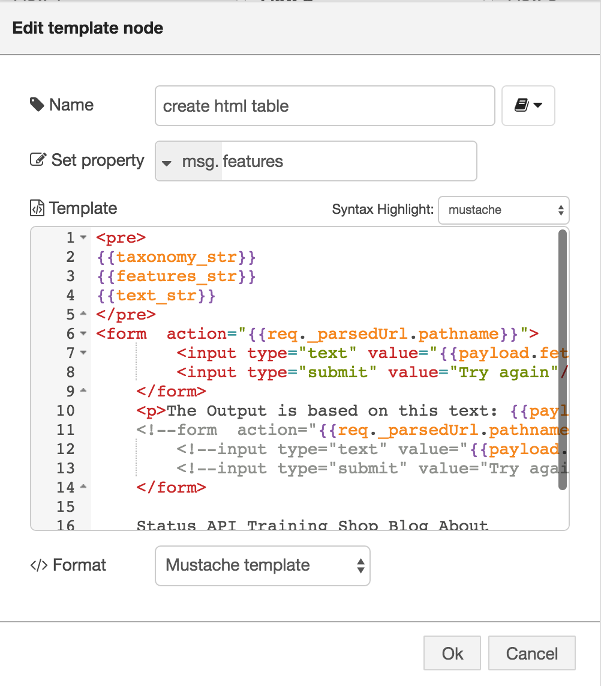

#Create a table from the Alchemy Api features

This lab is an extension of this [Alchemy Feature Extraction lab](/basic_examples/alchemy_api_feature_extraction/README.md).

With this extended lab you can easily see what the output of the different features of the Alchemy API Feature Extract node is.
With just a few minor changes you can have a different output.

The final flow looks like this:


First set up a 'http in' node like this:


I have put in 'resp', as this is the response page. but you can add anything.

You can access this page via {http://XXXX.mybluemix.net/resp} where XXXX is the name of your app.

The next node is a 'Switch' node. in the following image you can see how it is configured:


           payload.fetext 

will be used later to add the output to the html page.

From the Switch node the flow will be split. First we connect a 'change' node, to output 2 of the 'switch' node. This change node will set.

           msg.payload.fetext
to

           the msg.payload
See screenshot


Then the actual Alchemy Feature Extract node comes in. You can choose one of the features by using the check box. Iin this case I used Keywords. Remember this feature, it will be used later again.


The next step is setting up a small function:


Here you use 

           msg.features.keyword

NOTE: the last part of this message can be changed to any other feature, but then you have to select another feature in the previous step.

These are the different features which can be used:
- page-image
- image-kw
- feed
- entity
- keyword
- title
- author
- taxonomy
- concept
- relation
- pub-date
- doc-sentiment

The following node is a 'template' node which contains the HTML to create the page. This page will have an inpout field an a button to push the text to the Alchemy API.
The HTML code can be downloaded [here](aapi_table_template1.txt) and looks like this:



Then another template is used is for putting the out put of the Alchemy API on the page:


You can copy this into the template:

           Create Alchemy API output
           {{{features}}}
           {{{text}}}
           
The final node is the 'http response' node.


Here you use the same name as you used in the 'http in' node.

You have to wire the nodes together in the way you can see in the overview at the beginning of this lab.

The final flow looks like this:


In order the execute this app open a new browser and browse to {http://XXXX.mybluemix.net/resp?fetext="<enter text here>"}
```
For example - 
http://XXXX.mybluemix.net/resp?fetext="AlchemyAPI uses natural language processing, artificial intelligence, deep learning and massive-scale web crawling to power it's text analysis capabilities. Try entering your own text in this text box to see what knowledge AlchemyAPI can extract from your unstructured data."
```

You can download the completed flow here

