# Fetching word alignments from the Speech to Text service

## Overview
The speech to text services allows time alignment for each word in the transcript to be returned. Unfortunately the 
speech to text node only returns the default transcript. If you need alternative transcripts or time alignment then
you will need to call the service using a HTTP Response node. This exercise shows how to retrieve the time alignments for 
each word in the default transcript. You should be able to adapt this flow, and by modifying the paramaters into the 
service modify the response. eg. Fetch confidence levels for each word. 

## Initial Form
The flow begins by showing a form.

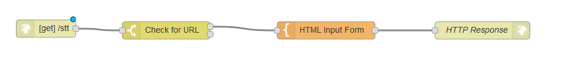

The entry point into the application is a HTTP Input configured to respond to a GET.

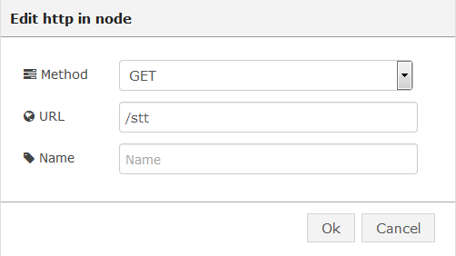

The switch node checks for a url.

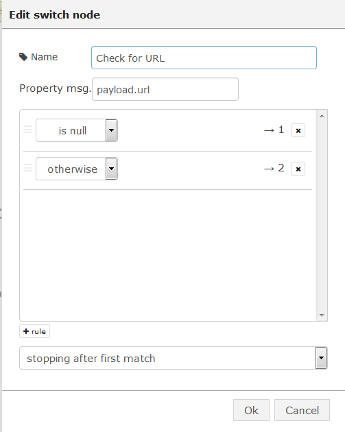

The Template prompts the user to enter a url.

```
<h1>Speech to Text Demo on Node-RED</h1>
<h2>Enter a URL for the audio file</h2>
<form  action="{{req._parsedUrl.pathname}}">
    Url: <input type="text" name="url"/><br/>
    <input type="submit" value="recognize"/>
</form>
```

## Fetch the Audio
If a url has been provided, it should point to a wav 
file (eg. [Example Wav URL](http://www-mobile.ecs.soton.ac.uk/hth97r/links/Database/man1_wb.wav)
Use a function to setup a HTTP Request for the audio file

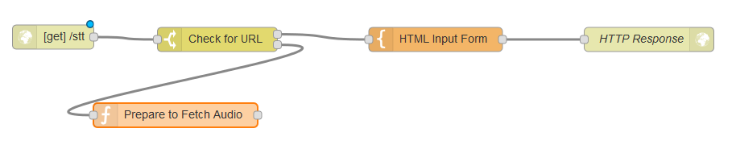

The contents of which is:

```
audiourl = encodeURI(msg.payload.url)
msg.url=audiourl;
return msg;
```

Use a HTTP Response node,

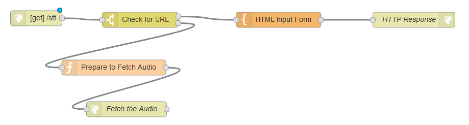

configured to return a binary buffer


## Invoke Speech to text
Add a function that will take the returned audio file, and prepare the http headers and url to invoke 
the Speech to Text service

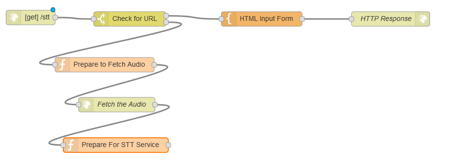


The url has parameters to fetch timestamps, and for the audio to be processed as a continous stream, ignoring
any speech pauses in the audio.

```
msg.headers = {'Content-Type' : 'audio/wav'};
msg.url="https://stream.watsonplatform.net/speech-to-text/api/v1/recognize?timestamps=true&continuous=true";
return msg;
```

A HTTP Request node is used to invoke the Speech to text service,

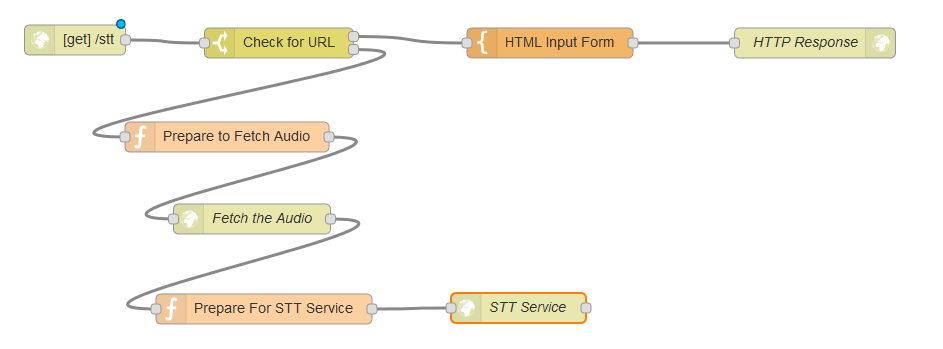


which needs to be configured to use basic authentication. Remember to enter Speech to Text service credentials which you can 
obtain from bluemix.

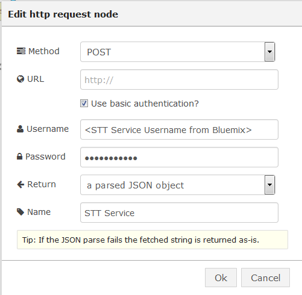


## Process the text
Control is then pased to a function which prepares data and the header for the response HTML Page.
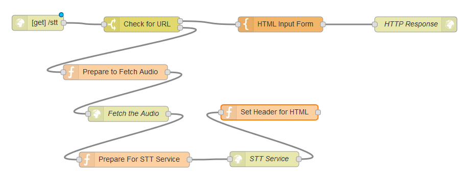

The function pulls out the time track and the transcript from the results to make them more accessible 
by the HTML template 

```
msg.sttout = msg.payload.results[0].alternatives[0];
msg.transcript = msg.payload.results[0].alternatives[0].transcript;
msg.headers = {'Content-Type' : 'text/html'};
return msg;
```

The output HTML template

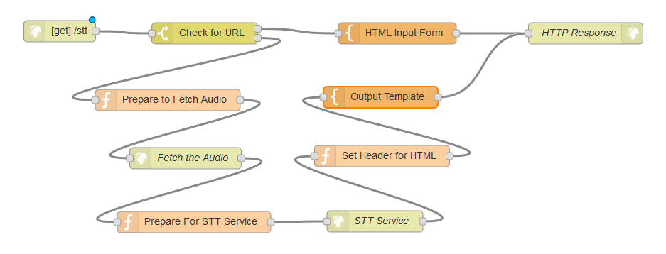

iterates over the response, and injects the words, and their timing positioning in the audio track. 
```
<h1>Speech to Text Results</h1>
<div>{{transcript}}</div>
<ul>
    {{#sttout}} 
        <li>
            <table>
                <thead>
                    <tr><th>Word</th><th>Start</th><th>End</th></tr>
                </thead>
                <tbody>
                    {{#timestamps}}
                        <tr>
                            {{#.}}
                                <td>{{.}}</td>
                            {{/.}}    
                        </tr>
                    {{/timestamps}}
                </tbody>                    
            </table>
        </li>
    {{/sttout}}    
</ul>
```

## Running the application
When you run the application a web page based of /stt will be available to you

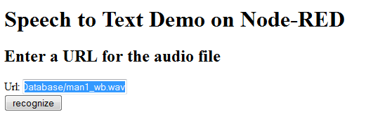

The application will respond with a transcript and a table showing the start and
end timing for each word in the audio stream.

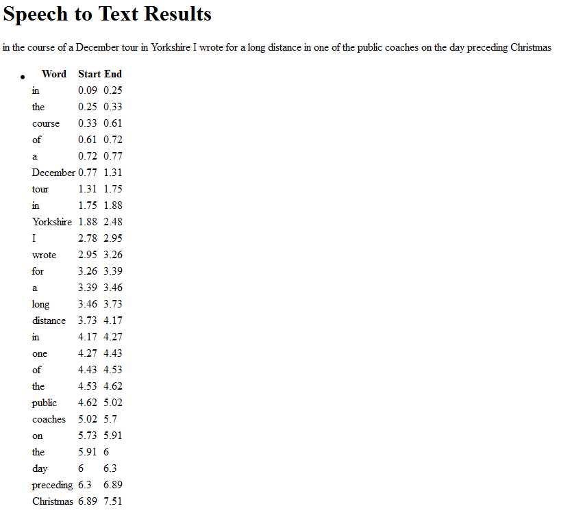

The completed flow is available at [Speech to Text Timestamps Flow](astt_speech_timestamps_flow.json)
