# Visual Recogition Training with your own images advanced Lab
## Overview
Version 2 of the Visual Recognition service allows you to build your own image classifications. There is, however, not
yet a node-RED node for this version of the Visual Recognition service. To allow you to use this training capability in
node-RED we have adapted the visual recognition sample application. We show you how to use the sample appplication to create
your own classifications, and our modified version provides an API that you can use to check an image against your visual 
classififier. 

## Training
In this section we show you how to create and train your own new visual recognition classifications. You can do this using 
our modified version of the visual recognition sample 
application [Visual Recognition sample application](https://visual-recognition-moscow.mybluemix.net/)

The sample application has an option that will allow you to create a custom classifier.  

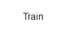

Each classification needs a minimum of 50 positive and 50 negative images. So for example if you were creating 
classifications for sporting events, then for each event type you would provide 50 positive and 50 negative images. eg.
50 images showing Soccer, 50 images not showing soccer for the Soccer classification. Similary 50 positive and 50 negatives images 
for the Rugby classification. 

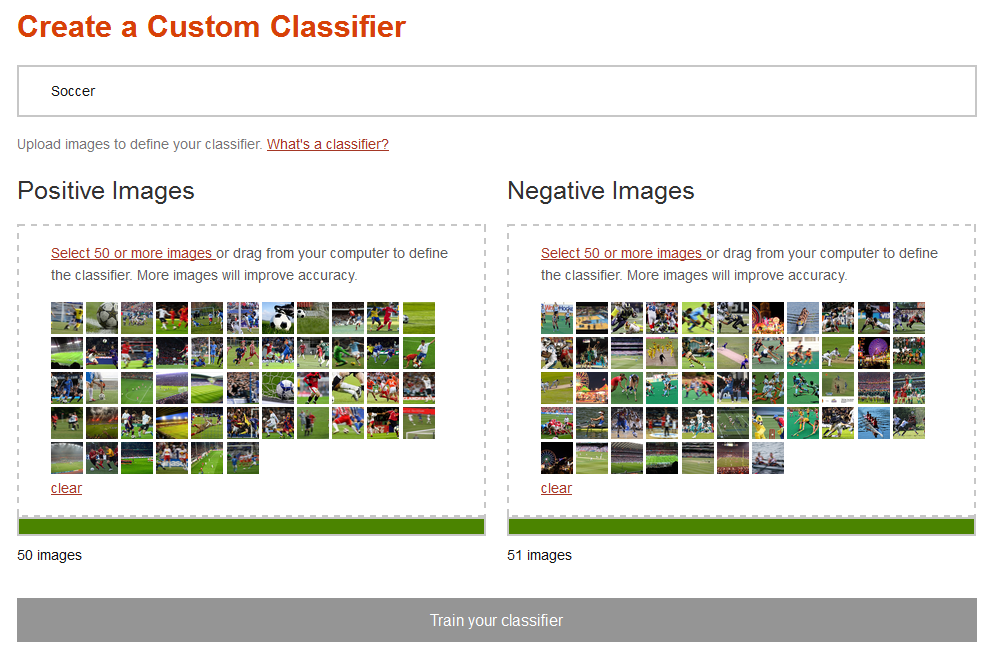

It may take a few minutes for your new classifier to be ready

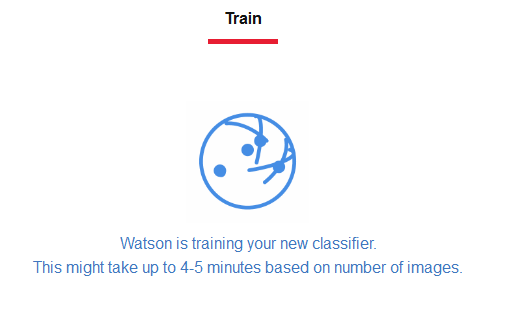

Once it is ready you can begin to use your classification. You do, however, need the classifier id. You can get this when 
the test option is displayed

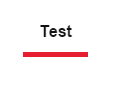

We will be modifying the application to display the classifier id, but for now you can determine the 
id using browser developer tools.

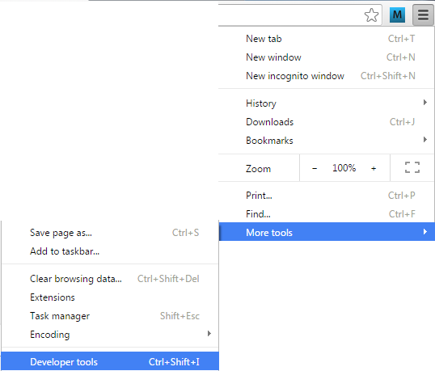

Switch to the console and type "CLASSIFIER_ID". The console will show you the ID for your Classifier.
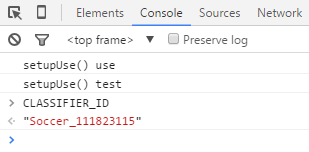

## Classification

The first part of the classification flow, displays a form where you are prompted to enter an image url and a classifier id. The id comes from the training you 
completed previously and the image url is the new image that you want to check against your classifier.

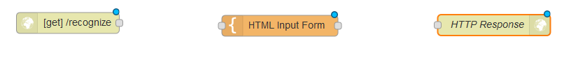

Where HTML Input Form looks like 
```
<h1>Visual Recognition Demo on Node-RED</h1>
<h2>Type a image URL</h2>
<form  action="{{req._parsedUrl.pathname}}">
    Url: <input type="text" name="url"/><br/>
    Classifier id: <input type="text" name="classifier_id"/><br/>
    <input type="submit" value="Classify"/>
</form>
```

When the response from the form is returned and a url has been specified, then the application can start the process of 
classifying the image as specified in the image url.

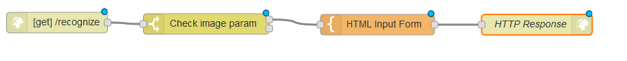

If no url has been provided then the form is redisplayed
 
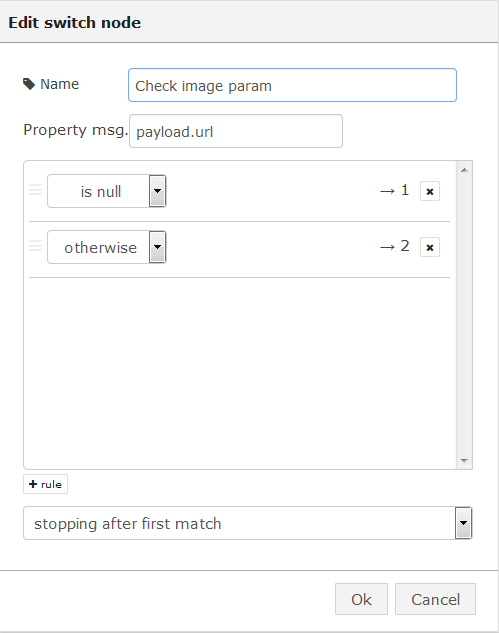

if a url has been provided then we pass control to a function node

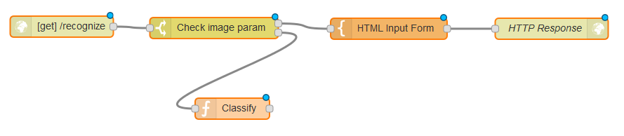

that caches the image url and sets up a REST call to our classify API.

```
msg.imageurl = encodeURI(msg.payload.url)
msg.url="https://visual-recognition-moscow.mybluemix.net/api/classify?url=" + encodeURI(msg.payload.url)+"&classifier_id=" + encodeURI(msg.payload.classifier_id);
return msg;
```

The API is then called.

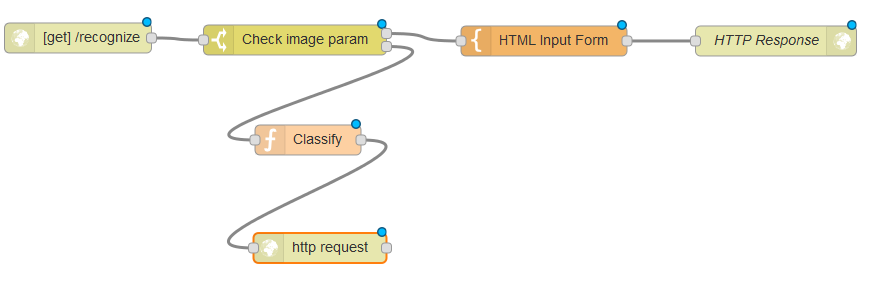

which will return a json object.

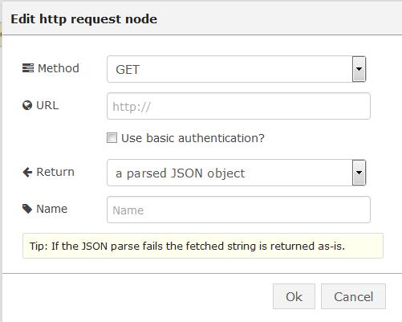

We then pass the reponse to a function

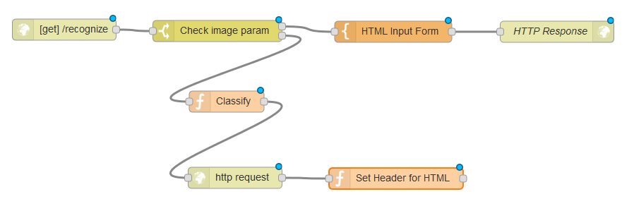

which sets the headers so that the browser will treat the response as HTML
```
msg.imageclasses = msg.payload;
msg.headers = {'Content-Type' : 'text/html'};
return msg;
```

The return html is then created
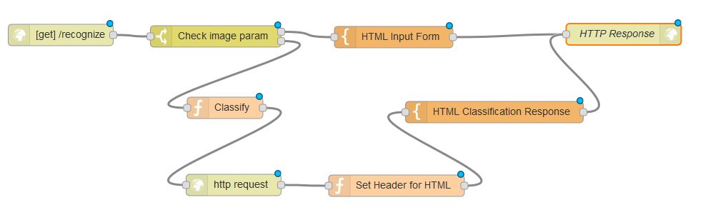

which makes use of mustache templating to iterate over the response and inject the image, classification and confidence
into the response.

```
<h1>Visual Recognition on Node-RED</h1>
{{#imageclasses}}
    {{#images}}
        <div></div>
        <div>{{image}}</div>
        <br/>
        <table border='1'>
            <thead>
                <tr><th>Classifier</th><th>Score</th></tr>
            </thead>
            <tbody>
                {{#scores}}
                    <tr>
                        <td>
                            {{name}}
                        </td>
                        <td>
                            {{score}}
                        </td>
                    </tr>
                {{/scores}} 
                {{^scores}}
                    <tr>
                        <td colspan="2">
                            No match to classification
                        </td>
                    </tr>
                {{/scores}}                
            </tbody>
        </table>
    {{/images}}    
{{/imageclasses}}
```

## Running Application

If you provide an image that doesn't match, then the application will tell you

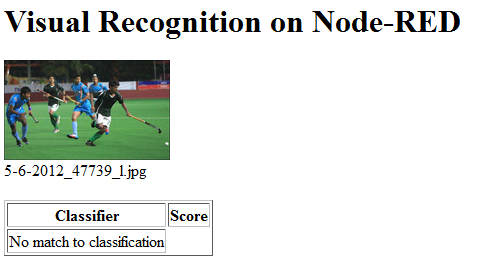

When you provide an image that does match, then you will get a confidence level.

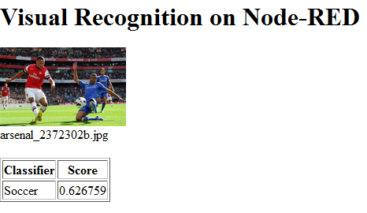

If you don't specify a classifier id, then the application will try matching against all its classifications. Only classifications 
that it matches will be returned.

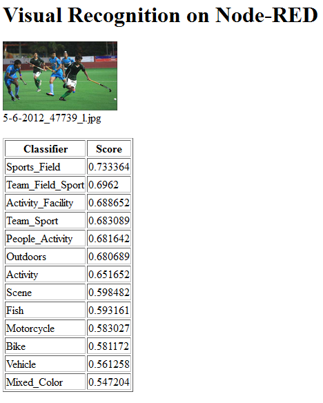


The completed flow is available at [Visual Recognition Image Classification Flow](avr_classify_image_flow.json)

## Training using the new Visual Recognition Training node for Node-RED

Now training can also be done by using a new Node-RED node. The requirements for the training are still the same: two sets of positive and negative images. These sets will have to be packed in a ZIP file and then made available to the application either as a binary stream or as an URL pointing to the file.

In the picture we can see how the Box node has been used to retrieve the files. The pictures which have been used are from the retriever and non-retriever dogs example which can be found within the [Visual Recognition documentation](https://visual-recognition-demo.mybluemix.net/train). The zipped image sets are also available at [Positive](files/retrievers_positive.zip) and [Negative](files/retrievers_negative.zip).

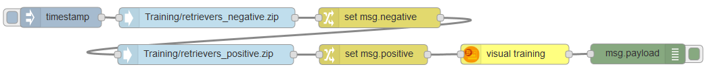

The only thing that we need to take into account is that the files which are going to be used for training need to be specified in <b>msg.positive</b> and <b>msg.negative</b>. This is why the change nodes have been used. The configuration of one of this nodes is displayed in the image. 

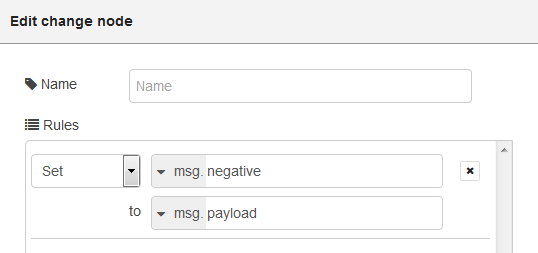

To configure the visual recognition training node, only a name for the resulting classifier and the credentials have to be provided. Credentials can be specified either selecting an existing Alchemy service binded to the Node-RED application or providing them manually.

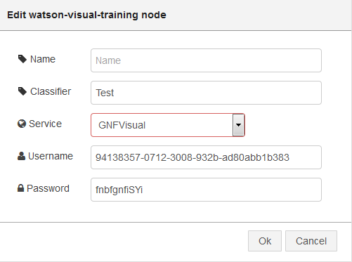

The training will take a few seconds and after that the response will include the id of the generated classifier. This unique id (and not the provided name) is required for other operations on the visual recognition engine.

```
{   
    "name": "Test", 
    "classifier_id": "Test_1002609660", 
    "created": "2016-04-12T13:44:43.000Z", 
    "owner": "9d768f31-1805-3007-b070-1def5fe9cd0a-us-south" 
}
```

## Additional tooling nodes

Additionally to the new training node, a utils node has been included. This node is useful for getting a list of classifiers, querying the details for a single classifier or deleting it from the repository.

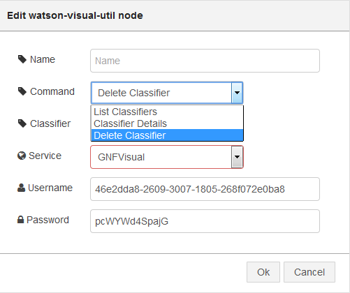

