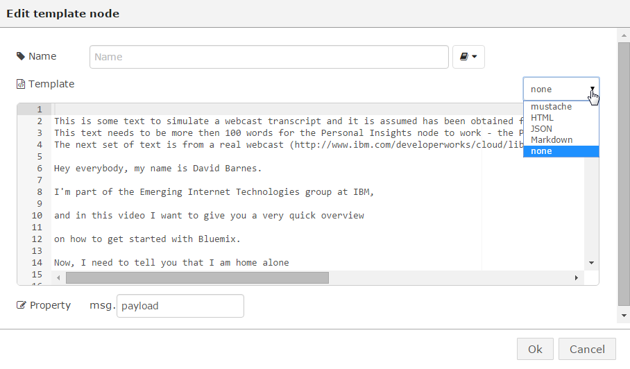

# Node-RED Webcast classifier (BETA - not complete)

**NOTE** : Due to time restrictions it was not possible to complete this lab but it does features some ideas and design considerations on which node is to be used where.

## Overview
In this lab we will explore how Node-RED rapid prototyping capabilities can be used to analyse a webcast transcript in order to classify it using Watson Node-RED nodes.  Many of us have to decide which webcast we need to listen to and a way of classifying them against your own needs would beneficial.  The idea is that Speech to text and then Personality Insights, Alchemy API Feature Extraction and other Watson nodes can be used to help in deciding which webcast to listen to against your own preferences.

## Prerequisite
 - It is assumed that you have completed the ([Speech to Text lab](/basic_examples/speech_to_text/README.md)) and you are familiar with Node-RED nodes.

## Flow building
To simulate some webcasts transcripts the HTTP Request/Response nodes are used to feed the Watson nodes with appropriate information.

Drag a HTTP Request, a Template and HTTP Response nodes to the palette and join them as shown below

For the HTTP Request node enter "/wc1" in the URL field.  For the Template node change the it to "none" and cust/paste the webcast text to the body of the Template.

The above allows you to use Node-RED to publish a webpage, just go to http:/x.x.x..mybluemix.net/wc and the text in the Template will be shown.

To use the publishing feature drag the following nodes onto the palette

The flow file is [here](wcc_phase1.json)

When you click the wc1 Inject node, the text "wc1" is sent to the Function.  Inside the function (at present) is hard coded the URL of the application and "wc1" is appended.  For output one this URL can be sent directly to the Alchemy API  Feature Extraction node since it can take a URL as an inout and fetches the contents itself.  However the Personality Insights node can only work on lines of test and so we need to fetch the contents for it.  The URL is thus sent to a HTTP Request node to go to the link specified.  The web page is served up by Node-RED and then the resultant page (the webcast text) is passed to the Personality Insights node.
