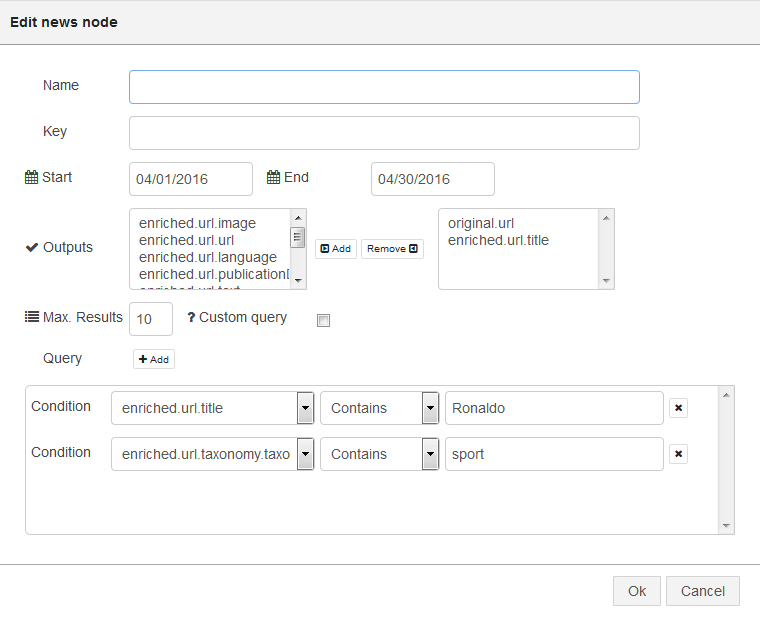
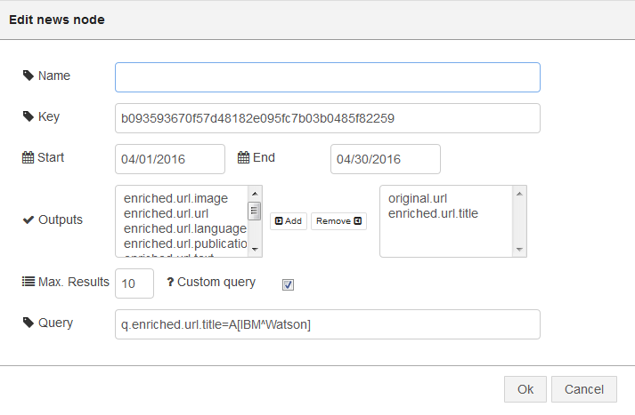

#Watson Alchemy News for Node-RED
##Overview
Alchemy News gives access to a hyper-relevant, curated dataset of news and blogs that has been enriched with AI.
AlchemyData News indexes 250k to 300k English language news and blog articles every day with historical search available for the past 60 days.
##Basic Alchemy News flow
In order to create a flow which searchs in the Alchemy News repository the news node has to be inserted in the flow.

Configuration dialog requires that we specify the key which will be used to access the service. A start and end date for the search is also mandatory. Then the fields which are expected in the output must be specified from the list. It is also posible to limit the maximum number of results. 
Finally the condition which must meet the documents has to be specified. This condition can be built using an assistant. Each condition added must indicate the field, the condition (contains, not contains for texts or greater, less than, etc. for numbers) and the value. 
In this example the news should contain the name Ronaldo in the title and they should have been classified as being related with sports.

When the flow is executed, a JSON with the results is returned from the node.

It is also possible to write custom complex queries by following the directions in the [Alchemy News API documentation](http://docs.alchemyapi.com/). When the <i>Custom query</i> checkbox is selected, the assistant dissapears and a free input box is displayed. In this example news with a title including both the words IBM and Watson will be returned.

The output for this second query is the one displayed below.

