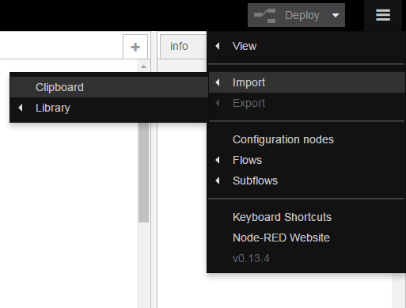
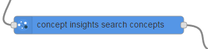
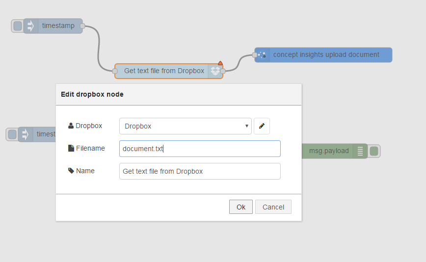

# Concept Insights service

## Overview
The IBM Watson™ Concept Insights service enables you to identify conceptual associations in the content that you provide. Input content is auto-tagged against a concept graph, which is a formal representation of the relationships between concepts that are present in the data. The concept graph used by the Concept Insights service is based on content that has been ingested from the English language Wikipedia.

## Installation of the Concept Insights Nodes
Follow the instructions at [watson contribution nodes](/watson_contribution_nodes/README.md) 
to install the concept insights nodes into your Bluemix instance of Node-RED. 

## Lab 1: Discover TED talks using topics, words or concepts
This lab will use a given flow contained in this directory. Copy the contents of `concept-insights-ted-talks-lab-1.json` to the clipboard. In the Node-RED flow editor, import the flow as follows:

and paste in the contents of `concept-insights-ted-talks-lab-1.json`. Once imported, click "Deploy" in the top right corner. This flow sets up a HTTP endpoint for your application that returns relevant TED Talks that contain concepts similar to the given search term.  Once deployed, you can visit http://localhost:1880/TEDTalks?concept=computer if running locally or http://<bluemixhostname>.mybluemix.net/TEDTalks?concept=computer to see TED Talks related to the term "Computer". Try changing the concept parameter to see TED Talks relating to different topics. 

### How the flow works
First of all, the incoming HTTP request is parsed and the concept parameter is extracted.

Then, the Concept Insights Search Concepts node is used to find concepts related to the given search term. These concepts are returned as an array.

The concepts returned are then passed to the Concept Insights Search node where a conceptual search query is performed. This finds all TED Talks that contain concepts specified in the input `msg.concepts`.

Finally, the result of the conceptual search query is passed to the HTTP response and returned to the user.

## Lab 2: Upload a document to a corpus for indexing
This lab will show you how to upload your own file from Dropbox for indexing and analysis so you can perform queries based around your own data. Before you start, make sure you have the Dropbox node on your palette and have configured it correctly. [These instructions](https://github.com/watson-developer-cloud/node-red-labs/tree/master/utilities/dropbox_setup) explain this step in more detail. First of all, import the `concept-insights-upload-document-lab-2.json` file into the Node-RED flow editor as detailed in Lab 1, then deploy the flow using the button in the top right corner. Select a file to upload by editing the configuration of the Dropbox node.

The upload document node has been populated with some default information, such as the name of a corpus, the name of a document and a document label. If you wish to change this, double click the upload document node to reconfigure it.

Deploy the flow and click the inject node to begin uploading the file. The file will begin to upload to the Concept Insights service and a status is shown underneath the upload document node. The document will begin indexing and this is indicated as follows:

Once the document is ready, the status will change as follows:

When the document has finished uploading, queries can be performed on the corpus and the document using the Concept Insights search node. The following flow retrieves corpus statistics and outputs the result to the debug tab. Click the inject node to try it out. Other queries are available by changing the configuration of the search node.

