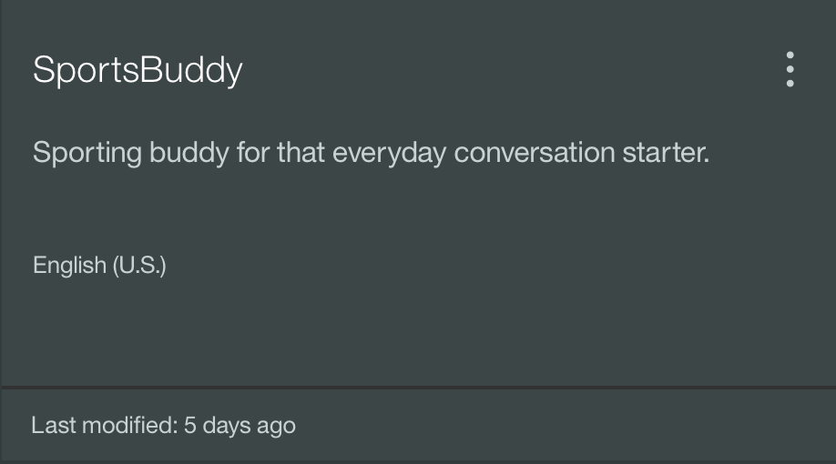
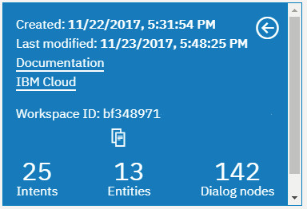
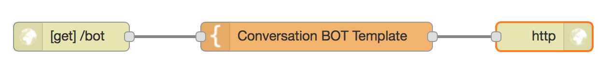
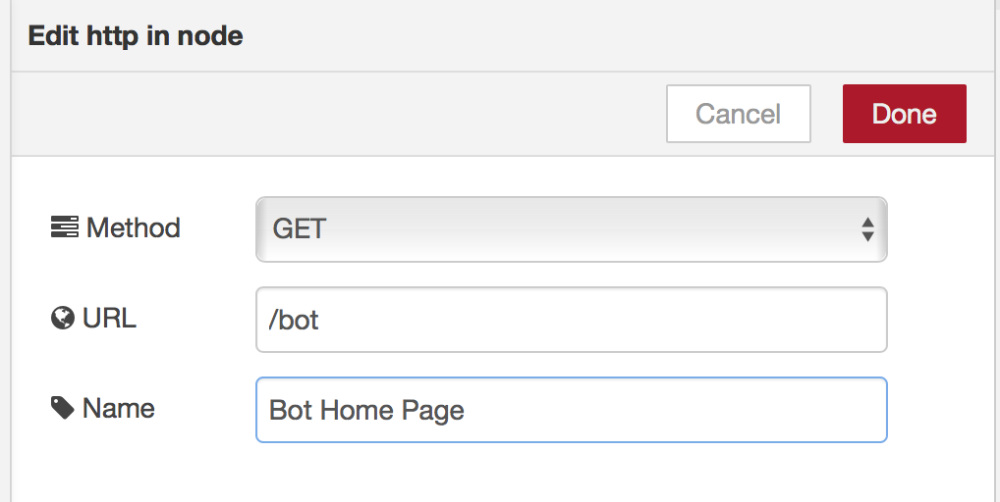
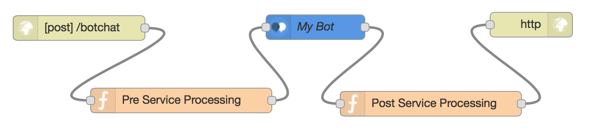
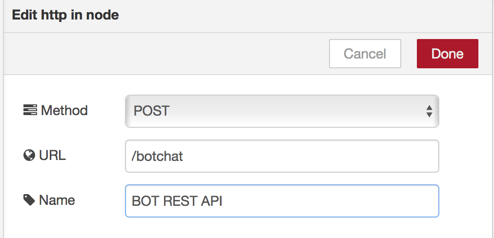
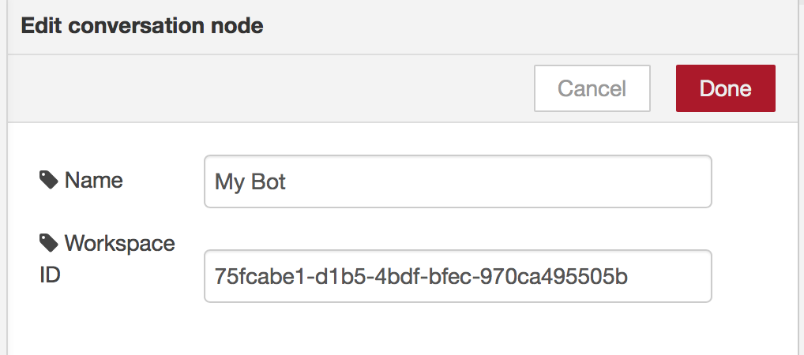

# Conversation service

## Overview
The conversation service integrates natural language understanding, to determine intent and entities, with
dialog tools which allow for a natural conversation flow between your application and your users.

## Getting Started
Before you can use the service through the node on node-RED you will need to create your conversation. Follow the
[Tutorial](http://www.ibm.com/watson/developercloud/doc/conversation/tutorial_basic.shtml) to guide you through the process of
launching the conversation service tooling, creating a workspace, registering intents and entities and creating a dialog.
The tooling is the only way in which dialogs, intents and entities can be registered with the service.

## Conversation Flow construction
In this exercise, we will show how create a Conversation Bot Flow. It will consist of two sub-components. The first will
consist of the HTML template, with javascripts, that will be the front end of your Bot. The second will be an REST API that will
encaspulate the Conversation service.

### Connecting to an existing Conversation service on Bluemix
To use the conversation node you will have already created an instance of the Service in Bluemix and used the service tooling to
register intents, entities and dialogs.
You will need the workspace id. Obtain this from the service tooling. Select details for your workspace,


by clicking on


which will reveal your workspace id.


### The HTML template
Build a flow comprising of HTTP In, Template, and HTTP Response nodes


Configure the HTTP In node. This will be your Bot's home page.


Configure the Template node with the following code.
```
<html>
  <head>
    <meta charset="utf-8">
    <meta http-equiv="X-UA-Compatible" content="IE=edge">
    <meta name="viewport" content="width=device-width, initial-scale=1">
    <title>
	  My BOT
	</title>
	<link rel="stylesheet"
        type="text/css"
        href="https://maxcdn.bootstrapcdn.com/bootstrap/3.3.7/css/bootstrap.min.css" />
  </head>
  <body>

    <div class="container">
      <div id="no-script"class="bg-info">
        This application needs JavaScript enabled in your browser!
      </div>
      <div id="id_contextdump"></div>

      <h1>My BOT</h1>
      <div id=id_botchathistory>
	  </div>

	  <div>
	      <form>
            <label for="id_chattext">Your Input: </label>
            <input type="text" name="chattext" id="id_chattext">
            <br/><br/>
	      </form>
	      <button onclick="javascript:onChatClick()">Send</button>
	  </div>
    </div>
    <script type="text/javascript" src="https://code.jquery.com/jquery-2.1.4.min.js"></script>
    <script src="https://maxcdn.bootstrapcdn.com/bootstrap/3.3.7/js/bootstrap.min.js"></script>

    <script type="text/javascript">

      $(document).ready(function() {
          javascriptCheck();
          	$('#id_contextdump').hide();
      });

      // if javascript is enabled on the browser then can
      // remove the warning message
      function javascriptCheck() {
        $('#no-script').remove();
      }

      function createNewDiv(who, message) {
        var txt = who + ' : ' + message;
        return $('<div></div>').text(txt);
      }

      function chat(person, txt) {
        $('#id_botchathistory').append(createNewDiv(person, txt));
      }    

      function processOK(response) {
        console.log(response);
        console.log(response.botresponse.messageout);
        console.log(response.botresponse.messageout.output.text);
        console.log(response.botresponse.messageout.context);
        chat('Bot', response.botresponse.messageout.output.text);
        $('#id_contextdump').data('convContext', response.botresponse.messageout.context);
      }

      function processNotOK() {
        chat('Error', 'Error whilst attempting to talk to Bot');
      }

      function invokeAjax(message) {
        var contextdata = $('#id_contextdump').data('convContext');
        console.log('checking stashed context data');
        console.log(contextdata);


        //var ajaxData = "msgdata=" + message;
        var ajaxData = {};
        ajaxData.msgdata = message;
        if (contextdata) {
          ajaxData.context = contextdata;    
        }

        $.ajax({
          type: 'POST',
          url: 'botchat',
          data: ajaxData,
          success: processOK,
          error: processNotOK
        });
      }

      // User has entered some text.
      function onChatClick() {
        var txt = $('#id_chattext').val();
        chat('You', txt);
        invokeAjax(txt);
      }

    </script>
  </body>
</html>

```
This sets up the homepage of your BOT as a single page application. It uses AJAX to invoke a REST API that you will now implement.

### The REST Subflow
For the REST subflow build a flow comprising of HTTP In, a function, conversation, as second function, and HTTP Response nodes


Configure the HTTP In node as a POST API.


Configure the first function to pull out the user text and any conversation context information, with the following code.
```
// stash away incoming data
msg.mydata = {};
msg.mydata.messagein = msg.req.body.msgdata;
msg.payload = msg.mydata.messagein;

msg.params = { "context": msg.req.body.context};

return msg;
```

Configure the Conversation node with the Workspace ID:


Configure the second function to build a response, incorporating the conversation context and bot response, with the following code.
```
msg.mydata.messageout = msg.payload;

msg.payload = {};
msg.payload.botresponse = msg.mydata;

return msg;
```

### Testing the flow
To run the web page, point your browser to  `/http://xxxx.mybluemix.net/bot` and enter text to drive your bot.

### Flow source
The complete flow is available at [Conversation-Lab-WebPage](conversation_lab.json).
