# Dialog service

## Overview
The dialog service enables automation of a conversation between your application and a user. The node is available
as a Watson Developer Cloud contribution to Node-RED and needs to be installed. 

## Installation of the Dialog Node
Follow the instructions at [watson contribution nodes](/watson_contribution_nodes/README.md) 
to install the dialog node into your Bluemix instance of Node-RED. 

## List available dialogs
The first part of the flow is to generate a list of the available dialogs. 

Copy an inject node.

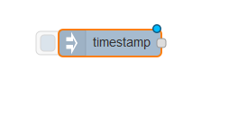

Feed the output from the inject node to a dialog node.

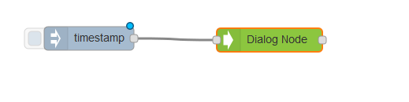

Configure the mode for the dialog node to list the available dialogs.

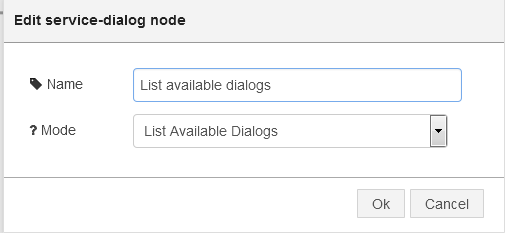

Send the output to a debug node.

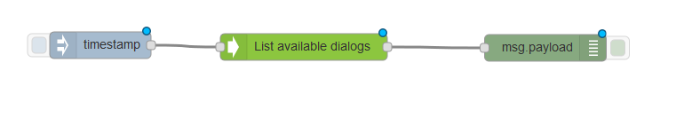

The list is available at msg.dialog.

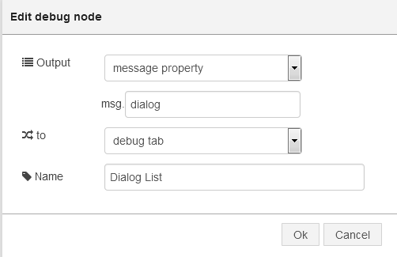

If you haven't registered any dialogs then the output list will be empty.

Either follow [Dialog Template Creation](../dialog_template_creation/README.md) or use
the dialog tool [dialog tool](https://github.com/watson-developer-cloud/dialog-tool) to register
your dialogs. 

Once you have registered dialogs, then they will show up.

Make a node of the dialog IDs you will need these for the next step.

## Start a Dialog Conversation
When the dialog ID is known, a conversation can be started.

Add a new inject node.

Configure the input to send a string as the conversation starter.

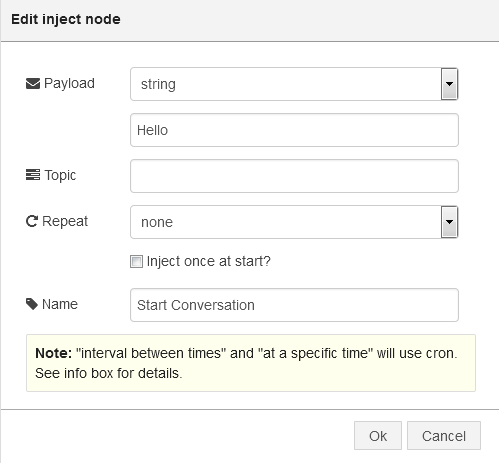

Add a new dialog node.

 
Configure the node to start the conversation, setting the dialog id.

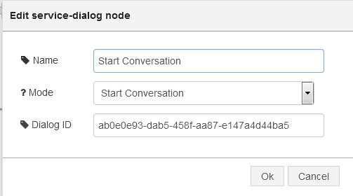

Send the output to a debug node.

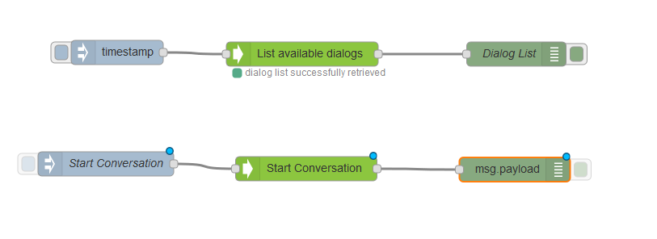

The salutation response from the dialog is available at msg.dialog.

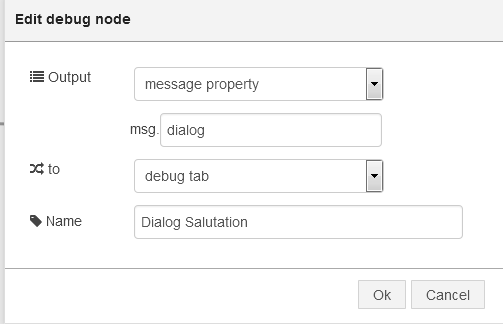

The salutation response from the dialog is available at msg.dialog.

Make a note of the client ID and the converstaion ID. You will need these to continue the conversation.

## Continue a Conversation
With the client ID and conversation ID dialog ID you can continue a conversation, the state and properties
will be remembered by the service. 

Add a new inject node.

Add a new dialog node, setting the mode, dialog ID, client ID, and conversation ID.

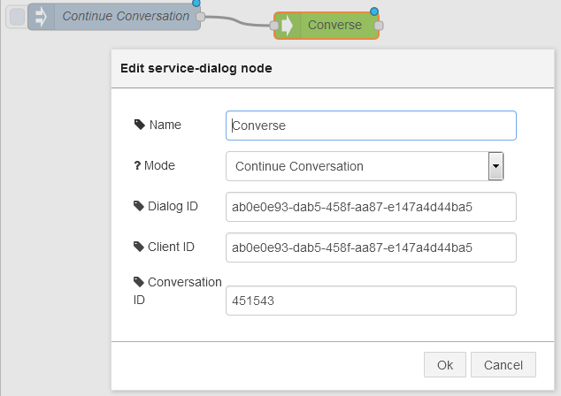

Send the output to a debug node. 

Where you will be able to see the response from the dialog service. 

## Delete a Dialog
This mode enables you to delete a Dialog given its Dialog ID. To do so, just add the Dialog ID in the node configuration.

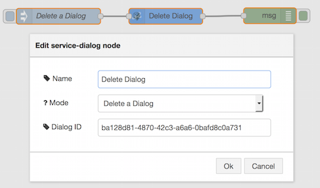

Send the output to a debug node

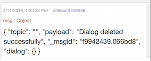

## Delete all Dialogs
This mode enables you to delete all Dialogs associated to the underlying Watson Dialog service instance. <b>Use it with caution as the deletion is permanent</b>

Send the output to a debug node

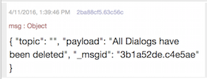

The completed flow is available at [Dialog Flow](dialog_flow.json)
A new flow that illustrates all available Dialog Node Modes is available at [Dialog Flow2](dialog_flow2.json), and proposes an automated Simulation of a Dialog Creation, Starting and following a Conversation. This second flow also shows you the 2 two new modes <b>Delete a Dialog</b>, and <b>Delete All Dialogs</b>.
