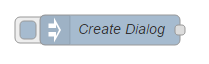
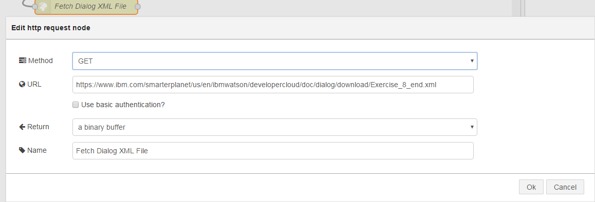
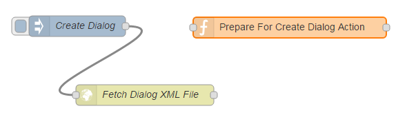
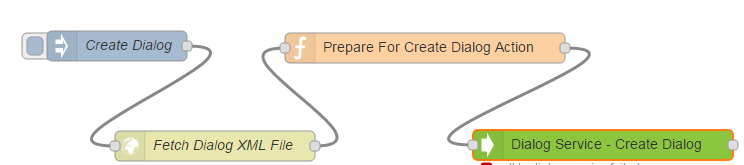
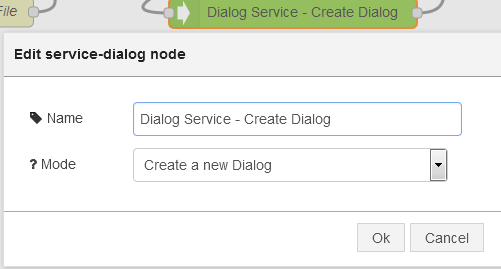
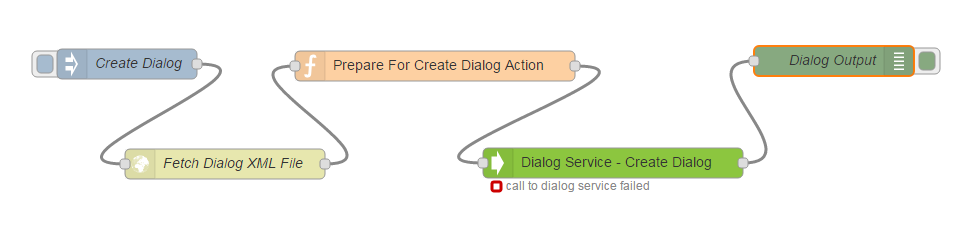
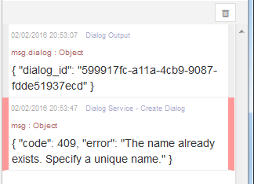

# Dialog Template Creation

## Overview
The dialog service enables automation of a conversation between your application and a user. The node is available
as a Watson Developer Cloud contribution to Node-RED and needs to be installed. 

## Installation of the Dialog Node
Follow the instructions at [watson contribution nodes](/watson_contribution_nodes/README.md) 
to install the dialog node into your IBM Cloud instance of Node-RED. 
*Notice* : in the Watson Node-RED Boilerplate this installation have been already done.

## On IBM Cloud

If you are using Node-RED on IBM Cloud, go to your Node-RED app and click 'add a service or API' This will open a new window where you can select the Watson Dialog service. Then you click on 'Use' a screen will show which asks for a restage, click on 'yes' and wait a minute. When the application is started click on the Url to go to your Node-RED application.

## Create Dialog Template

Copy an inject node.



Feed the output from the inject node to a HTTP request node.  


Configure the mode for the http request node to fetch a dialog file.



Feed the file into a function node.



Code up the function node to pass in the file, and to give the dialog template a name.

```
msg.dialog_params = {};
msg.dialog_params["file"] = msg.payload;
msg.dialog_params["dialog_name"] = "Pizza Ordering";
return msg;
``` 


Feed the output into a dialog service node.



Set the mode for the node to Create Dialog.




Use a debug node to see the output from the service,



which will be available on msg.dialog 


If the dialog is create you should see the following response.


If you run the flow again, then you the create should be rejected as a duplicate.



The completed flow is available at [Dialog Template Creation Flow](dialog_template_creation_flow.json).

<n>Notice</b> : you can also use Dropbox instead of using the HTTP Request node : How to setup your Node-RED with [Dropbox nodes](https://github.com/watson-developer-cloud/node-red-labs/tree/master/utilities/dropbox_setup)
