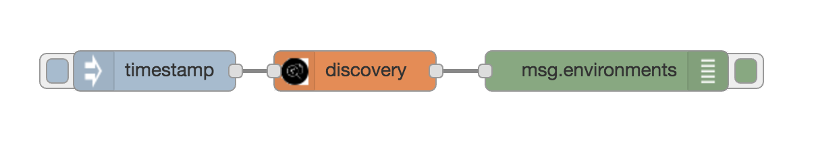
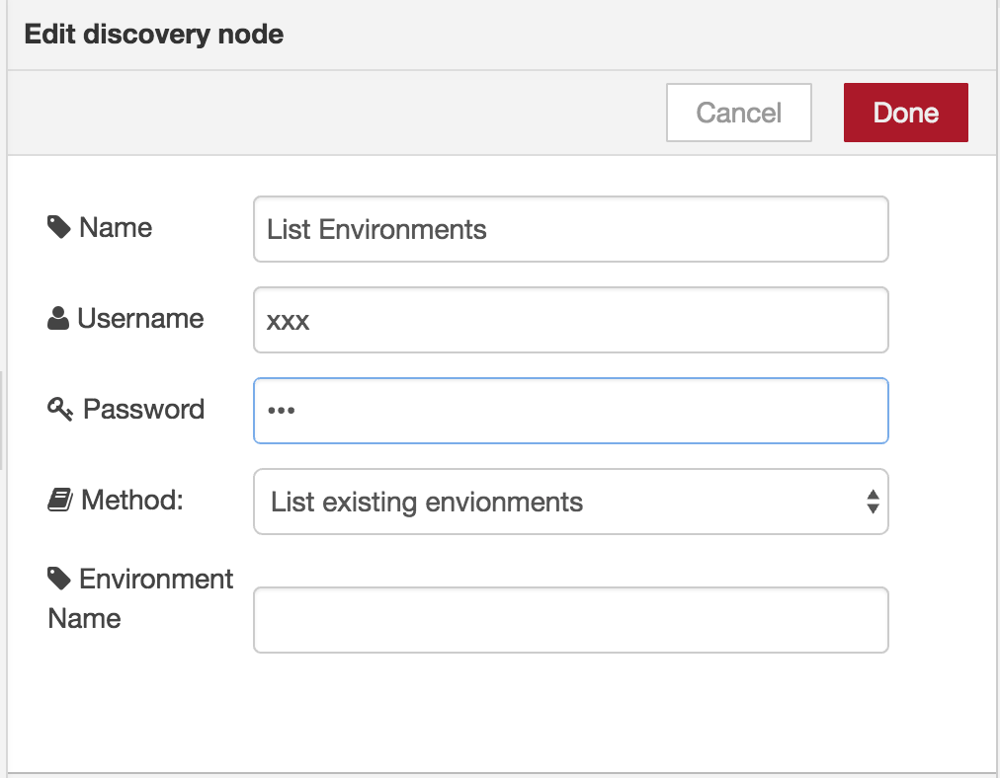
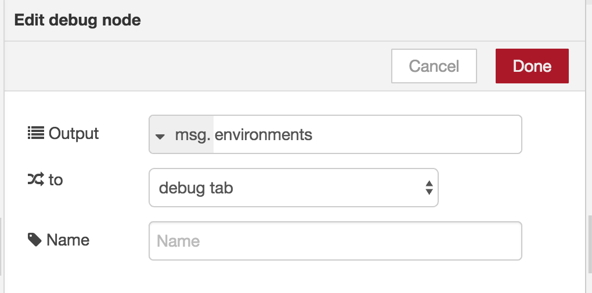

# Discovery service

## Overview
The discovery service makes it possible to prepare and search your unstructured data  in the same was as the Alchemy News prepares and allows search for News.

## Getting Started
Before you can use the service through the node on node-RED you will need to create your discovery environment. Follow the
[Getting Started Guide](https://www.ibm.com/watson/developercloud/doc/discovery/getting-started-tool.shtml) to guide you through the process of
launching the discovery service tooling, creating a collection, and adding content.

## Discovery Flow construction
In this exercise, we will show how create a Discovery Flow. Initially you will use
the Discovery Node to list environments, collections, configurations and run query. Then you will use the Query Builder node to prepare a query to be used by a Discovery
Node.

### List Environments
Build the following flow.

Configure the Discovery Node to list environments.

Configure the debug node to display the selected list.

### Discovery Query Builder Node
The Discovery Query Builder Node can be used to build a query to be used by the
Discovery Node.
Build the following flow.

Configure the Query Builder Node to search the News Environment, for the Entities
'Watson' and 'Facebook', with a docSentiment of 'positive'.

Configure the Discovery Node to limit the search to 5 items, and only the text.

Configure the debug node to display the search results.

## Completed Flows
The complete flow is available at [Discovery-Lab](discovery_lab.json).
