# Lab : Watson Discovery service with Node-RED

## Overview
The Discovery service makes it possible to prepare and search your unstructured data, in the similar way to the deprecated Alchemy News, the Discovery node allows you to create, manage and search the Watson system environment (News in English, Spanish and Korean), as well as any private collections.
Although the node can be used to create and manage your environments and collections, there is tooling provided in the IBM Cloud to create your own discovery environment. Follow the [Getting Started Guide](https://console.bluemix.net/docs/services/discovery/getting-started-tool.html#getting-started-with-the-tooling) to guide you through the process of launching the discovery service tooling, creating a collection, and adding content.

## Node-RED Watson Discovery nodes
There are 2 nodes used in these examples for the Watson Discovery service:
1. 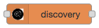 Discovery Node - list environments, collections, configurations and run queries.
1. 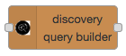 Query Builder node - fetches the searchable fields in the collection and allows you to set upto 3 query search items. 

  
## Discovery Flows construction
In this exercise, we will show you how to create several flows to list environments, collections, configurations and run a simple query. Then you will use the Query Builder node to prepare a query to be used by a Discovery Node.

### Environments Examples
Build the following flows to list existing environments and then extract the details of the environment.

The timestamp inject nodes are used purely to initiate the flows. Configure the Discovery Node to list environments.

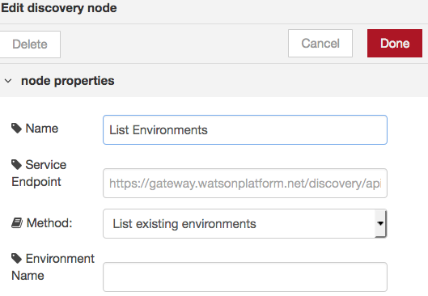

Change the method to be "List existing environments" 

Configure the debug node to display msg.environments 

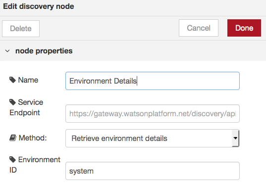

Change the method to be "Retrieve environment details" 

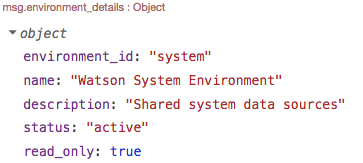

Configure the debug node to display msg.environments_details

### Collections Examples
Build the following flows to list existing collections, within the system environment, and then extract the details for one of the collections.
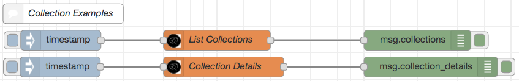
The timestamp inject nodes are used purely to initiate the flows. Configure the Discovery Node to list collectionss.

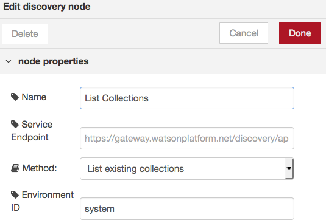

Change the method to be "List existing collections" and add "system" for the environment ID.

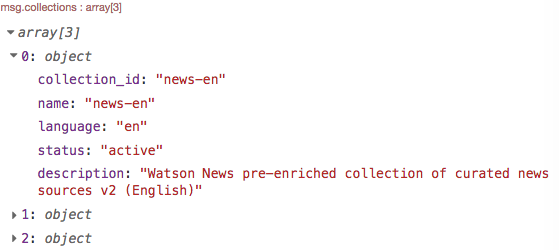

Configure the debug node to display msg.collections. 

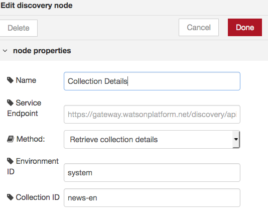

Change the method to be "Retrieve collections details", add "system" for the environment ID and "news-en" for the collection ID.

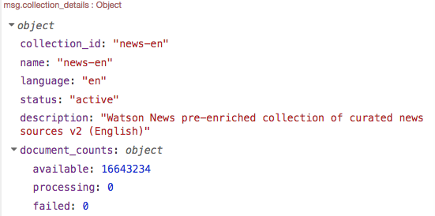

Configure the debug node to display msg.collection_details

### Configurations Example
Build the following flow to list existing configurations, within the system environment, and then extract the details for one of the collections.
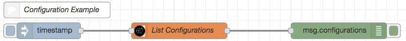
The timestamp inject node is used purely to initiate the flow. Configure the Discovery Node to list configurations.

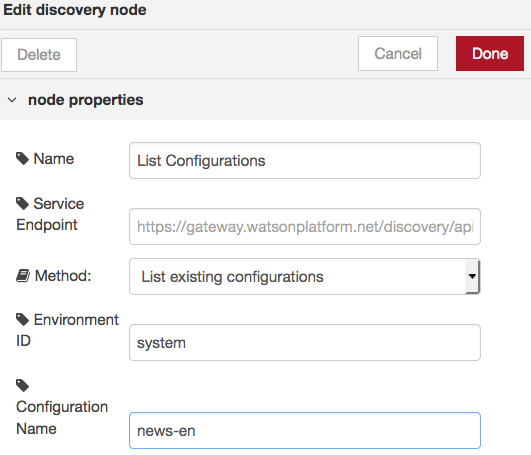

Change the method to be "List existing configurations", add "system" for the environment ID and "news-en" for the configuration ID.

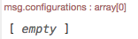

Configure the debug node to display msg.configurations. (There are **NO** configurations on the system collection "news-en").

### Query Example
Build the following flow to run a sample query, within the system environment.
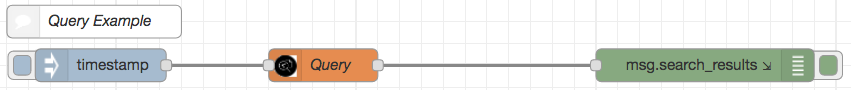
The timestamp inject node is used purely to initiate the flow. Configure the Discovery Node to run a query.

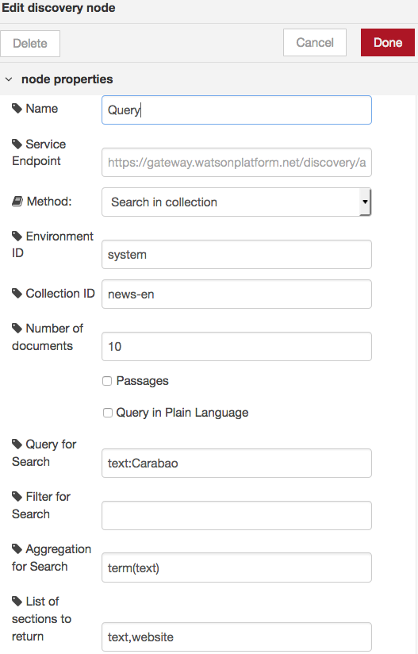

* Change the method to be "Search in collection" 
* add "system" for the environment ID 
* "news-en" for the collection ID
* Number of documents can be set to 10
* Query for Search can set change to your requirements, I have used "text:Carabao" 
* Aggregation for Search can set change to your requirements, I have used "term(text)" 
* List of sections to return can set change to your requirements, I have used "text,website" 

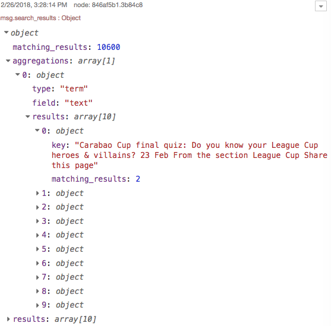

Configure the debug node to display msg.search_results. 

### Discovery Query Builder Node
The Discovery Query Builder Node can be used to build a query to be used by the Discovery Node.
Build the following flow.
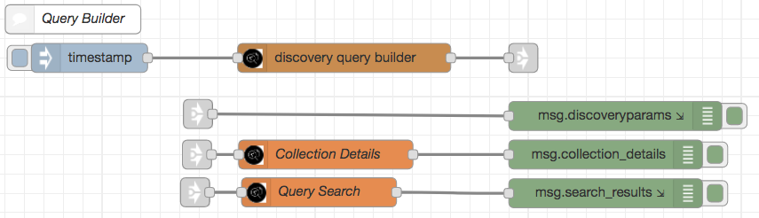

The Query Builder Node will pre-fill menu lists for Environment and Collection. 

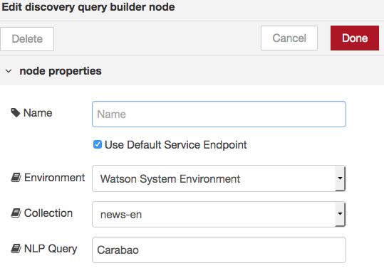

Select Watson System Environment and "news-en" for the collection, type your search argument(s) in the NLP Query. I have used the word "Carabao" but you can build a more sophisticated query.

The first debug node should be set to msg.discoveryparams, which will show you the parameters that will be used 

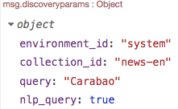

Change the method to be "Retrieve collections details", add "system" for the environment ID and "news-en" for the collection ID.

The next debug node should be set to msg.collection-details, which will show you what will be searched

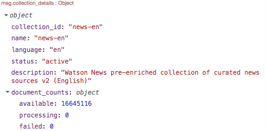

Change the method to be "Search in collections" and the number of documents to 5. All other params will be over-ridden by those set in Query Builder node.

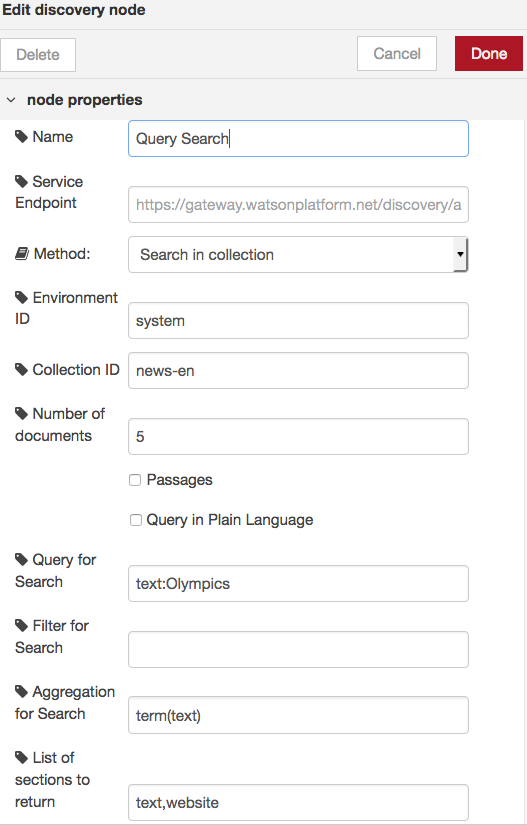

The final debug node should be set to msg.search_results, so that you can see the 5 results.

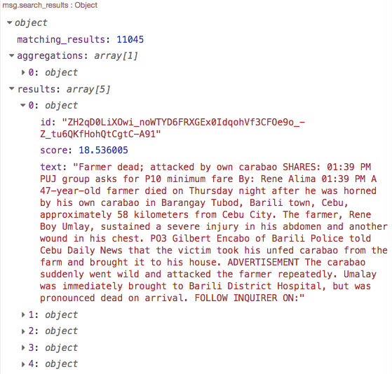

## Completed Flows
The complete flow is available at [Discovery-Lab](images/Discovery-Flows.json).
