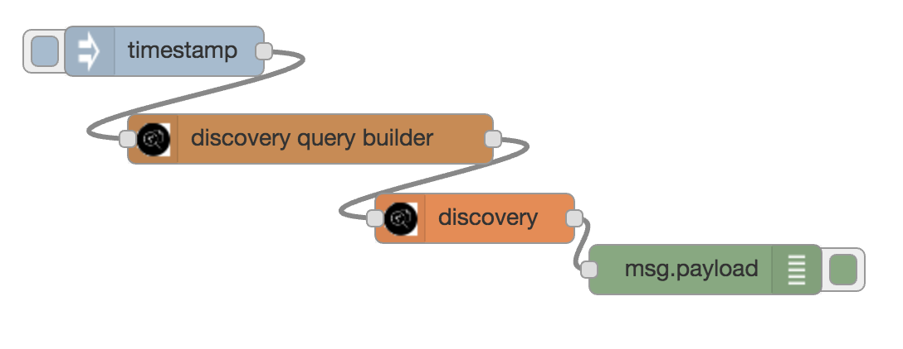
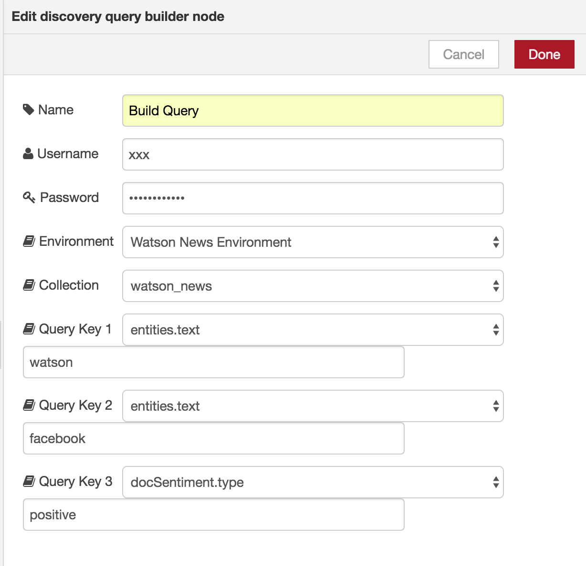
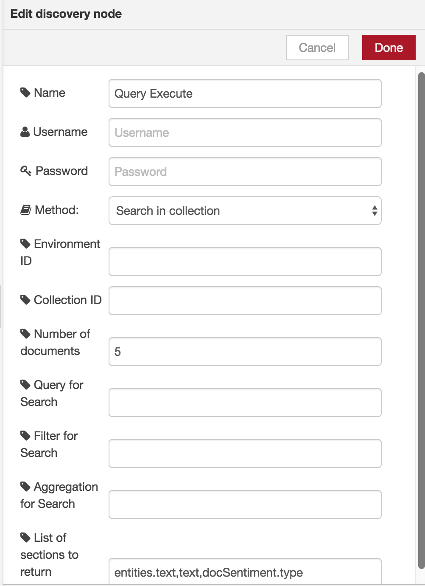
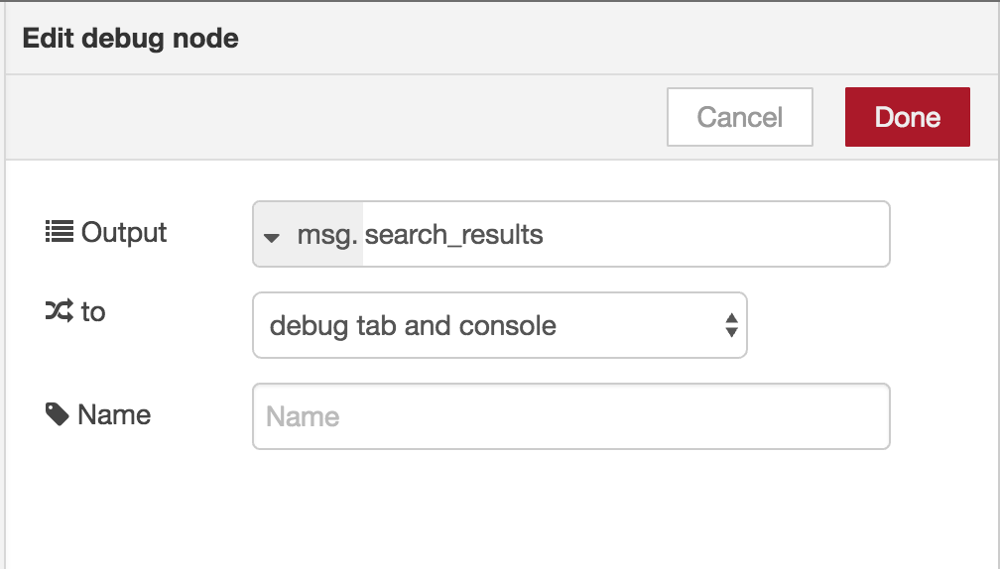

# Lab : Watson Discovery service with Node-RED

## Overview
The Discovery service makes it possible to prepare and search your unstructured data, in the similar way to the deprecated Alchemy News, the Discovery node allows you to create, manage and search the Watson system environment (News in English, Spanish and Korean), as well as any private collections.
Although the node can be used to create and manage your environments and collections, there is tooling provided in the IBM Cloud to create your own discovery environment. Follow the [Getting Started Guide](https://console.bluemix.net/docs/services/discovery/getting-started-tool.html#getting-started-with-the-tooling) to guide you through the process of launching the discovery service tooling, creating a collection, and adding content.

## Node-RED Watson Discovery nodes
There are 2 nodes used in these examples for the Watson Discovery service:
1.  Discovery Node - list environments, collections, configurations and run queries.
1. Query Builder node - fetches the searchable fields in the collection and allows you to set upto 3 query search items. 

  
## Discovery Flows construction
In this exercise, we will show you how to create several flows to list environments, collections, configurations and run a simple query. Then you will use the Query Builder node to prepare a query to be used by a Discovery Node.

### Environments Examples
Build the following flows to list existing environments and then extract the details of the environment.

The timestamp inject nodes are used purely to initiate the flows. Configure the Discovery Node to list environments.

Change the method to be "List existing environments" 

Configure the debug node to display msg.environments 

Change the method to be "List existing environments" 

Configure the debug node to display msg.environments_details

### Collections Examples
Build the following flows to list existing collections, within the system environment, and then extract the details for one of the collections.

The timestamp inject nodes are used purely to initiate the flows. Configure the Discovery Node to list environments.

Change the method to be "List existing collections" 

Configure the debug node to display msg.Ccollections 

Change the method to be "List existing environments" 

Configure the debug node to display msg.environments_details

**here**
### Discovery Query Builder Node
The Discovery Query Builder Node can be used to build a query to be used by the
Discovery Node.
Build the following flow.

Configure the Query Builder Node to search the News Environment, for the Entities
'Watson' and 'Facebook', with a docSentiment of 'positive'.

Configure the Discovery Node to limit the search to 5 items, and only the text.

Configure the debug node to display the search results.

## Completed Flows
The complete flow is available at [Discovery-Lab](discovery_lab.json).
