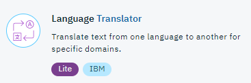

# Lab: Watson Language Translator with Node-RED

## Overview
The Language Translator service can identify language of a text or provides domain-specific translation between languages. Currently, three domains are available. For best results, a domain that matches the content to be translated should be chosen. The service includes a new Glossary-Based Customization function, which requires the Translator service to be connected via the advanced plan.

To get the latest on languages and domains supported please refer the latest documentation [Language Translator Documentation](https://console.bluemix.net/docs/services/language-translator/index.html)

### Prerequisites and setup
To get the Language Translator service credentials on IBM Cloud automatically filled-in by Node-RED, you should connect the Language Translator service to the Node-RED application in IBM Cloud.



Please refer to the [Node-RED setup lab](/introduction_to_node_red/README.md) for instructions.

## Node-RED Watson Language Translator nodes
The Node-RED  nodes provide a set of easy wrapper nodes to
* translate text within a domain or
* identify the language of a text

The service will also provide a confidence level of it's result.

## Watson Translator Flow Construction
In this exercise we have 5 basic flows using the Identify or Translator nodes broken into 3 sections
1. Translate text
2. Identify the language
3. Managing Custom Models
   * Create a custom model
   * Get the Status of a model
   * Delete an existing model

## Building the Translator flow


In this example some text (in English in this case) is injected, translated (to French) and put the result to the Debug tab. Add onto the canvas an inject node, language translator node and debug node. In the following screenshots you can see how the nodes are configured.

For the Inject node, in the payload, enter some text. You can use any text for this node. As an example:
`Hello I am Watson. I am very happy to translate you this message. Have a lovely day. Bye.`

**Tips** : use double quotes for terms you do not want to be translated by Watson.


For the language translator node, if you choose to use the example text then set the node parameters to:
* Mode = Translate
* Domains = Conversational
* Source = English
* Target = French

However if you have chosen text in a different language, or wish to translate into a different language, then edit the `source` and `target`.


Edit the debug node. As the translated text will be returned on msg.payload, make sure that you are looking for this in the Debug node.


This completes the first part of the flow. If you deploy and initiate the inject node, you will see the translation in the debug tab.

It is also possible to change the configuration dynamically, as the next steps will show:

### Dynamic Configuration


Start by duplicating the original inject node (copy + paste).

Add a function node and enter the following code:
```JAVASCRIPT
msg.srclang = 'en';
msg.destlang = 'es';
return msg;
```

This will translate your text from English to Spanish.


Link the function node back to the Language Translator node. Deploy and initiate the inject node.

You can also copy the code for the flow [here](language_translator-flow.json) and import it from clipboard into Node-RED:

## Building the Identify flow
This example will have 3 inputs with different languages. The language identify flow should look like


### en text inject node
Add an inject node to the canvas. Double-click the node, then change the name to identify the block. Change the input type to string and add your required text. For example:

> Give me one good reason why I should never make a change


### af text inject node
Add another inject node to the canvas. Double-click the node, then change the name to identify the block, change the input type to string and add your required text. As an example, Afrikaans text:

> As jy in die bende wil wees, moet jy cool wees, soos pappa!


### it inject node
Add another inject node to the canvas. Double-click the node, then change the name to identify the block, change the input type to string and add your required text. As an example, Italian text:

> Dovresti solo spegnere le dannate porte!


### Add the Language Identification node
Drag and drop a Language Identification node from the nodes palette, and wire it to your input node. It does not require any modification.

### Add first debug node
Drag and drop a debug node from the nodes palette, and wire it to your Language Identification node. Double-click the node, then change the output to msg.lang. This will give you primary language identified.

### Add second debug node
Drag and drop a debug node from the nodes palette, and wire it to your Language Identification node. Double-click the node, then change the output to msg.languages. This will give you an array of all languages identified in order of the confidence level


You can also copy the code for the flow [here](identify-flow.json) and import it from the clipboard into Node-RED.

--------------------------------------------------------------------------------------------------------------------------------
## Building flows to customize your domain
This example will show 3 flows to train a custom domain, get the status of a domain and delete custom models. The custom model flows should look like:


**Note**: If you want to do the training part of this lab, then make sure than you select the **Advanced plan** when creating the service. You can use your own data to create a custom dictionary, and a custom translation model in the Watson Language Translator API.

You can find out more about training a custom model and the required TMX file format from the documentation [here](https://console.bluemix.net/docs/services/language-translator/customizing.html).

#### Download a sample TMX file [here](https://raw.githubusercontent.com/watson-developer-cloud/node-red-labs/master/utilities/box_setup/glossary.tmx).

### Flow 1 - Create a model
Drag and drop an inject node on your palette, this node won't need any configuration as it is just here to start the flow. However, it is useful to name it `Create`.

#### Add a Dropbox node
**Note:** If you haven't done it yet, set up the Dropbox node as shown [here](https://github.com/watson-developer-cloud/node-red-labs/tree/master/utilities/dropbox_setup).

Once you have completed the Dropbox Setup guide, enter your credentials and the name of your TMX file (or path to your file if it's in a subfolder) in the node. your node configuration should look something like this:


#### Add a Language Translator node
To get the file from the Dropbox node and send it to the service. This node should be configured like so:
* Mode = Train
* Base Model = English to French
* File type = Forced Glossary


#### Add debug node
Drag and drop a debug node and set the output to msg.payload. This will show the model_id of the new file that has been created. You will need this if you want use the model elsewhere.

Deploy the application and initiate the flow. In the debug tab, make a note of the ID as you will need it in the next step.

### Flow 2 - Get the status of a model
**Note:** In order to get the status of a model you've sent for training, you'll need to provide its ID. This was output from the Training flow (previous step).

Drag and drop an inject node on your palette, this node won't need any configuration it is just here to start the flow. However it is useful to name it `Status`.

#### Add a Language Translator node
This node should be configured like so:
* Mode = Get Status
* Model ID = use the model-id from the training flow


#### Add debug node
Drag and drop a debug node and set it to msg.payload. This will give you the status of the model, it can be either:

 - training - Training is still in progress.
 - queued@<#> - Training has not yet started and the model is in the queue. The # indicates the number of your model in the queue.
 - error - Training did not complete because of an error.
 - available - Training is completed, and the service is now available to use with your custom translation model.

### Flow 3 - Delete a model
**Note:** In order to get the status of a model you've sent for training, you'll need to provide its ID. This was output from the Training flow that you should have noted.

Drag and drop an inject node on your palette, this node won't need any configuration, it is just here to start the flow. Again, it is useful to name it `Delete`.

#### Add a Language Translator node
This node should be configured
* Mode = Delete
* Model ID = use the model-id from the training flow


#### Add debug node
Drag and drop a debug node and let it set to msg.payload. This will only return an error if the model couldn't be deleted (modelid not found).

### Available Flows
You can also copy the code for the flows here and import them from clipboard into Node-RED:
- [Building the Translator flow](translator-flow.json)
- [Building the Identify flow](identify-flow.json)
- [Building flows to customize your domain](training-flow.json)

## Language Translator Documentation
To find more information on the Watson Language Translator underlying service, visit these webpages:
- [Language Translator Documentation](https://console.bluemix.net/docs/services/language-translator/index.html)
- [Language Translator API Documentation](https://www.ibm.com/watson/developercloud/language-translator/api/v2)
