# Lab : Watson Natural Language Classifier with Node-RED

**Note:** The Natural Language Classifier(NLC) service was not available in all regions, at the time of testing (1st March 2018).  For this exercise, please set your IBM Cloud region to **_US South_**

## Overview

The Natural Language Classifier is a service that needs to be trained. Take a look at the documentation and demo for the service to learn about it:

- [Overview](https://console.bluemix.net/docs/services/natural-language-classifier/natural-language-classifier-overview.html) of the Natural Language Classifier service.
- [Demo](https://natural-language-classifier-demo.ng.bluemix.net/) of the service.

## Node-RED Watson Natural Language Classifier Node

The Node-RED  node provides an easy wrapper node to use the NLC API. The node has 4 modes
* Classify
  * matches the input with the classifier and returns the top classes with a confidence rating.
* Train
  * creates a classifier from the input training data. The training data should be a String or String Array.
* Remove
  * deletes a classifier
* List
  * produces an array of available classifiers

## Creating and populating the service on IBM Cloud

Create an instance of the service in IBM Cloud by selecting the **Natural Language Classifier** in the IBM Cloud catalog.

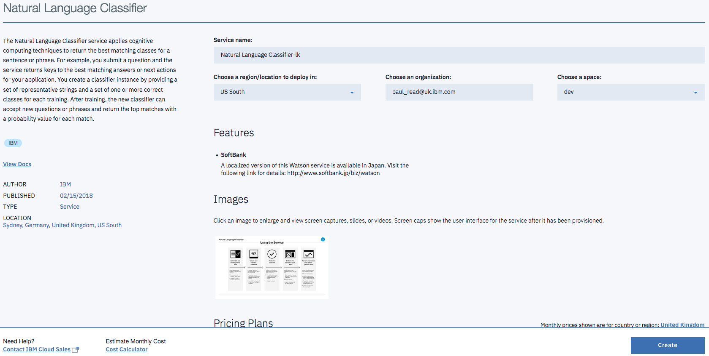

Click **Create** to instantiate your instance of the service. Once created, return to the Dashboard and click on the service in the **Cloud Foundary services**

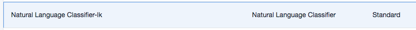

On the service dashboard, click **Access the beta toolkit**.

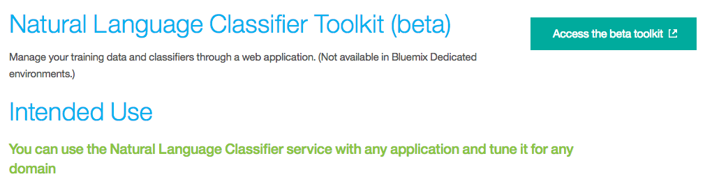

Log in to IBM Cloud to load your instance of the Natural Language Classifier and you will be asked to confirm that you allow the toolkit to access your instance:

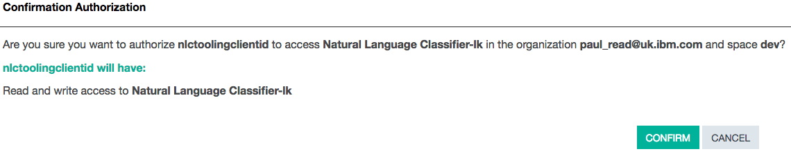

Click **Training Data** and then follow the steps as documented in the [documentation](https://console.bluemix.net/docs/services/natural-language-classifier/tool-overview.html).

Train the Natural Language Classifier service with the sample CSV file from the documentation.

You need a Classifier ID, which you can find by clicking **Classifiers**:

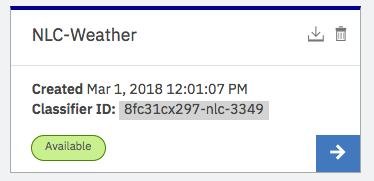

Make a note of the Classifier ID, it will be used throughout the rest of the exercise.

## NLC Flows construction

### Connecting to an existing service on IBM Cloud

**You can download the [flow](NLC-Status.json) for this part of the lab.**

In this part of the lab, you will use the Natural Language Classifier service that you instantiated in IBM Cloud, earlier in the lab .

You should have created a Node-RED application by using the Node-RED Starter Community boilerplate in IBM Cloud.

Using standard Node-RED nodes, you will :

- Check the status of the classifier,
- Ask a question of the service via calls in Node-RED.

Open your Node-RED flow editor, then drag two **Inject** nodes, two **Function** nodes, one **http request** node and one **Debug** node onto the palette. Join them as shown in this image:

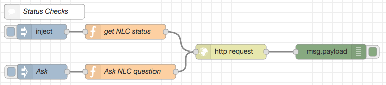

Double-click the top **Inject** node, select the string option, and leave it `blank`:

Double-click the top **Function** node:
- Name the node `get NLC status`.
- Enter the following code. **Important:** Replace `D385B2-nlc-530` with your classifier ID.

    `msg.url="https://gateway.watsonplatform.net/natural-language-classifier/api/v1/classifiers/D385B2-nlc-530";`

The classifier ID is hardcoded in this example request (msg.url="https://gateway.watsonplatform.net/natural-language-classifier/api/v1/classifiers/**_D385B2-nlc-530_**").

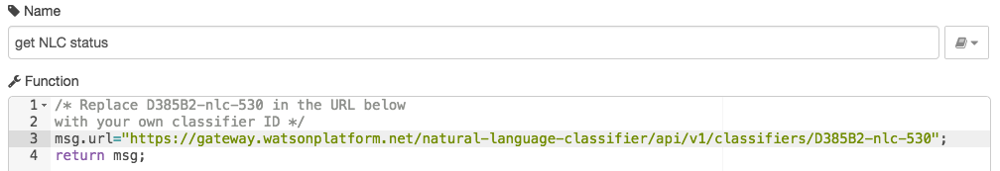

Back in IBM Cloud, open your application and navigate to the Natural Language Classifier service.

Go to your service instance and click **Show Credentials**:

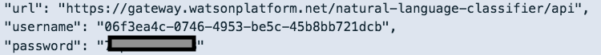

Double-click the **http request** node and enter your service credentials for your Natural Language Classifier instance in the node:

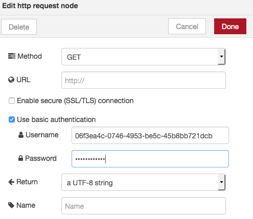

Click **OK** to close and then **Deploy** the app.

Click **Inject node** and see if the Natural Language Classifier service is available in the "debug" tab:

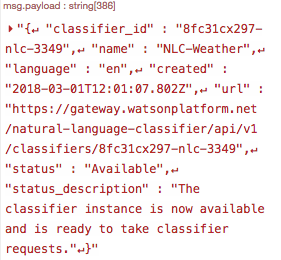

Double-click the other **Function** node and paste the following code. Replace `D385B2-nlc-530` with your classifier ID:

        msg.url="https://gateway.watsonplatform.net/natural-language-classifier/api/v1/classifiers/D385B2-nlc-530/classify?text=" + encodeURI(msg.payload);

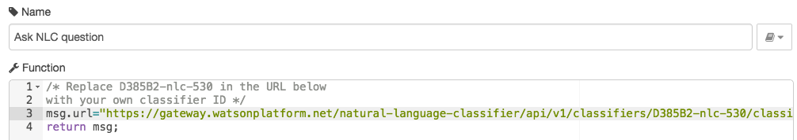

Double-click the second **Inject** node. Change the payload to `string` and enter the question, `Is it hot?`:

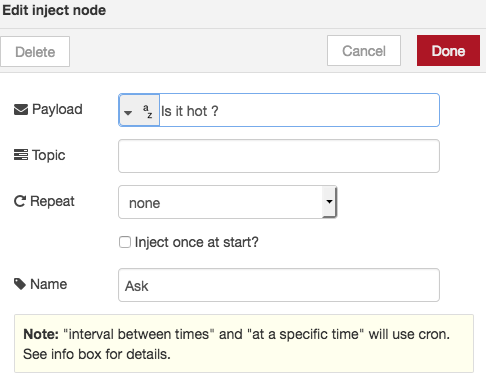

Click **OK** to close and then **Deploy** the app.

Click the **Inject** node and look at the contents of the "debug" tab:

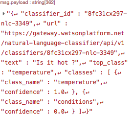

### Using Natural Language Classifier from Node-RED

**You can download the [flow](NLC-Usage.json) for this part of the lab.**

#### Training a Classifier

Drag a **Natural Language Classifier (NLC)** node to the palette. Double click and set the **Mode** to `train`, and give it a name:

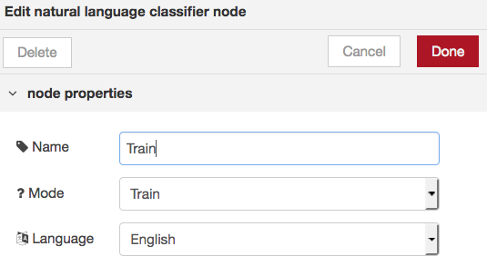

Make sure that you have both the **Dropbox** and **Box** Node-RED nodes added to your application. If you haven't, see -> [Dropbox nodes](https://github.com/watson-developer-cloud/node-red-labs/tree/master/utilities/dropbox_setup).

Make sure that you uploaded file weather_data_train.csv to your Dropbox or Box locations (a copy of the file is here -> [weather csv file](weather_data_train.csv)).

Add the right **Dropbox** node to the palette:

Add your **Dropbox** node credentials and click **Add**:

Add the weather_data_train.csv file to the Dropbox node settings:

Join this to the **NLC** node, and also introduce an **Inject** node. This flow gets the file from Dropbox and feeds it into the NLC node.

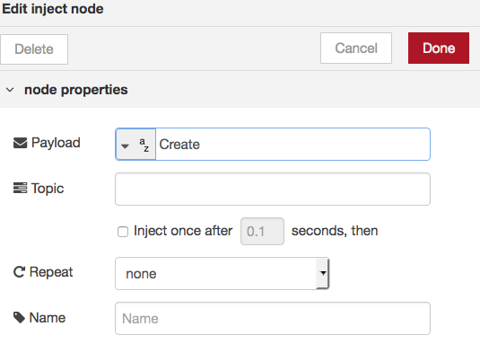

Also add a **Debug** node to the output of the NLC node and **Deploy**.

When you initiate the flow, the ID of the classifier is returned in the "debug" tab of Node-RED. In the following example the ID is **cd6374x52-nlc-1515**:

**Note:** The classifier is now being trained, which can take some time (30-50 mins).

To see the status of the training, go to the Natural Language Classifier service of your app and click the service:

You should be presented with a page with the **Access beta toolkit** button:

Click **Access beta toolkit**. You should see a list of classifiers that have a status of `Training` or `Available`. You need to be signed in so the Toolkit can access your classifiers.

Copy a classifier ID so that you can test the Remove(Delete) functionality later on in this lab:

#### Listing all Classifiers

Drag a **Natural Language Classifier (NLC)** node to the palette. Double click to set the **Mode** to `List` and then give it a name:

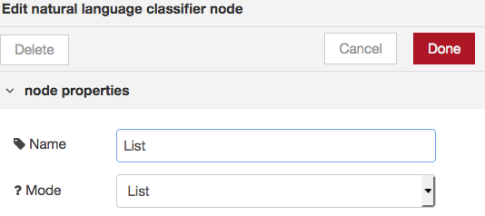

Add an **Inject** node to initiate this flow.

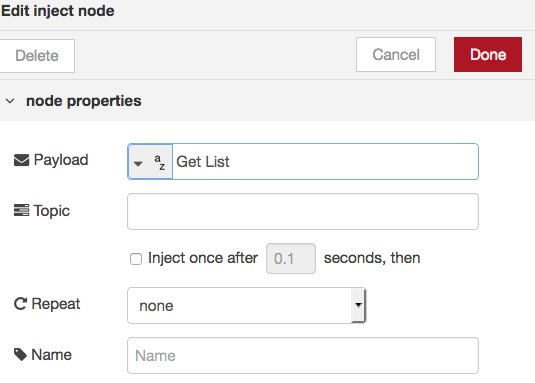

Also add a **Debug** node to the output of the NLC node and **Deploy**.

When you initiate the flow, an array of the classifiers is returned in the "debug" tab of Node-RED. In the following example one of the IDs is **8fc193x296-nlc-3488**:

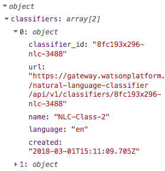

#### Classifier Questions

Drag a **Natural Language Classifier (NLC)** node to the palette. Double click to set the **Mode** to `Classify`, then add a validate Classifier ID and give it a name:

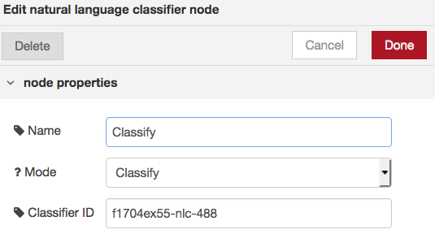

Add 2 **Inject** nodes to initiate this flow. The first node will inject the question "Is it hot?"  

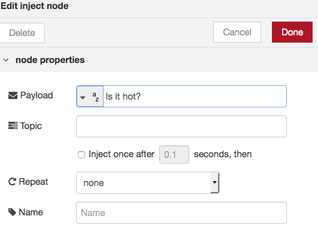

The second inject node will inject the question "Is it humid?"

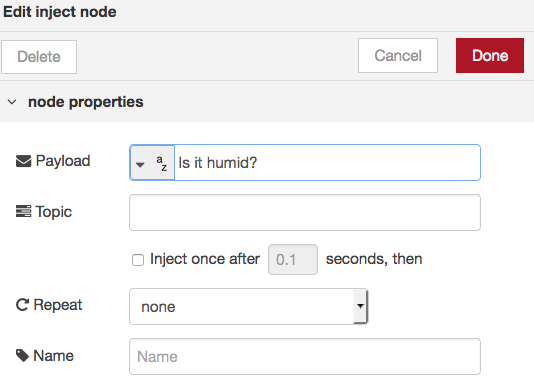

Also add a **Debug** node to the output of the NLC node and **Deploy**.

If you initiate the flow with the "Is it hot?" question, an array of the classes is returned in the "debug" tab of Node-RED. The array will be in order of the confidence rating

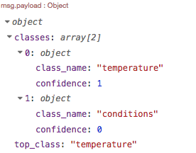

If you initiate the flow with the "Is it humid?" question, the "debug" tab of Node-RED will show results similiar to.

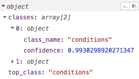

#### Remove(Delete) a Classifier

Drag a **Natural Language Classifier (NLC)** node to the palette. Double click to set the **Mode** to `Remove` and then give it a name:

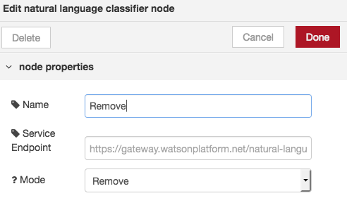

Add an **Inject** node to initiate this flow.

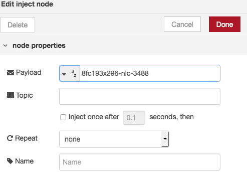

Also add a **Debug** node to the output of the NLC node and **Deploy**.

When you initiate the flow, if it is successful then an empty dataset returned in the "debug" tab of Node-RED.

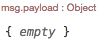

## Complete Flows
You can download the completed [flows](NLC-Complete.json) to compare against what you created.

## Natural Language Classifier Documentation
To find more information on the Watson Natural Language Classifier underlying service, visit these webpages:
- [NLC Documentation](https://console.bluemix.net/docs/services/natural-language-classifier/getting-started.html#natural-language-classifier)
- [NLC API Documentation](https://www.ibm.com/watson/developercloud/natural-language-classifier/api/v1/curl.html?curl)
