#Natural Language Classifier

**Note:** For this exercise, make sure that your IBM Cloud region is set to **_US South_**

The Natural Language Classifier is a service that needs to be trained. Take a look at the documentation and demo for the service to learn about it:

- [Overview](https://console.bluemix.net/docs/services/natural-language-classifier/natural-language-classifier-overview.html) of the Natural Language Classifier service.
- [Demo](https://natural-language-classifier-demo.ng.bluemix.net/) of the service.
- [API reference](http://www.ibm.com/watson/developercloud/natural-language-classifier/api/v1/?node#introduction), which includes helpful information about curl and the SDKs.

##Creating and populating the service on IBM Cloud
Create an unbound instance of the service in IBM Cloud.

Select **Natural Language Classifier** in the IBM Cloud catalog.

Click **Create** to instantiate your instance of the service:


On the service dashboard, click **Access the beta toolkit**.
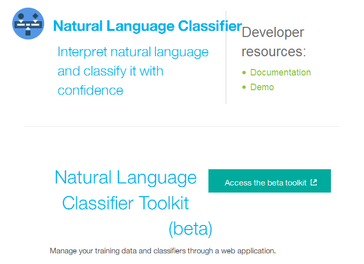

Log in to IBM Cloud to load your instance of the Natural Language Classifier.
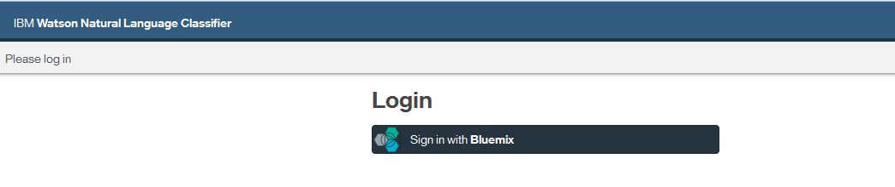

Confirm that you allow the toolkit to access your instance:
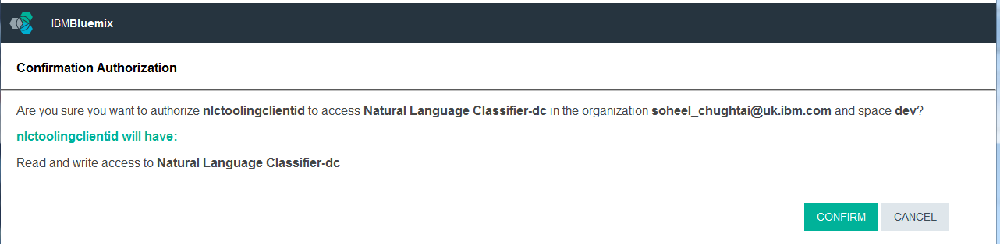

Click **Training**, and then follow the steps as documented in the [documentation](https://console.bluemix.net/docs/services/natural-language-classifier/tool-overview.html).

Train the Natural Language Classifier service with the sample CSV file:

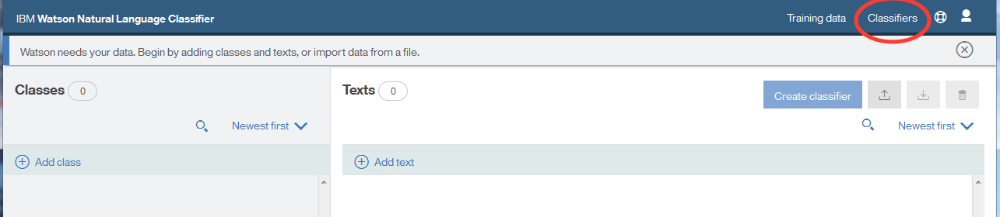

You need a Classifier ID, which you can find by clicking **Classifiers**:

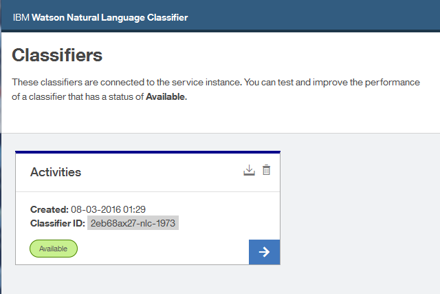

##Connecting to an existing service on IBM Cloud

**Tip:** You can download the [flows](nlc_flows.json) for this part of the lab.

In this lab, we assume (for now) that you created an instance of the Natural Language Classifier service in IBM Cloud. 

We also assume that you created a Node-RED application by using the Node-RED Starter Community boilerplate in IBM Cloud.

These are your next steps:

- Check the status of the classifier,
- Ask a question of the service via calls in Node-RED.

Open your Node-RED flow editor, then drag two **Inject** nodes, two **Function** nodes, one **http request** node and one **Debug** node. 

Join them as shown in this image:
 
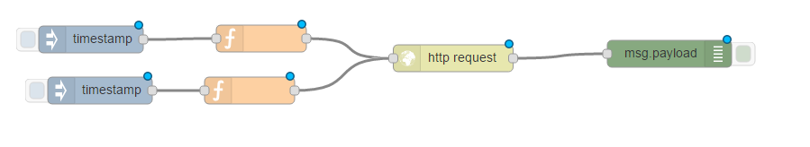

Notice the blue icons next to each node that indicate that further configurations are needed on each node.

Double-click the top **Inject** node, select the string option, and leave it `blank`:


Double-click the top **Function** node:
- Name the node `get NLC status`.
- Enter the following code. **Important:** Replace `D385B2-nlc-530` with your classifier ID.

    `msg.url="https://gateway.watsonplatform.net/natural-language-classifier/api/v1/classifiers/D385B2-nlc-530";`

The classifier ID is hardcoded in this example request (msg.url="https://gateway.watsonplatform.net/natural-language-classifier/api/v1/classifiers/**_D385B2-nlc-530_**"). When the official Node-RED NLC nodes are created, there will be some other mechanism (to be decided) to enter the classifier ID.


Back in IBM Cloud, open your application and navigate to the Natural Language Classifier service.

Go to your service instance and click **Show Credentials**:


```json
{
  "natural_language_classifier": [
	{
	  "name": "ibmwatson-nlc-classifier",
	  "label": "natural_language_classifier",
	  "plan": "standard",
	  "credentials": {
		"url": "https://gateway.watsonplatform.net/natural-language-classifier/api",
		"username": "306c5772-63d0-40f4-b50d-4de334a00243",
		"password": "WHAT EVER YOUR PASSWORD IS"
	  }
	}
  ]
}
```

Copy your username and password values.

Double-click the **http request** node and enter your service credentials for your Natural Language Classifier instance in the node:


Click **Deploy**.

Click **Inject node** and see if the Natural Language Classifier service is available in the "debug" tab:

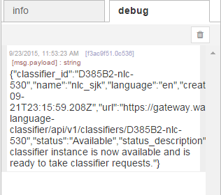

Double-click the other **Function** node and paste the following code. Replace `D385B2-nlc-530` with your classifier ID:

        msg.url="https://gateway.watsonplatform.net/natural-language-classifier/api/v1/classifiers/D385B2-nlc-530/classify?text=" + encodeURI(msg.payload);
    


Double-click the second **Inject** node. Change the payload to `string` and enter the question, `Is it hot?`:


Click  **Deploy**

Click the button of the **Inject** node and look at the contents of the "debug" tab:


##Using Natural Language Classifier from Node-RED

Using your existing boilerplate, drag a **Natural Language Classifier (NLC)** node to the palette. 

Double click and set the **Mode** to `train`, and give it a name:

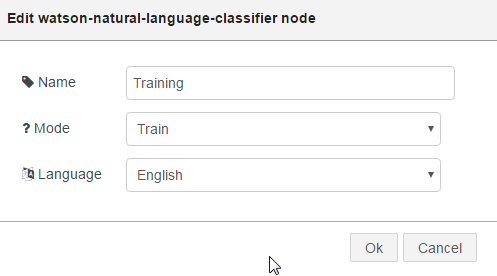

Make sure that you have both the **Dropbox** and **Box** Node-RED nodes added to your application. If you haven't, see -> [Dropbox nodes](https://github.com/watson-developer-cloud/node-red-labs/tree/master/utilities/dropbox_setup).

Make sure that you uploaded file weather_data_train.csv to your Dropbox or Box locations (a copy of the file is here -> [weather csv file](weather_data_train.csv)).

Add the right **Dropbox** node to the palette:

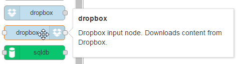

Add your **Dropbox** node credentials and click **Add**:

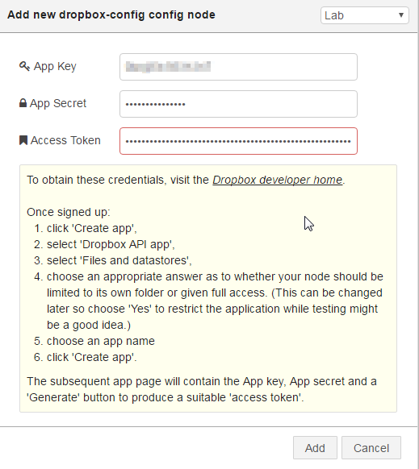

Add the weather_data_train.csv file to the Dropbox node settings:

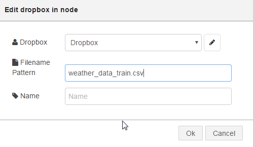

Join this to the **NLC** node, and also introduce an **Inject** node. This flow gets the file from Dropbox and feeds it into the NLC node.

Also add a **Debug** node to the output of the NLC node:

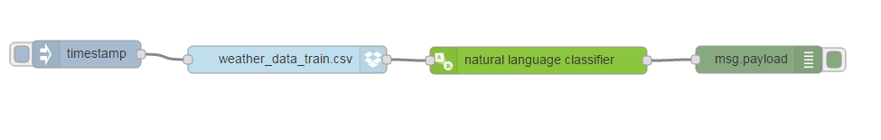

The ID of the classifier is returned in the "debug" tab of Node-RED. In the following example the ID is **cd6374x52-nlc-1515**:

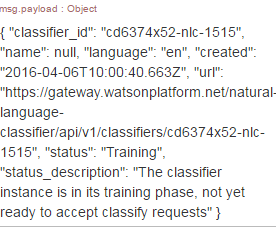

**Tip:** The classifier is now being trained, which can take some time (30-50 mins). There is currently (April 2016) no way to know when the training is finished.  Some loop code can been written in Node-RED which polls the service to determine when the service is available, but this is not part of this lab.

To see the status of the training, go to the Natural Language Classifier service of your app and click the service:

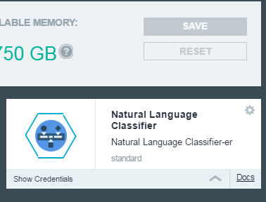

You should be presented with a page with the **Access beta toolkit** button:

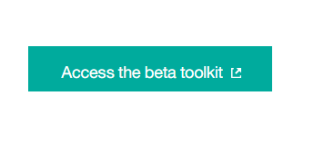

Click **Access beta toolkit**. You should see a list of classifiers that have a status of `Training` or `Available`. You need to be signed in so the Toolkit can access your classifiers.

Copy a classifier ID so that you can test the deletion functionality later on in this lab:

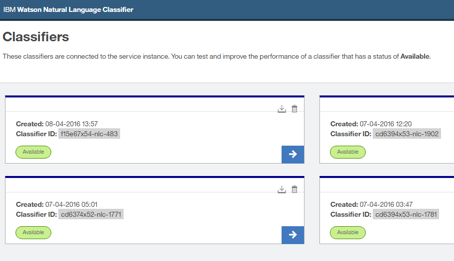

Add 4 Inject nodes, 3 Classifier nodes and 3 debug nodes:

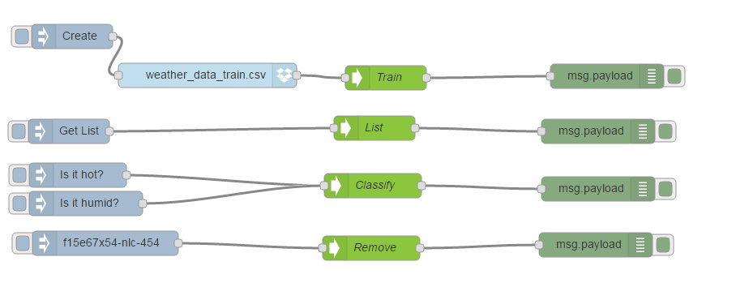

Change the **Mode ** of the first new classifier node to `List`:


Change the next classifier node to `Classify` and the final one to `Remove`.

**NOTE**: For the **Remove Inject** node, change the **Inject** string to a classifier that exists (you noted one down earlier).

Click the **Get List Inject** node. In the "debug" tab you see a list of classifiers.

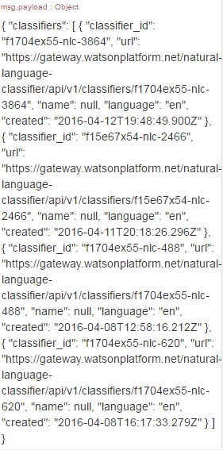

Click the **Is it hot?** node. In the "debug" tab, you see (as before) the confidence level that the classifier returns.

Click the **Inject** node connected to the **Remove NLC** node.  **Important:** when clicked it will delete the classifier.

Download the completed [flows](nlc_flows_with_nlc_service.json) to compare against what you created.
