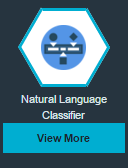
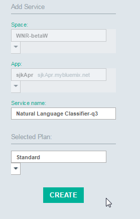
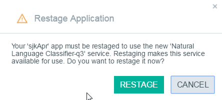

#Natural Language Classifier
**Note** For this exercise please check that your Bluemix region is set to US South

The Natural Language Classifier (NLC) is a service that can be trained and it 
is useful to describe how to create the steps to use it since it offers some cognitive learning features. 

Overview of NLC -> [Overview](http://www.ibm.com/smarterplanet/us/en/ibmwatson/developercloud/doc/nl-classifier/)
 
Standard NLC Demo -> [Demo](http://natural-language-classifier-demo.mybluemix.net)

 Very useful API documentation which is sometimes hard to find -> [Useful API docs for curl, Node and Java](https://www.ibm.com/smarterplanet/us/en/ibmwatson/developercloud/natural-language-classifier/api/v1/?node#introduction)

##Creating and populating a NLC Service on Bluemix

Within Bluemix you can create an **unbound instance** of the NLC Service, by selecting Natural Language Classifier
in the Bluemix catalog.

Click on the CREATE button to instantiate your unbound instance of the Natural Language Classifier service.

On the service description page click on the "Access the toolkit" button. 

Sign on to Bluemix to allow the toolkit to access your instance of the Natural Language Classifier.

Confirm authorization for the toolkit access your instance.

Click on Training and then follow the steps as documented in [NLC toolkit](https://www.ibm.com/smarterplanet/us/en/ibmwatson/developercloud/doc/nl-classifier/tool_examples.shtml).  

Train the NLC Service with the sample CSV file.

You will need a Classifier ID, this can be obtained by clicking the Classifiers button and the Classifier ID is shown.

##Connecting to a existing NLC Service on Bluemix
 
In this lab we will assume (for now) that you have created a NLC Service in Bluemix and now wish to (a) check it's status and (b) ask it a question via calls in Node-RED.  We also assume you have created a Node-RED application using the Node-RED Starter Community boilerplate in Bluemix.

Open your Node-RED flow editor and drag/drop an two Inject nodes, two Function nodes, one http request node and one Debug node and join up as shown below  :
 

Notice the blue icons next to each node which indicates further configurations are needed on each node.

Double-click the top Inject node and select Blank from the option

Double-click the top Function node and enter the following code and name the node "get NLC status".  

NOTE : the NLC classifier ID has been hard coded in the request (msg.url="https://gateway.watsonplatform.net/natural-language-classifier/api/v1/classifiers/**D385B2-nlc-530**") just for speed - when the official Node-RED NLC nodes are created then there will be some other mechanism (to be decided) on how the NLC classifier ID is used/entered.  

    `msg.url="https://gateway.watsonplatform.net/natural-language-classifier/api/v1/classifiers/D385B2-nlc-530";`

Go to Bluemix and open your application and navigate to the NLC Service.  Go to your NLC Service and click on Show Credentials - you have already carried this out in the section above and is just repeated here for reference.

    {
      "natural_language_classifier": [
        {
          "name": "ibmwatson-nlc-classifier",
          "label": "natural_language_classifier",
          "plan": "standard",
          "credentials": {
            "url": "https://gateway.watsonplatform.net/natural-language-classifier/api",
            "username": "306c5772-63d0-40f4-b50d-4de334a00243",
            "password": "WHAT EVER YOUR PASSWORD IS"
          }
        }
      ]
    }

Make a note of the username and password values.  Double-click the HTTP Request node and enter your credentials for your NLC Service in the node 

Click the Deploy button.

Click on the Inject node button and see if you are returned in the Debug Tab the reply that the NLC Service is available.

Double-click the other Function node and paste the following code :

        msg.url="https://gateway.watsonplatform.net/natural-language-classifier/api/v1/classifiers/D385B2-nlc-530/classify?text=" + encodeURI(msg.payload);
    

Double-click the second Inject node and change the payload to String and enter the question "Is it hot ?"

Click the Deploy button

Click the button of the Inject node and look at the contents of the Debug Tab

##Using the NLC Service from Node-RED

First bind a NLC Watson Service to your Application

Select your Application and click the Natural Language Classifier Watson Service

Click Create

Click Restage

Once the Application has started go back to your palette and drag a Natural Language Classifier (NLC) node to the palette.  Double click and set the Mode to **Training** and give it a name.

We assume that you have enabled your Application to have the both the Dropbox and Box Node-RED nodes added to your Application - if you haven't then see -> ???.  Make sure you have uploaded file weather_data_train.csv to your Dropbox or Box locations (copy of the file is here -> [weather csv file](weather_data_train.csv).

Add the right Dropbox node to the palette

Add your Dropbox node credentials and click Add

Add the weather_data_train.csv file to the Dropbox node settings

Join this to the NLC node and also introduce a Inject node to thus be able to start Dropbox to get the file and feed it into the NLC node, also add a Debug node to the output of the NLC node

The ID of the NLC is returned in the Debug Tab of Node-RED - in the example below this is **cd6374x52-nlc-1515**

NOTE : the NLC is now being trained - this could take some time.  There is currently (April 2016) no method of being able to know when the training is finished.  As an example some loop code has been written in Node-RED which poles the NLC Service to determine when the service has completed the training and is in Available mode - this is shown below and including in the copy of the flow but will not be explained in detail.

To see the status of the training then go to the NLC Service of your App and click on the Service

You should be presented with a page which has a "Access beta toolkit" button

Click the button and you should see a list of NLC classifiers which are in Traing or Available mode.

The flows for this lab are here -> [flows](nlc_flows.json)
