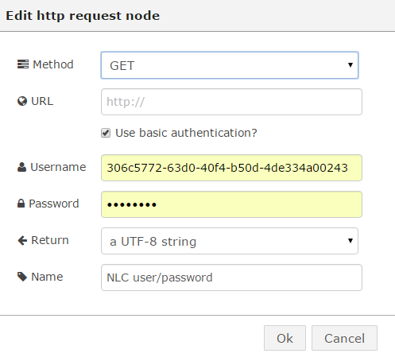

#Natural Language Classifier (beta, no Node-RED node exists)

The Natural Language Classifier (NLC) is a beta Service (as of Sept 2015) but it would be useful to describe how to create the steps to use it since it offers some cognitive learning features.

Overview of NLC -> [Overview](http://www.ibm.com/smarterplanet/us/en/ibmwatson/developercloud/doc/nl-classifier/)
 
Standard NLC Demo -> [Demo](http://natural-language-classifier-demo.mybluemix.net/?cm_mc_uid=84253509386814425332224&cm_mc_sid_50200000=1442982326)

 Very useful API documentation which is sometimes hard to find -> [Useful API docs for curl, Node and Java](https://www.ibm.com/smarterplanet/us/en/ibmwatson/developercloud/natural-language-classifier/api/v1/?node#introduction)

##Creating and populating a NLC Service on Bluemix

Within Bluemix you can create an unbound instance of the NLC Service but this comes some charges.

If you go here -> [Toolkit](http://www.ibm.com/smarterplanet/us/en/ibmwatson/developercloud/doc/nl-classifier/tool_overview.shtml) and then scroll to "Deploy the toolkit to Bluemix from the ibmwatson-nlc-groundtruth project in the Bluemix DevOps Services. " and click [ibmwatson-nlc-groundtruth](https://hub.jazz.net/project/wdctools/ibmwatson-nlc-groundtruth/overview?cm_mc_uid=84253509386814425332224&cm_mc_sid_50200000=1442982326).  Do NOT try the "Build and Deploy" option in the top right of the screen but scroll down to the README.md body and click on the "Deploy to Bluemix" button

Click Login and pick a Region/Organisation/Space for the Service to be created in.

Wait till the application has been deployed and started

Go to the Toolkit application and click Show Credentials for the Natural Language Classifier service that is bound to your toolkit app.  Copy the values of the username and password parameters.

Go to the Toolkit application and enter the username and password that you obtained from the Credentials - these are NOT your Bluemix username/password but the username/password OF the NLC Service.

Click on Training and then follow the steps as documented in [NLC toolkit](http://www.ibm.com/smarterplanet/us/en/ibmwatson/developercloud/doc/nl-classifier/tool_overview.shtml).  Train the NLC Service with the sample CSV file.

You will need a Classifier ID, this can be obtained by clicking the Classifiers button and the Classifier ID is shown.

##Connecting to a existing NLC Service on Bluemix
 
In this lab we will assume (for now) that you have created a NLC Service in Bluemix and now wish to (a) check it's status and (b) ask it a question via calls in Node-RED.  We also assume you have created a Node-RED application using the Node-RED Starter Community boilerplate in Bluemix.

Open your Node-RED flow editor and drag/drop an two Inject nodes, two Function nodes and one Debug node and join up as shown below  :
 

Notice the blue icons next to each node which indicates further configurations are needed on each node.

Double-click the top Inject node and select Blank from the option

Double-click the top Function node and enter the following code and name the node "get NLC status".  

NOTE : the NLC classifier ID has been hard coded in the request (msg.url="https://gateway.watsonplatform.net/natural-language-classifier/api/v1/classifiers/**D385B2-nlc-530**") just for speed - when the official Node-RED NLC nodes are created then there will be some other mechanism (to be decided) on how the NLC classifier ID is used/entered.  

    `msg.url="https://gateway.watsonplatform.net/natural-language-classifier/api/v1/classifiers/D385B2-nlc-530";`

Go to Bluemix and open your application and navigate to the NLC Service.  Go to your NLC Service and click on Show Credentials - you have already carried this out in the section above and is just repeated here for reference.

    {
      "natural_language_classifier": [
        {
          "name": "ibmwatson-nlc-classifier",
          "label": "natural_language_classifier",
          "plan": "standard",
          "credentials": {
            "url": "https://gateway.watsonplatform.net/natural-language-classifier/api",
            "username": "306c5772-63d0-40f4-b50d-4de334a00243",
            "password": "WHAT EVER YOUR PASSWORD IS"
          }
        }
      ]
    }

Make a note of the username and password values.  Double-click the HTTP Request node and enter your credentials for your NLC Service in the node 

Click the Deploy button.

Click on the Inject node button and see if you are returned in the Debug Tab the reply that the NLC Service is available.

Double-click the other Function node and paste the following code :

        msg.url="https://gateway.watsonplatform.net/natural-language-classifier/api/v1/classifiers/D385B2-nlc-530/classify?text=" + encodeURI(msg.payload);
    

Double-click the second Inject node and change the payload to String and enter the question "Is it hot ?"

Click the Deploy button

Click the button of the Inject node and look at the contents of the Debug Tab

##Using the NLC Service from Node-RED (using Node-RED node : TBC)

The flows for this lab are here -> [flows](nlc_flows.json)
