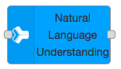
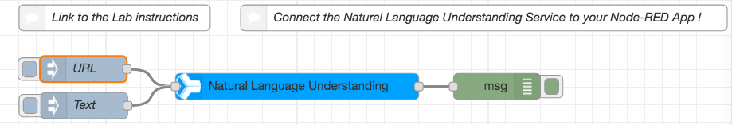
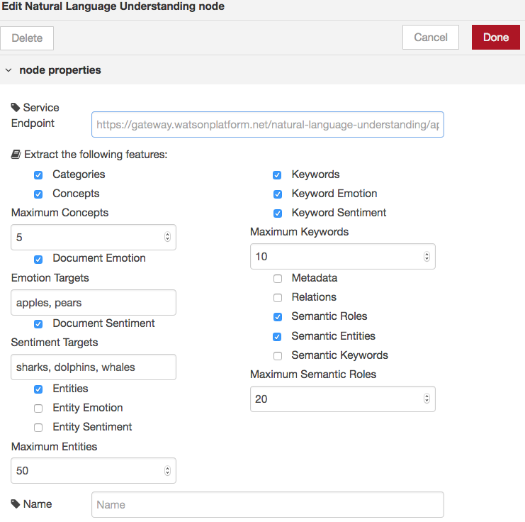
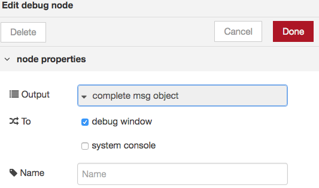
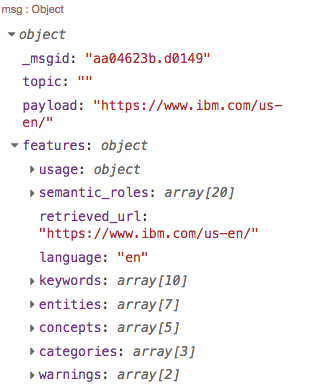
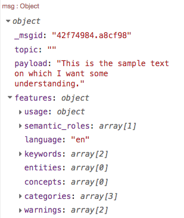

# Lab : Watson Natural Language Understanding (NLU) service with Node-RED

## Overview
Natural Language Understanding enables advanced text analysis through natural language processing. The service analyzes unstructured text to extract metadata such as entities, general concepts, keywords, categories, relations, sentiment, and emotion. With custom annotation models developed using [Watson Knowledge Studio] (https://www.ibm.com/watson/services/knowledge-studio/), you can further customize the service to identify domain-specific entities and relations in your content.
## Node-RED Watson  NLU node
The Node-RED  provides an easy to use wrapper that you can extract meta-data from content. You can analyse external URLs, HTML files or text content.

## Watson NLU Flow Construction

In this exercise we will show you how to use the node to extract data from a webpage and simple text. 

### Prerequisites and setup

To get the NLU service credentials on IBM Cloud automatically filled in by Node-RED, you should connect the NLU service to the Node-RED application.

Please refer to the [Node-RED setup lab](/introduction_to_node_red/README.md) for instructions. 

## Building the Flow

### Required Nodes
Add the following nodes from the palette to your flow canvas. 

"	Two Inject nodes.
"	A Natural Language Understanding node.
"	 A Debug node.

### Flow Wiring
Wire the nodes together.

### Node configuration
The first inject node will be used to inject a url into the flow. The example uses the standard [IBM US site https://www.ibm.com/us-en/](https://www.ibm.com/us-en/)

The second inject node will be used to inject text into the flow. Any text can be used,  I have used :
¢	This is the sample text on which I want some understanding.

Configure the Natural Language Understanding node for the service features that you want to detect. As you select the items you require the node menu will expand with additional options.

Configure the debug node to show the complete msg object.

### Trying your flow
The output from the URL inject should look like

and the output from the Text inject should look like

## Flow Source

The complete flow is available at [flows](nlu_flow.json)

## NLU Documentation
To find out more information on the Watson Natural Language Understanding service visit these webpages: 
- [NLU Documentation] (https://console.bluemix.net/docs/services/natural-language-understanding/index.html) of the Natural Language Understanding service.
- [NLU API Documentation] (  https://www.ibm.com/watson/developercloud/natural-language-understanding/api/v1/).
