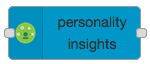
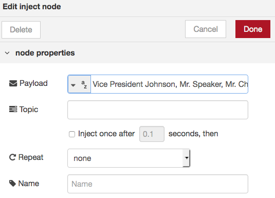
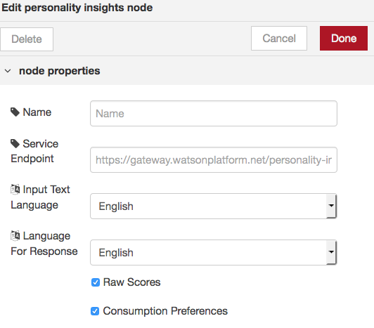
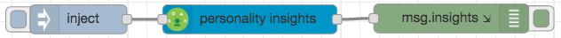
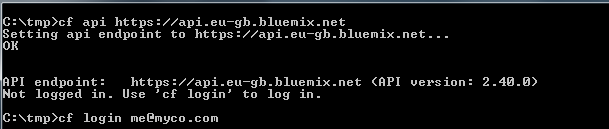
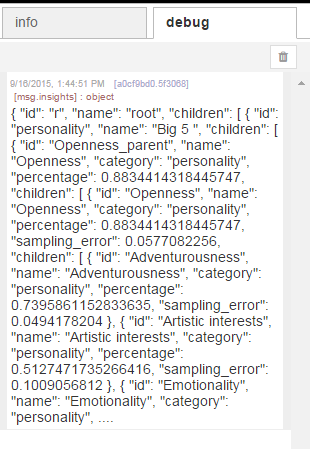

# Lab : Watson Personality Insights service with Node-RED
## Overview
The IBM Watson Personality Insights service uses linguistic analytics to infer cognitive and social characteristics, including Big Five, Values, and Needs, from communications that the user makes available, such as email, text messages, tweets, forum posts, and more, go to personal-insights for a full description and demo
The objective is to send the Personality Insights node the same data as used for the standard web demo and to show the JSON profile object and its values match those of the demo.
## Node-RED Watson Personality Insights (PI) node
The PI node   is a wrapper for the Watson Personality Insights API. It will accept text on the msg.payload and produce a json profile object.
## Personality Insights flow construction
In this exercise we will create a very simple flow to inject a text into the node and produce the json profile object. 
Drag an inject node to the palette. Double-click the inject node and change Payload to string.
Go to sample file and open the file and paste the text to the blank field below the Payload field (this is the same text that is used in the standard web demo).

Drag the personality insights node to the palette. Double-click the inject node to open, you are able to change both the input and response languages, if you wish. Always check the Language Support documentation for the latest information on Languages. You can also get additional results by checking the tick-boxes for Raw Scores and Consumption Preferences:
- Raw Scores indicates whether a raw score in addition to a normalized percentile is to be returned for each characteristic; raw scores are not compared with a sample population. 
 - Consumption Preferences indicates whether consumption preferences are to be returned with the results. 
 
Drag a debug node to the palette. Double-click the debug node and replace ‘payload’ to ‘insights’. Also make sure that **debug** and **console** are selected in the To field.

Join them as shown below
 
## Optional Steps if you want to see logs on the cloud
You must have the Cloud Foundry Command Line Interface installed. The code can be found on the Cloud Foundry Github repository, the installation and usage documentation is available on-line.
•	Open a command line on your laptop and login to IBM Cloud with your username/password. Making sure that you are connecting to the appropriate datacenter for your application, each datacenter has a unique url for 
•	US South - https//api.ng.bluemix.net 
•	The UK - https//api.eu-gb.bluemix.net
•	Germany - https//api.eu-de.bluemix.net
•	Sydney - https//api.au-syd.bluemix.net

•	Once you are logged in type 
```cf logs *app_name*```
 where app_name is the name of your application.
•	Return to the Node-RED palette.
•	Click the Deploy button
•	Click on the debug tab to the top right of the palette.
•	Click the button next to the inject node.
You will see an output in the debug tab starting with '{ [msg.insights] : object }' followed by the JSON object. **NOTE : you will not be able to see the full object**

Go back to the command prompt and see that the full object has been shown.

Compare the items in the JSON object to those of the demo for Personality Insights - you can see that the values shown are the same (or very similar).
A completed flow file card be found here


