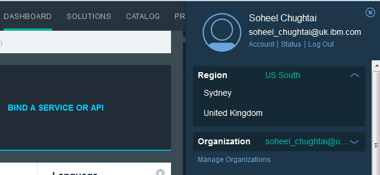
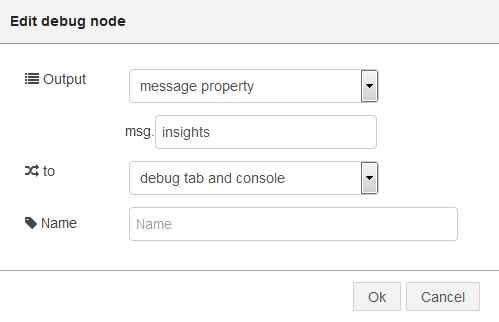
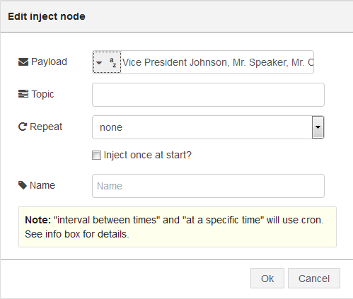
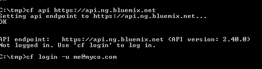
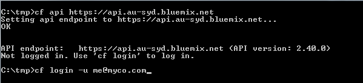

##Personality Insights Introduction

The IBM Watson Personality Insights service uses linguistic analytics to infer cognitive and social characteristics, including Big Five, Values, and Needs, from communications that the user makes available, such as email, text messages, tweets, forum posts, and more, go to [personal-insights](http://www.ibm.com/smarterplanet/us/en/ibmwatson/developercloud/personality-insights.html) for a full description and demo

The objective is to send the Personality Insights node the same data as for the demo (https://watson-pi-demo.mybluemix.net/) and to show the JSON object and its values match those of the demo

Check out this page for full instructions on getting started with Node-RED.

##Deploy Node-RED on Bluemix

- You need a [Bluemix](https://console.ng.bluemix.net/) account. Log into the Bluemix.
- Verify that your region setting is set to US South. 
- When you are logged in go to 'Catalog' and click on the 'Node-RED starter' application in Boilerplates. 
- On the right side of the screen you must give it a name, which must be unique. Then click 'Create'. 
- Right now the Node-RED application is being created and deployed. This will take a few minutes.
- Follow the instructions to install cloud foundry or cf
- When finished click on the URL, which opens up your Node-RED application.

Check out this [page]( http://nodered.org/docs/getting-started/) for full instructions on getting started with Node-RED.

##Personality Insights Lab

- Go back to the Bluemix dashboard and click on the icon of the nodered application you just created.
- Pick “Add a Service or API” and click the Personality Insights node under Watson section.  Make sure your Application is listed and click on Use.  Click on Restage.
- Drag an inject node to the palette.
- Drag the personality insights node to the palette.
- Drag a debug node to the palette.
- Join them as shown below

- Double-click the debug node and replace ‘payload’ to ‘insights’. Also change “to” to “debug tab and console”

- Double-click the inject node and change Payload to string.  
Go to [sample file](personal_insights_input_text.txt) and open the file and paste the text to the blank 
field below the Payload field (this is the same text that is used in the demo).

- Open a command line on your laptop and login to Bluemix with your username/password. Making sure that you 
are connecting to the appropriate datacenter for your application. 
- For US South it will look like

, 
- for the UK 

- and for Sydney 

- Type **cf logs app_name** where **app_name** is the name of your application.  
- Return to the Node-RED palette.
- Click the Deploy button
- Click on the debug tab to the top right of the palette.
- Click the button next to the inject node.  

You will see an output in the debug tab starting with '{ [msg.insights] : object }' followed by the JSON object.  NOTE : you will not be able to see the full object

Go back to the command prompt and see that the full object has been shown. 

Compare the items in the JSON object to those of the demo for Personality Insights - you can see that the values shown are the same (or very similar).

A completed flow file card be found [here](personal_insights_flows.json)

