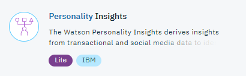
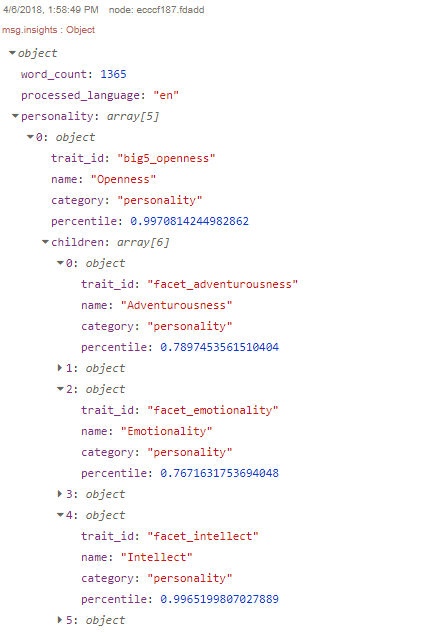
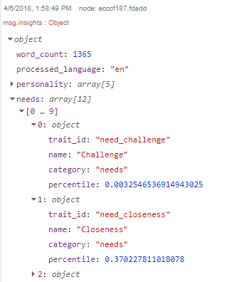
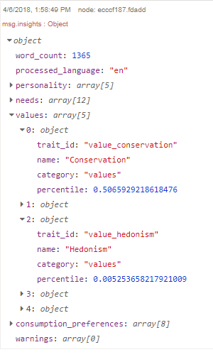

# Lab : Watson Personality Insights service with Node-RED

## Overview
The IBM Watson Personality Insights service uses linguistic analytics to infer cognitive and social characteristics including the Big Five, Values, and Needs. It uses communications that the user makes available, such as email, text messages, tweets, forum posts and more!

The objective is to send the Personality Insights node the same data as used for the standard web demo and to show the JSON profile object and its values match those of the demo.

## Node-RED Watson Personality Insights node
The Personality Insights node  is a wrapper for the Watson Personality Insights API. It will accept text on the msg.payload and produce a json profile object.

### Prerequisites and setup
To get the Personality Insights service credentials on IBM Cloud automatically filled-in by Node-RED, you should connect the Personality Insights service to the Node-RED application in IBM Cloud.

Please refer to the [Node-RED setup lab](/introduction_to_node_red/README.md) for instructions.

## Personality Insights flow construction
In this exercise, you will create a simple flow to inject text into the node and produce a json profile object.

Start by dragging an inject node to the palette. Double-click the inject node and change payload to string.

Open the [sample file](personal_insights_input_text.txt). Copy and paste the text into the payload field.

Add a Personality Insights node to the palette and double-click the inject node to edit.

The sample text is English, so make sure the input text language is set to English. If you are not using the sample text file, you can change both the input and response languages.

**Note: Always check the Language Support documentation for the latest information on languages.**

You can get additional results by checking the tick-boxes for Raw Scores and Consumption Preferences:
- Raw Scores indicates whether a raw score in addition to a normalized percentile is to be returned for each characteristic; raw scores are not compared with a sample population.
- Consumption Preferences indicates whether consumption preferences are to be returned with the results.

 

Drag a debug node to the palette. Double-click the debug node and replace `payload` to `insights`. Also make sure that **debug** and **console** are selected in the `To` field.

Join them together as shown below:

Deploy the application and initiate the inject node. In the debug tab you can view the scores for each personality big 5, needs, values and consumption preferences.

'Personality Big 5' Results:

'Needs' Results:

'Values' Results:

## Flow Source
The complete flow is available [here](personal_insights_flows.json).

## Personality Insights Documentation
To find more information on the Watson Personality Insights underlying service, visit these webpages :
- [Personality Insights Documentation](https://console.bluemix.net/docs/services/personality-insights/index.html#about)
- [Personality Insights Documentation](https://www.ibm.com/watson/developercloud/personality-insights/api/v3/)
