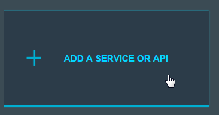
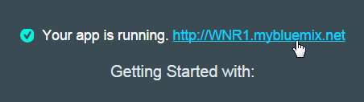

#Relationship Extraction

NOTE : This Lab is still under constructions - DO NOT USE for the moment

Relationship Extraction leverages Watson machine learning technologies. The API can analyze news articles and use statistical modeling to perform linguistic analysis of the input text. It then finds spans of text and clusters them together to form entities, before finally extracting the relationships between them.  

Documentation -> [https://www.ibm.com/smarterplanet/us/en/ibmwatson/developercloud/relationship-extraction.html](https://www.ibm.com/smarterplanet/us/en/ibmwatson/developercloud/relationship-extraction.html)

Demo -> [http://ibmlaser.mybluemix.net/siredemo.html](http://ibmlaser.mybluemix.net/siredemo.html)

Open your Application and add the Relationship extraction Service to your application.  Got to you Node-RED application and click on "Add a Service or API"

Pick the Relationship  section

Your application will be shown, click "Use" to bind the Alchemy API Service to your application

You will be prompted to Restage the application, click Restage.  Wait till the you see "Your app is running"

Click on your App link

Click on the "go to your Node-RED flow editor" button

Drag an Inject node to the palette

Drag a Relationship Extract node to the palette

Finally drag a Debug node to the palette

Join the nodes as shown below

Open this file [re_file](re-input_file) 

Double-click the Inject node and change the payload to Blank

Copy the following text to your clipboard (hightlight, ctrl-c)

**AlchemyAPI uses natural language processing, artificial intelligence, deep learning and massive-scale web crawling to power it's text analysis capabilities. Try entering your own text in this text box to see what knowledge AlchemyAPI can extract from your unstructured data.**
