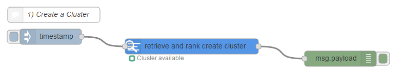
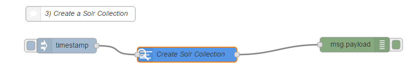
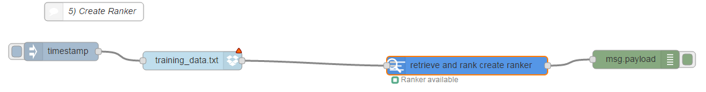

# Retrieve and Rank Service

## Overview
The IBM Watson™ Retrieve and Rank service combines two information retrieval components in a single service: the power of Apache Solr and a sophisticated machine learning capability. This combination provides users with more relevant results by automatically reranking them by using these machine learning algorithms.

## Installation of the Retrieve and Rank Nodes
Follow the instructions at [watson contribution nodes](/watson_contribution_nodes/README.md) 
to install the retrieve and rank nodes into your IBM Cloud instance of Node-RED. 

## Lab 1: Retrieve and Rank using the Cranfield data collection
To complete this tutorial, you use the publicly available test data that is called the [Cranfield collection](http://ir.dcs.gla.ac.uk/resources/test_collections/cran/). The collection contains abstracts of aerodynamics journal articles, a set of questions about aerodynamics, and indicators of how relevant an article is to a question. To use your own data, please refer to the [documentation](https://console.bluemix.net/docs/services/retrieve-and-rank/overview.html).

This lab will use a given flow contained in this directory. Copy the contents of `lab.json` to the clipboard. In the Node-RED flow editor, import the flow as follows:

and paste in the contents of `lab.json`. Once imported, click "Deploy" in the top right corner. This flow sets up all the configuration nodes and searching facilities that are present in the [Cranfield sample tutorial](https://console.bluemix.net/docs/services/retrieve-and-rank/getting-started.html).

Before you proceed, make sure you have the Dropbox node on your palette and have configured it correctly. [These instructions](https://github.com/watson-developer-cloud/node-red-labs/tree/master/utilities/dropbox_setup) explain this step in more detail.

### Breakdown
1) **Create a cluster**. The following set of nodes create a cluster within the rank and retrieve service. 

Double click the node to select the size of the cluster and add a cluster name. For a simple cluster for testing, choose the "Free" option. Note that you can only create one free cluster per service. The cluster will take a minute or so to prepare and when it is available the status of the node will be updated.

2) **Upload Solr Configuration**. The following set of nodes upload a .zip file for the given cluster consisting of the solr configuration. Double click the node to enter in the `cluster_id` given in the output from step 1) and a name for the configuration.

3) **Create Solr Collection**. The following set of nodes create a Solr Collection for the given cluster. Double click the node to enter in the `cluster_id` given in the output from step 1) and the configuration name specified in step 2).

4) **Index Documents**. The following set of nodes upload documents to the given collection for indexing. Double click the node to enter in the `cluster_id` given in the output from step 1) and the collection name specified in step 3).

5) **Create Ranker**. The following set of nodes create a ranker to be used for ranking the documents. Double click the node to enter a name for the ranker. The ranker will take approximately 5 minutes to train. The status of the node will be updated once it is available.

6) **Search the collection**. Whilst you wait for the ranker to become available, you can perform queries on the collection (Retrieve). The following set of nodes perform this with a query string passed in on `msg.payload`.

7) **Rerank the search results**. Once the ranker is available, you can perform Retrieve queries on the collection to rank the documents. The following set of nodes perform this with a query string passed in on `msg.payload`. The `ranker_id` is specified in the node configuration panel.

