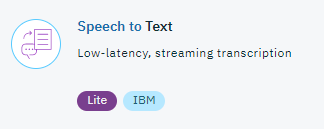

# Lab: Speech to Text with Node-RED
## Overview
The Watson Speech to Text service can be used anywhere voice-interactivity is needed. The service is great for mobile experiences, transcribing media files, call centre transcriptions, voice control of embedded systems, or converting sound to text to then make data searchable. Supported languages include:
- Brazilian Portuguese
- Korean
- French
- US English
- Mandarin
- Japanese
- UK English
- Spanish
- Arabic

## Node-RED Watson Speech to Text node
The Node-RED  node provides a very easy wrapper node to convert human voice into written words.

## Watson Speech to Text Flow
This lab can be completed in 3 ways:
1. On IBM Cloud straight from an URL
2. On IBM Cloud uploading a WAV file using an upload node (Dropbox, Box...)
3. A stand-alone system (using a local file or your microphone)

### Prerequisites and setup
To get the Speech to Text service credentials on IBM Cloud automatically filled-in by Node-RED, you should connect the Speech to Text service to the Node-RED application in IBM Cloud.

Please refer to the [Node-RED setup lab](/introduction_to_node_red/README.md) for instructions.

## Building the flow
### 1. Uploading from a URL

In this step, an audio file will be transcribed. An example audio file can be found [here](http://sd-2.archive-host.com/membres/up/102033098234604628/SpaceShuttle.wav). Feel free to use this URL or provide your own.

Start by adding an Inject node. This will provide the URL to the WAV file which will be passed into the Speech To Text service. The inject node is configured like this:

Next, add a Speech to Text node. This will stream the .wav file from the URL provided and transcribe it. Configure the node like this:

The .wav file provided as an example is in English. If you're using your own file in a different language make sure to change it the language in the Speech to Text node. You can also select the quality of your .wav file (narrowband or broadband) and choose whether you want the speaker labels to be on to identify which individuals are speaking.

Finally add a debug node. This will allow you to see the results of the transcription, it is configured like this:

The output is set to msg.transcription so only the transcription is shown in the debug tab.

You're now good to go! Make sure to connect your nodes together, deploy and initiate the inject node to see it working.

#### Flow Source
The complete flow can be found here: [Text To Speech on IBM Cloud lab flow using an URL](s2t_url_flow.json)

### 2. Uploading from a Dropbox node

This is similar to injecting the file from an URL, except here you are going to provide the file from your Dropbox account.
Note: If you haven't done it yet, set up the Dropbox node as shown [here](https://github.com/watson-developer-cloud/node-red-labs/tree/master/utilities/dropbox_setup).

Firstly, you need to upload a WAV file to your Dropbox account. Upload your own file or download the example WAV file from [here](http://sd-2.archive-host.com/membres/up/102033098234604628/SpaceShuttle.wav) (right-click, save-as) and upload it to your Dropbox.

Drag and drop an inject node onto your canvas. This doesn't need any configuration as will simply initiate the flow.

Next, add a Dropbox node. Add in your credentials and the name of your file (or path to your file if it's in a subfolder). Your node configuration should look like this:

Next, add a Speech to Text node that transcribe the .wav file from the Dropbox node. The node should be configured like so:

The .wav file provided as an example is in English. If you're using your own file in a different language make sure to change it the language in the Speech to Text node. You can also select the quality of your .wav file (narrowband or broadband) and choose whether you want the speaker labels to be on to identify which individuals are speaking.

Finally add a debug node that will allow you to see the results of the transcription, it is configured like this:

The output is set to msg.transcription so only the transcription is shown in the debug tab.

You're now good to go! Make sure to connect your nodes together, deploy and initiate the inject node to see it working.

#### Flow Source
The complete flow can be found here: [Text To Speech on IBM Cloud lab flow using the Dropbox node](s2t_dropbox_flow.json)

### 3. On a stand-alone system
#### Prerequisites
To complete this section, you need to have a local instance of Node-RED running with the IBM Watson nodes installed. If you don't have that yet, go to [this link](/introduction_to_node_red/README.md) to find out how to install.

You also need to go the IBM Cloud catalog and add a Speech to Text service. Once the service is deployed, click on 'Service Credentials', then 'New Credential', 'Add' and then 'View Credentials'. Make a note of the username and password as you will need this shortly.

In this lab an audio file will be transcribed. This audio file can be downloaded [here](http://sd-2.archive-host.com/membres/up/102033098234604628/SpaceShuttle.wav) (click the download arrow).
In the following screenshots you can see how the nodes are configured.

Start by adding an Inject node and configure it like this:

Next add a File in node. This node points to the file on the local system. Configure it like this:

Add a Speech to Text node after the File In Node. This is where you need the username and password from the Speech to Text service in IBM Cloud. Configure the node like so:

Finally, add a Debug node. You need to configure this for getting the output in the debug window. The Speech to Text node outputs the transcribed text into msg.transcription so you need to set the debug node to listen for msg.transcription:

Wire all the nodes together and click on 'Deploy'. Initiate the Inject node and you will see the transcribed text from the audio file in the debug window.

#### Flow Source
The complete flow can be found here: [Text To Speech lab flow](s2t_local_flow.json)

## Speech to Text Documentation
To find more information on the Watson Speech to Text underlying service, visit these webpages :
- [STT Documentation](https://console.bluemix.net/docs/services/speech-to-text/index.html#about)
- [STT API Documentation](https://www.ibm.com/watson/developercloud/speech-to-text/api/v1/)
