# Lab: Watson Speech to Text service with Node-RED (timestamps) 
## Overview

The Speech To Text service converts the human voice into the written word. This service uses machine intelligence to combine information about grammar and language structure with knowledge of the composition of the audio signal to generate a more accurate transcription. It provides a variety of interfaces that make it suitable for any application where speech is the input and a textual transcription is the desired output. 

## Watson Services using Node-RED

Most of the Watson Node-RED nodes are simple wrappers to allow developers to use the Watson services in a simple way, often returning a default output dataset. Occasionally you may want to use some of the options and this can be achieved by calling the service via a HTTP Response node.  

## Watson Speech to Text Service using a HTTP Response node

Unfortunately the speech to text node only returns the default transcript. The service allows for many options, in this example, we will use the “timestamps” parameter to produce timestamps for the words it transcribes. If you need alternative transcripts or time alignment then you will need to call the service using a HTTP Response node. 

You should be able to adapt this flow, and by modifying the parameters into the service modify the response. eg. Fetch confidence levels for each word or search for keywords.

## Building the flow

I have split the building of the flow into 4 sections 
1. Initial HTML form
1. Prepare & fetch the audio file
1. Run the STT service
1. Format output

### Part one - Initial Form
You will need 4 nodes 
*	http input
*	switch
*	template
*	http response
The flow begins by showing a form and requesting the URL of a WAV file.


The entry point into the application is a HTTP Input configured to respond to a GET.

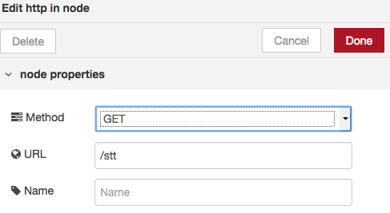

The switch node checks for a url. 

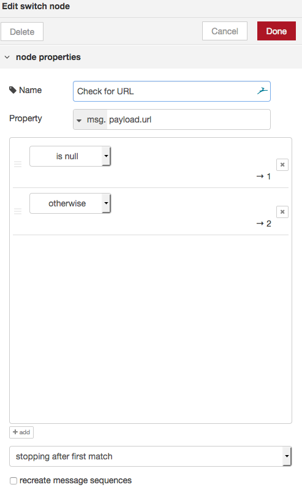

The Template prompts the user to enter a url.

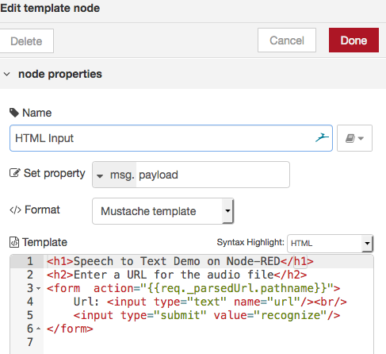

The text for the input for is 

```
<h1>Speech to Text Demo on Node-RED</h1>
<h2>Enter a URL for the audio file</h2>
<form  action="{{req._parsedUrl.pathname}}">
    Url: <input type="text" name="url"/><br/>
    <input type="submit" value="recognize"/>
</form>
```

### Part two - Fetch the Audio

If a url has been provided, it should point to a wav file (eg. [Example Wav URL](https://aacapps.com/lamp/sound/nicole.wav))

You will need 6 nodes 
*	2 x function
*	http request
*	debug
*	link in
*	link out

I have added link nodes to provide a virtual wire between nodes to tidy the flow diagram.
 
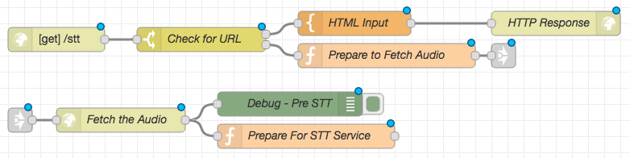

Attach a function node to setup a HTTP Request for the audio file


The code for the function is:

```
audiourl = encodeURI(msg.payload.url)
msg.url=audiourl;
return msg;
```

Then add the link in and link out nodes, before adding a HTTP Request node,

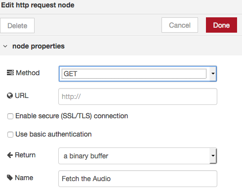

configured to return a binary buffer

Add a function that will take the returned audio file, and prepare the http headers and url to invoke the Speech to Text service

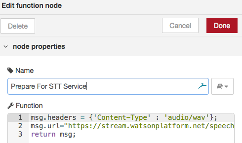


The url has parameters to fetch timestamps, and for the audio to be processed as a continuous stream, ignoring any speech pauses in the audio.

```
msg.headers = {'Content-Type' : 'audio/wav'};
msg.url="https://stream.watsonplatform.net/speech-to-text/api/v1/recognize?timestamps=true&continuous=true";
return msg;
```

Now add the debug node to display the payload from fetch audio function.

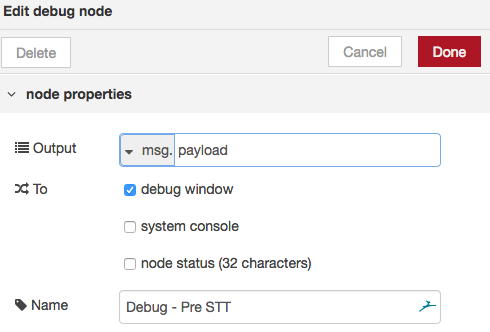

### Part three - Fetch the Audio

You will need 5 nodes 
*	function
*	http request
*	debug
*	link in
*	link out

Again, I have added link nodes to provide a virtual wire between nodes to tidy the flow diagram.
 
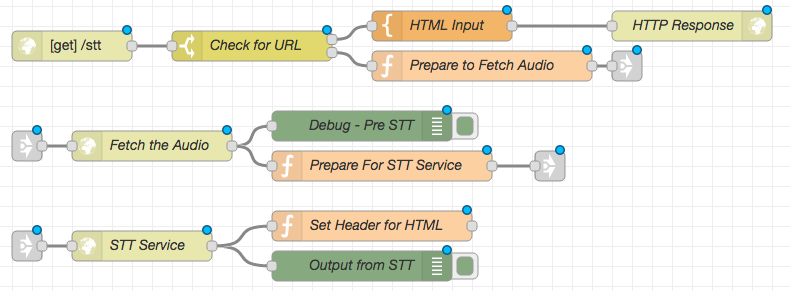

Use the link nodes to create a virtual wire from the Prepare function to a HTTP Request node. This will be used to invoke the Speech to text service,

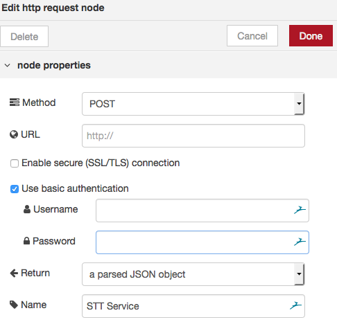

which needs to be configured to use basic authentication. Remember to enter Speech to Text  service credentials which you can obtain from IBM Cloud.

Control is then passed to a function, which prepares data and the header for the response HTML Page.
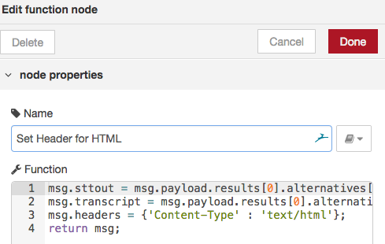

The function pulls out the time track and the transcript from the results to make them more accessible by the HTML template 

```
msg.sttout = msg.payload.results[0].alternatives[0];
msg.transcript = msg.payload.results[0].alternatives[0].transcript;
msg.headers = {'Content-Type' : 'text/html'};
return msg;
```

Add a debug node to show the results from the http post call.

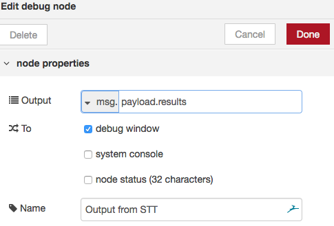

### Part four – Output results

You will need 2 nodes 
*	template
*	debug

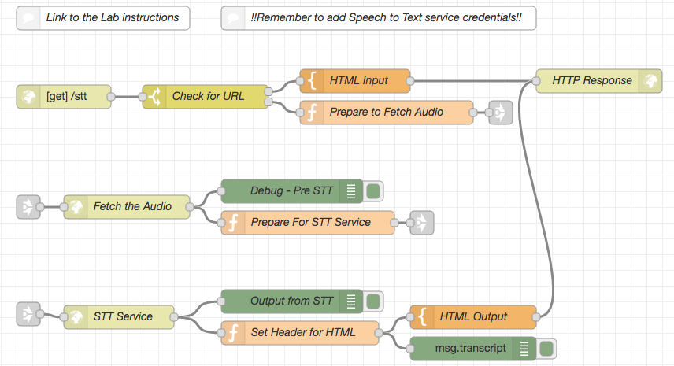

Connect the output HTML template node

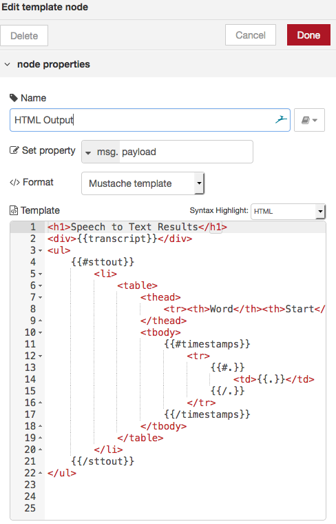

The node iterates over the response, and injects the words, and their timing positioning in the audio track. 
```
<h1>Speech to Text Results</h1>
<div>{{transcript}}</div>
<ul>
    {{#sttout}} 
        <li>
            <table>
                <thead>
                    <tr><th>Word</th><th>Start</th><th>End</th></tr>
                </thead>
                <tbody>
                    {{#timestamps}}
                        <tr>
                            {{#.}}
                                <td>{{.}}</td>
                            {{/.}}    
                        </tr>
                    {{/timestamps}}
                </tbody>                    
            </table>
        </li>
    {{/sttout}}    
</ul>
```

Finally connect the template node to the http response node and the application is complete. 

## Running the application
When you run the application, use the web page based on the IBM Cloud with /stt added to the url. (eg. https://*my-node-red-app*.eu-gb.mybluemix.net/stt)


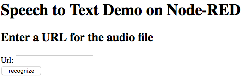

The application will respond with a transcript and a table showing the start and end timing for each word in the audio stream.

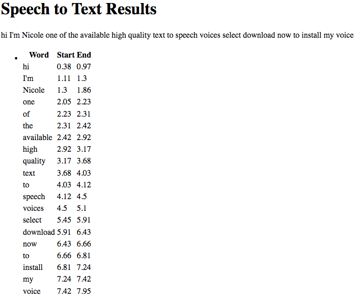

The completed flow is available at [Speech to Text Timestamps Flow](STT_http_flow.json)

## STT Documentation
To find out more information on the Watson Speech to Text service visit these webpages: 
- [STT Documentation](https://console.bluemix.net/docs/services/speech-to-text/getting-started.html) of the Speech to Text service.
- [STT API Documentation](https://www.ibm.com/watson/developercloud/speech-to-text/api/v1/).
