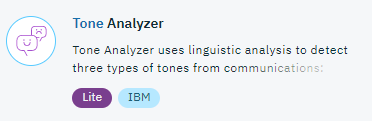
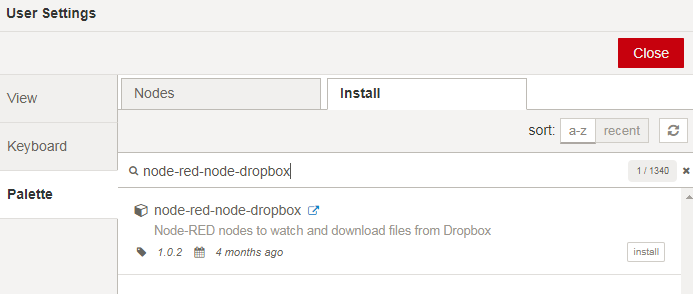

#  Lab: Watson Tone Analyzer with Node-RED
## Overview
The IBM Watson™ Tone Analyzer Service uses linguistic analysis to detect three types of tones from written text: emotions, social tendencies, and writing style. Emotions identified include things like anger, fear, joy, sadness, and disgust. Identified social tendencies include things from the Big Five personality traits used by some psychologists. These include openness, conscientiousness, extraversion, agreeableness, and emotional range. Identified writing styles include confident, analytical, and tentative.

Input written media into the Tone Analyzer service and use the results to determine if your writing comes across with the emotional impact, social tone, and writing style that you want your intended audience to see.

## Node-RED Watson Tone Analyzer node
The Node-RED  node provides a very easy wrapper node that takes text as input, and produces a set of values related to the emotions, social tendencies and writing style as output.

## Watson Tone Analyzer Flow Construction
In this exercise, we will show you how to set up the Tone Analyzer service with inputs from 3 different places.

### Prerequisites and setup
To get the Tone Analyzer service credentials on IBM Cloud automatically filled-in by Node-RED, you should connect the Tone Analyzer service to the Node-RED application in IBM Cloud.



Please refer to the [Node-RED setup lab](/introduction_to_node_red/README.md) for instructions.

## Building the flow
You must provide an Input to the Tone Analyzer (msg.payload) of either :
- a string
- a Node.js Buffer

The provided Flows file (see below) shows 3 different ways to connect the Input of the Tone Analyzer node:

1. Function node: you directly specify the string in the msg.payload
2. Dropbox node: you use a Dropbox account that holds the text file you want to be processed
3. Buffer: you can provide any text source in binary format, but it should be a Node.js Buffer. (for example : the HTTP REQUEST node using the binary mode)


### 1. Connect a Function node as input
Start by adding an inject node to the canvas. Connect it to a function node. In the function node, you need to enter some data. As an example, use the following code:

  ```
  var data = "Hi Team, I know the times are difficult! Our sales have been disappointing for the past three quarters for our data analytics product suite. We have a competitive data analytics product suite in the industry. But we need to do our job selling it!";
  msg.payload=data;
  return msg;

  ```


### 2. Connect a Dropbox account as input
You need to install the Dropbox node. In Node-RED, go to Options > Manage Palette. Select install, and search for 'node-red-node-dropbox' and install.



Add an inject node to the canvas and a Dropbox node and link them together.

Follow the instructions here to [set up your Dropbox account on Node-RED](https://github.com/watson-developer-cloud/node-red-labs/tree/master/utilities/dropbox_setup)


### 3. Connect a (Node.js) Buffer as input
Add an inject node to the canvas and a HTTP request node and link them together.

You can take a HTTP REQUEST node and configure it such :
- mode : GET
- URL : specify a valid URL where the text file is accessible
- Return : select Binary

As an example, in the URL, enter:
```
https://raw.githubusercontent.com/watson-developer-cloud/tone-analyzer-nodejs/master/public/data/corporate-announcement.txt
```


## Adding the Tone Analyzer node
Drag and drop a Tone Analyzer node from the nodes palette, and wire it to your input node.


Now configure your Tone Analyzer node by selecting in the dropdown list
- Method: General Tone
- version_date: Multiple Tones (Multiple Tones shows all tones as opposed to Dominant Tone which shows highest scoring tone)
- Tones (All / Emotion / Social / Writing): All (default value)
- Sentences (True / False): True (True shows breakdown by sentences, False shows overall breakdown)
- Content Type: Text
- Input Text Language: English


Add a Debug Node, and configure it to msg.response to see only the results data from the Tone Analyzer node.


## Flow Source
The complete flow is available [here](flow.json).


## Tone Analyzer Documentation
To find more information on the Watson Tone Analyzer underlying service, visit these webpages :
- [Tone Analyzer Documentation](https://console.bluemix.net/docs/services/tone-analyzer/index.html#about)
- [Tone Analyzer API Documentation](https://www.ibm.com/watson/developercloud/tone-analyzer/api/v3/)
