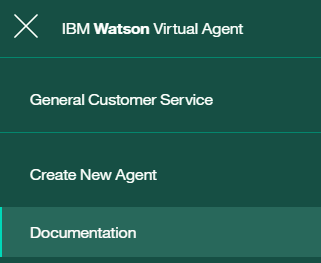
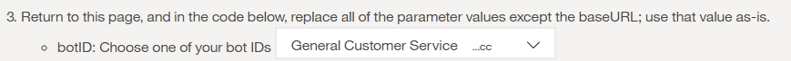

# Watson Virtual Agent

## Overview
The Watson Virtual Agent is a set of preconfigured cognitive components based on the Conversation service. It comes with a bot built on the Conversation service and a chat interface.

In this exercise, we will show you how to incorporate a Watson Virtual Agent into a Node-RED flow.

### Virtual Agent Bot
The bot is trained to recognize intents related to customer engagement, such as basic information queries and bill paying. The provided bot configuration tool enables you to configure company-specific information that can be provided in response to user queries, and to configure the response to each customer intent.

### Virtual Agent Chat Interface
The virtual agent chat interface, can be used to converse with the bot. You can use the provided chat widget, with or without customization.

## Getting Started
Follow the getting started guide [Getting Started](https://console.bluemix.net/docs/services/virtual-agent/getting-started.html) to register for the virtual agent and to configure the intents and responses according to your requirements.

### Agent IDs
To communicate with the Virtual Agent, your Node-RED flow will need a Bot ID, a Client ID and a Client Secret. To retrieve this information, from the Virtual Agent Workspace menu, select 'Documentation'.



Scroll down to the 'Publish' section. Follow step 2 for the Client ID and Client Secret and step 3 for the Bot ID. In step 3. you should get a drop down box to select the Virtual Agent you created in the setup process.




## Node-RED Flow
This Node-RED flow will show you how to integrate the Virtual Agent chat interface, and communications into your Node-RED application. There are 3 parts to the flow.

### 1. Chat widget
The first part of the flow creates a web page containing the Watson Virtual Agent Widget.


Add a HTTP In node and configure it as a GET (in the example as /wva)


In the function set the Bot ID and background homepage for your application.


Note: If you are going to use https for your agent page, then the homepage will also need to be addressed as https.

````

  msg.wva = {};
  msg.wva.botid = 'INSERT YOUR BOT ID HERE';
  msg.wva.homepage = 'https://www.ibm.com/watson/developer/';
  return msg;

````

Add a template node to the canvas. This code adds the Watson Virtual Agent Widget to the the template. Note where the template is given the Bot ID {{wva.botid}}.

The code also defines a baseURL of '/wvaProxy'. This will be the address that the widget will communicate with, and is the subject of the next part of the flow.

````
<html>
    <head>
        <title>IBM Watson Virtual Agent Chat Widget Sample</title>
        <meta charset="UTF-8">
        <meta name="viewport"
            content="width=device-width, initial-scale=1, maximum-scale=1, user-scalable=0" />
        <style>
            html, body, iframe { width: 100%; height:100%; padding:0; margin:0; }
            #ibm_chat_root { position:fixed; bottom:0; right: 20px; height: 80%; min-height:400px; width:300px; background:#000; }
        </style>
    </head>
    <body>
        <div id="ibm_chat_root"></div>
        <iframe style="width:100%; height:100%" src="{{wva.homepage}}"></iframe>
        <!--
        https://unpkg.com/@watson-virtual-agent/chat-widget@X.X.X/dist/chat.min.js for a specific version, where X.X.X is the semantic version of the chat widget.
        In your production environment, we recommend locking down your widget version.
        -->
        <script src='https://unpkg.com/@watson-virtual-agent/chat-widget/dist/chat.min.js'></script>
        <script>
            var botid = '{{wva.botid}}';
            var config = {
                el: 'ibm_chat_root',
                botID: botid,
                baseURL: '/wvaProxy',
                styles: {
                    background: 'rgba(255, 255, 255, 0.8)', //use rgba
                    text: 'rgba(0, 0, 0, 1)',
                    accentBackground: '#31eaf1', //or a hex code
                    accentText: '#ffffff',
                    secondaryBackground: '#f7f7f7',
                    secondaryText: '#464646',
                    link: '#ffffff'
                }
            };

            IBMChat.subscribe('action:updateAddress', function(data){
                console.log('Action - update Address');
                console.log(data);
                //make an ajax call to update a user address using "data"
                IBMChat.sendSilently('success');
                // or IBMChat.sendSilently('failure'); or IBMChat.sendSilently('cancel');
                });

            window.IBMChat.init(config);
        </script>
    </body>
</html>

````

Add a HTTP response node after the template node and wire them together. The first part of the flow should look like this:


### 2. Dialog Proxy
The second part of the flow creates a proxy for the initial communication from the Virtual Agent Widget.


Add a HTTP In Node and configure it as a POST for '/wvaProxy/bots/:botid/dialogs'


Code the function to add your client ID and secret to the header, and to build the Watson Virtual Agent Server URL that the message will be forwarded onto.

````
var botid = '';

if (msg.req && msg.req.params && msg.req.params.botid)
{
  botid = msg.req.params.botid;  
}

msg.url = 'https://api.ibm.com/virtualagent/run/api/v1/bots/' + botid + '/dialogs';
msg.method = 'POST';

msg.headers={ 'X-IBM-Client-Id': 'ADD YOUR CLIENT ID HERE',
              'X-IBM-Client-Secret': 'ADD YOUR CLIENT SECRET HERE'
             };


return msg;
````

Add a link out node after the function node and connect them together.

Below, add a link in node and a HTTP request node, linking the two together. Configure the HTTP request to return a JSON object.


This will initiate the conversation, and the Virtual Agent will assign a conversation id to the conversation. This conversation id is then used in all subsequent interactions.

Add a HTTP response node after the template node and wire them together. The second part of the flow should look like this:


### 3. Conversation Proxy
The third part of the flow creates a proxy for the continued communication from the Virtual Agent Widget.


Add a HTTP In Node and configure it as a POST for '/wvaProxy/bots/:botid/dialogs/:convid/messages'


Create a function node and add the following code. This adds your Client ID and Secret to the header and builds the Watson Virtual Agent Server URL that the message will be forwarded onto.

````
var botid = '';
var convid = '';
var message = '';

if (msg.req && msg.req.params && msg.req.params.botid)
{
  botid = msg.req.params.botid;  
}

if (msg.req && msg.req.params && msg.req.params.convid)
{
  convid = msg.req.params.convid;  
}

if (msg.payload && msg.payload.message) {
    message = msg.payload.message;
}


msg.url = 'https://api.ibm.com/virtualagent/run/api/v1/bots/' +
               botid + '/dialogs/' + convid +
               '/messages' + '?message=' + message;

msg.method = 'POST';

msg.headers={ 'X-IBM-Client-Id': 'ADD YOUR CLIENT ID HERE',
              'X-IBM-Client-Secret': 'ADD YOUR CLIENT SECRET HERE'
             };


return msg;

````

Add a link out node after the function node. Configure this link out, and the link out from Step 2, to connect to the link in node which precedes the HTTP request node.

Deploy your application and test it out.

### Complete Application
Your application should resemble


## Completed Flows
The complete flow is available at [Virtual-Agent-Lab](virtual_agent_lab.json).
