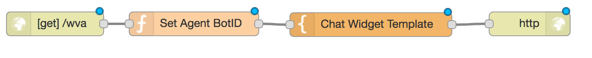
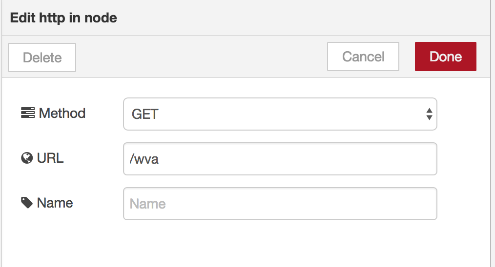
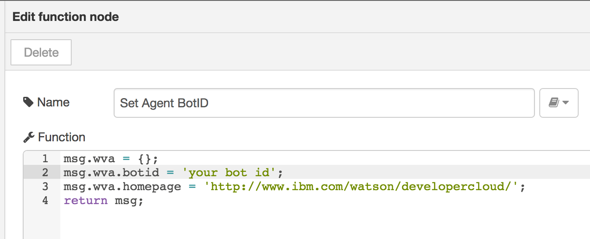
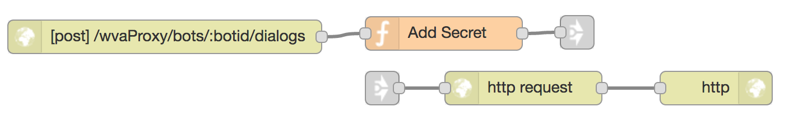
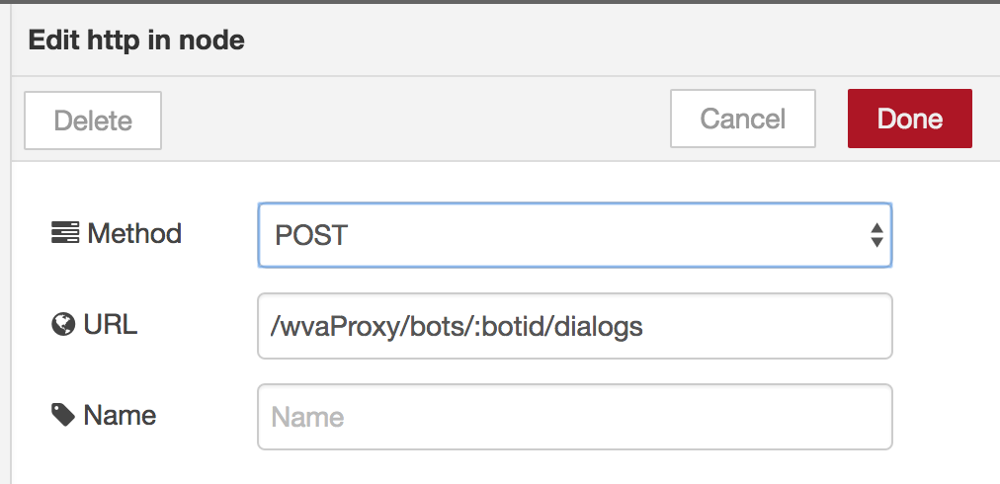
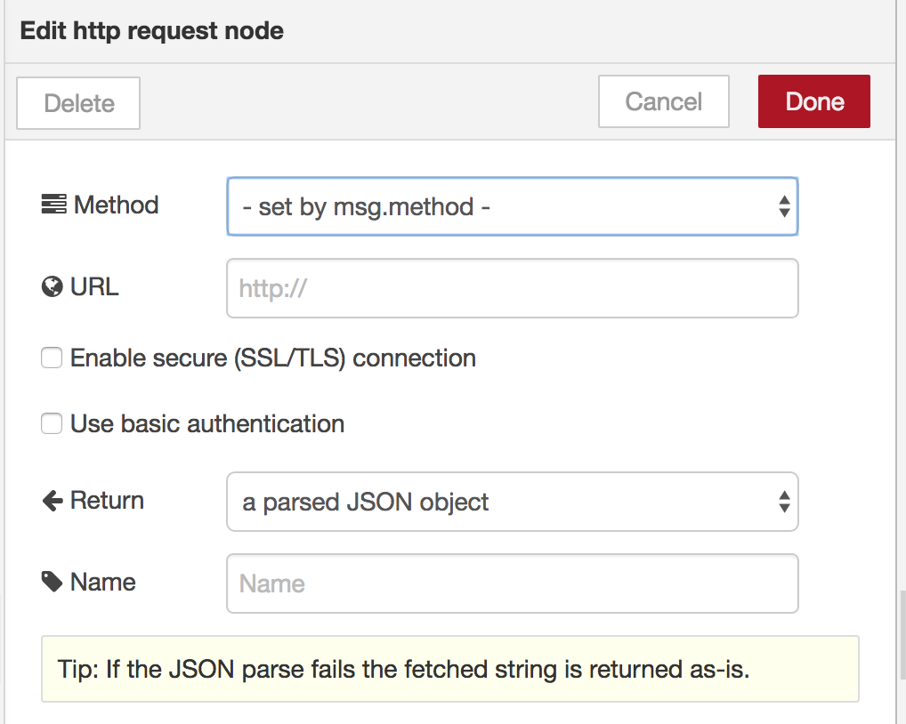
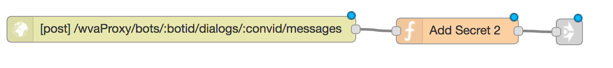
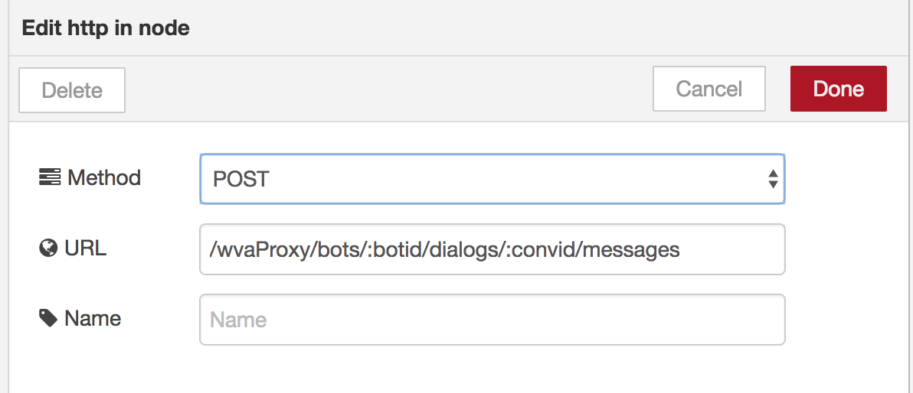
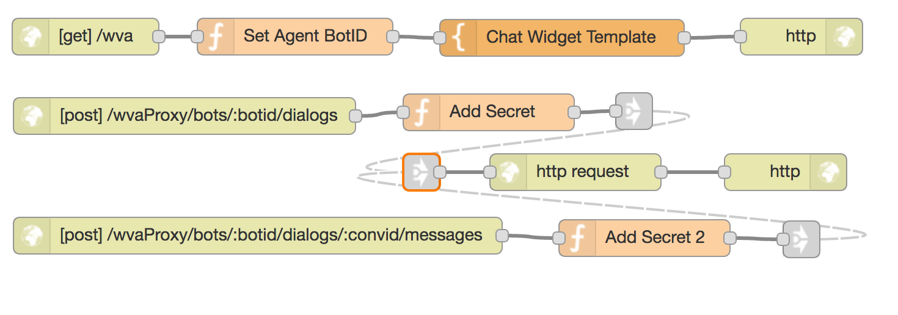

# Watson Virtual Agent

## Overview
The Watson Virtual Agent is a set of preconfigured cognitive components based on the Conversation service. It comes with a bot built on the Conversation service and a chat interface.

In this exercise, we will show how incorporate Watson Virtual Agent into a Node-RED flow.

### Virtual Agent Bot
The bot is trained to recognize intents related to customer engagement, such as basic information queries and bill paying. The provided bot configuration tool enables you to configure company-specific information that can be provided in response to user queries, and to configure the response to each customer intent.

### Virtual Agent Chat Interface
The virtual agent chat interface, can be used to converse with the bot. You can use the provided chat widget, with or without customization.

## Getting Started
Follow the getting started guide [Getting Started](
https://www.ibm.com/watson/developercloud/doc/virtual-agent/wva_getstart.shtml) to register for the virtual agent and to configure the intents and responses according to your requirements.

## Node-RED Flow
This node-RED flow will show you how to integrate the Virtual Agent chat interface, and communications into your node-RED application.

### Agent IDs
To communicate with the Virtual Agent your node-RED flow will need a Bot ID, a Client ID and a Client Secret. Follow the steps on the page [Chat Widget](https://github.com/watson-virtual-agents/chat-widget) to retrieve your IDs.

### Chat widget
The first part of the flow creates a web page containing the Watson Virtual Agent Widget.


Configure the HTTP In as a GET (in the example as /wva)


In the function set the Bot ID and background homepage for your application.



````

  msg.wva = {};
  msg.wva.botid = 'your bot id';
  msg.wva.homepage = 'http://www.ibm.com/watson/developercloud/';
  return msg;

````

Add the Watson Virtual Agent Widget to the the Template. Note where the template is given the Bot ID {{wva.botid}}.

It also defines a baseURL of '/wvaProxy'. This will be the address that the widget will communicate with, and is the subject of the next part of the flow.

````
<html>
    <head>
        <title>IBM Watson Virtual Agent Chat Widget Sample</title>
        <meta charset="UTF-8">
        <meta name="viewport"
            content="width=device-width, initial-scale=1, maximum-scale=1, user-scalable=0" />
        <style>
            html, body, iframe { width: 100%; height:100%; padding:0; margin:0; }
            #ibm_chat_root { position:fixed; bottom:0; right: 20px; height: 80%; min-height:400px; width:300px; background:#000; }
        </style>
    </head>
    <body>
        <div id="ibm_chat_root"></div>
        <iframe style="width:100%; height:100%" src="{{wva.homepage}}"></iframe>
        <!--
        https://unpkg.com/@watson-virtual-agent/chat-widget@X.X.X/dist/chat.min.js for a specific version, where X.X.X is the semantic version of the chat widget.
        In your production environment, we recommend locking down your widget version.
        -->
        <script src='https://unpkg.com/@watson-virtual-agent/chat-widget/dist/chat.min.js'></script>
        <script>
            var botid = '{{wva.botid}}';
            var config = {
                el: 'ibm_chat_root',
                botID: botid,
                baseURL: '/wvaProxy',
                styles: {
                    background: 'rgba(255, 255, 255, 0.8)', //use rgba
                    text: 'rgba(0, 0, 0, 1)',
                    accentBackground: '#31eaf1', //or a hex code
                    accentText: '#ffffff',
                    secondaryBackground: '#f7f7f7',
                    secondaryText: '#464646',
                    link: '#ffffff'
                }
            };

            IBMChat.subscribe('action:updateAddress', function(data){
                console.log('Action - update Address');
                console.log(data);
                //make an ajax call to update a user address using "data"
                IBMChat.sendSilently('success');
                // or IBMChat.sendSilently('failure'); or IBMChat.sendSilently('cancel');
                });

            window.IBMChat.init(config);
        </script>
    </body>
</html>

````

### Dialog Proxy
The second part of the flow creates a proxy for the initial communication from the Virtual Agent Widget.


Configure the HTTP In Node as a POST for '/wvaProxy/bots/:botid/dialogs'


Code the function to add your client ID and secret to the header, and to build the Watson Virtual Agent Server url that the message will be forwarded onto.

````
var botid = '';

if (msg.req && msg.req.params && msg.req.params.botid)
{
  botid = msg.req.params.botid;  
}

msg.url = 'https://api.ibm.com/virtualagent/run/api/v1/bots/' + botid + '/dialogs';
msg.method = 'POST';

msg.headers={ 'X-IBM-Client-Id': 'Your Client ID',
              'X-IBM-Client-Secret': 'Your Secret'
             };


return msg;
````

Configure the HTTP request to return a JSON object.



This will initiate the conversation, and the Virtual Agent will assign a conversation id to the conversation. This conversation id is then used in all subsequent interactions.

### Conversation Proxy
The third part of the flow creates a proxy for the continued communication from the Virtual Agent Widget.


Configure the HTTP In Node as a POST for '/wvaProxy/bots/:botid/dialogs/:convid/messages'


Code the function to add your client ID and secret to the header, and to build the Watson Virtual Agent Server url that the message will be forwarded onto.

````
var botid = '';
var convid = '';
var message = '';

if (msg.req && msg.req.params && msg.req.params.botid)
{
  botid = msg.req.params.botid;  
}

if (msg.req && msg.req.params && msg.req.params.convid)
{
  convid = msg.req.params.convid;  
}

if (msg.payload && msg.payload.message) {
    message = msg.payload.message;
}


msg.url = 'https://api.ibm.com/virtualagent/run/api/v1/bots/' +
               botid + '/dialogs/' + convid +
               '/messages' + '?message=' + message;

msg.method = 'POST';

msg.headers={ 'X-IBM-Client-Id': 'Your Client ID',
              'X-IBM-Client-Secret': 'Your Secret'
             };


return msg;

````

### Complete Application
Your application should resemble



## Completed Flows
The complete flow is available at [Virtual-Agent-Lab](virtual_agent_lab.json).
