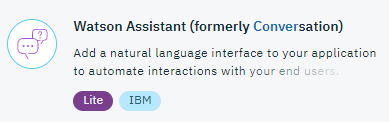
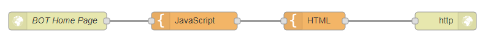
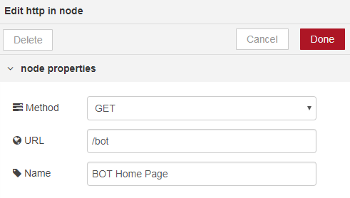
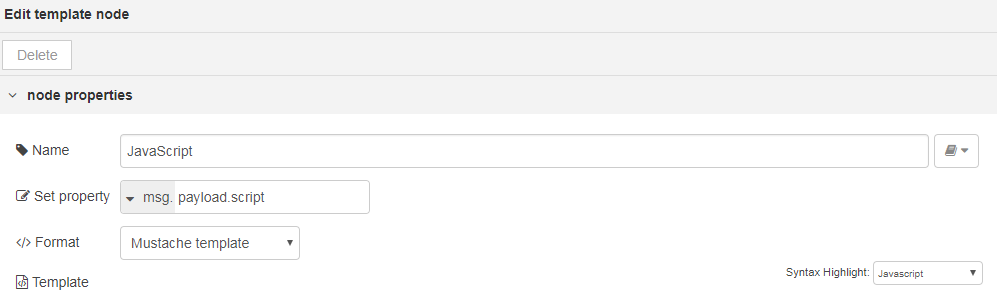
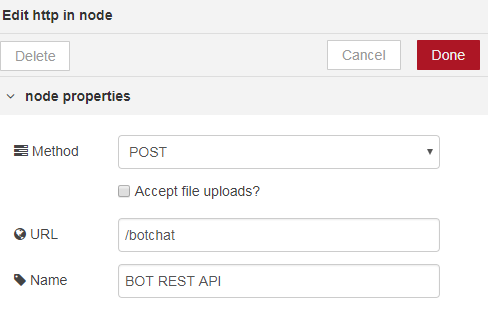

#  Lab: Watson Assistant with Node-RED
## Overview
The Watson Assistant service (formerly Watson Conversation) integrates natural language understanding, to determine intent and entities, with dialog tools which allow for a natural conversation flow between your application and your users.

## Node-RED Watson Assistant node
The Node-RED  node provides a very easy wrapper node to calls the Watson Assistant service and interact with the chat bot in Node-RED.

## Watson Assistant Flow Construction
In this exercise, we will show how create a Watson Assistant flow. It will consist of two sub-components. The first will consist of a HTML template with JavaScript which will be the front end of your Bot. The second will be a REST API that will encapsulate the Watson Assistant service.

### Prerequisites and setup
To get the Watson Assistant service credentials on IBM Cloud automatically filled-in by Node-RED, you should connect the Watson Assistant service to the Node-RED application in IBM Cloud.



Please refer to the [Node-RED setup lab](/introduction_to_node_red/README.md) for instructions.

## Getting Started with Assistant
Before you use the service through the conversation node on Node-RED, you need to create a workspace. Follow the [Getting started tutorial](https://console.bluemix.net/docs/services/conversation/getting-started.html) to guide you through the process of launching the Watson Assistant tool, creating a workspace, registering intents and entities and creating a dialog. The tooling is the only way in which dialogs, intents and entities can be registered with the service.

### Connecting to an existing service on IBM Cloud
To use the Conversation node you will have already created an instance of the Watson Assistant Service in IBM Cloud and used the service tooling to register intents, entities and dialogs.
You will need the Workspace ID. Obtain this from the service tooling. Select 'View details' for your workspace.


This reveals your workspace id. Copy this to your clipboard.


## Building the flow

### The HTML template
Build a flow comprising of HTTP In, two Templates, and HTTP Response nodes.


Configure the HTTP In node. This will be your Bot's home page.


Configure the JavaScript Template node with the following code:
```
$(document).ready(function() {
    javascriptCheck();
    $('#id_contextdump').hide();
    enterbutton();
    invokeAjax ("Hello");
});

// if javascript is enabled on the browser then can remove the warning message
function javascriptCheck() {
    $('#no-script').remove();
}

// creates div for interaction with bot      
function createNewDiv(who, message) {
    var txt = who + ' : ' + message;
    return $('<div></div>').text(txt);
}

// appends latest communication with bot to botchathistory
function chat(person, txt) {
    $('#id_botchathistory').append(createNewDiv(person, txt));
}    

// sets pressing of enter key to perform same action as send button
function enterbutton(){
    $(function() {
        $("form input").keypress(function (e) {
        if ((e.which && e.which == 13) || (e.keyCode && e.keyCode == 13)) {
             $('#id_enter').click();
             return false;
        } else {
        return true;
        }
     });
    });
}

// User has entered some text.
function onChatClick() {
    var txt = $('#id_chattext').val();
    chat('You', txt);
    invokeAjax(txt);
    $('#id_chattext').val('');
}

function processOK(response) {
    console.log(response);
    console.log(response.botresponse.messageout);
    console.log(response.botresponse.messageout.output.text);
    console.log(response.botresponse.messageout.context);
    chat('Bot', response.botresponse.messageout.output.text);
    $('#id_contextdump').data('convContext', response.botresponse.messageout.context);
}

function processNotOK() {
    chat('Error', 'Error whilst attempting to talk to Bot');
}

function invokeAjax(message) {
    var contextdata = $('#id_contextdump').data('convContext');
    console.log('checking stashed context data');
    console.log(contextdata);

    var ajaxData = {};
    ajaxData.msgdata = message;
    if (contextdata) {
        ajaxData.context = contextdata;    
    }

    $.ajax({
        type: 'POST',
        url: 'botchat',
        data: ajaxData,
        success: processOK,
        error: processNotOK
    });
}
```
Set the property to 'payload.script' and the Syntax highlight to 'JavaScript':



Configure the HTML template node with the following code:
```
<!--
# Copyright 2018 IBM
#
# Licensed under the Apache License, Version 2.0 (the "License");
# you may not use this file except in compliance with the License.
# You may obtain a copy of the License at
#
#     http://www.apache.org/licenses/LICENSE-2.0
#
# Unless required by applicable law or agreed to in writing, software
# distributed under the License is distributed on an "AS IS" BASIS,
# WITHOUT WARRANTIES OR CONDITIONS OF ANY KIND, either express or implied.
# See the License for the specific language governing permissions and
# limitations under the License.
-->

<html>
  <head>
    <meta charset="utf-8">
    <meta http-equiv="X-UA-Compatible" content="IE=edge">
    <meta name="viewport" content="width=device-width, initial-scale=1">
    <title>
	  My BOT
	</title>
	<link rel="stylesheet"
        type="text/css"
        href="https://maxcdn.bootstrapcdn.com/bootstrap/3.3.7/css/bootstrap.min.css" />
  </head>
  <body>

    <div class="container">
      <div id="no-script"class="bg-info">
        This application needs JavaScript enabled in your browser!
      </div>
      <div id="id_contextdump"></div>

      <h1>My BOT</h1>
      <div id=id_botchathistory>
	  </div>

	  <div>
	      <form>
            <label for="id_chattext">Your Input: </label>
            <input type="text" name="chattext" id="id_chattext">
            <br/><br/>
	      </form>
	      <button onclick="javascript:onChatClick()" id="id_enter">Send</button>
	  </div>
    </div>

    <script type="text/javascript" src="https://code.jquery.com/jquery-2.1.4.min.js"></script>
    <script src="https://maxcdn.bootstrapcdn.com/bootstrap/3.3.7/js/bootstrap.min.js"></script>

    <script>{{{payload.script}}}</script>
  </body>
</html>

```

This sets up the homepage of your BOT as a single page application. It uses AJAX to invoke a REST API that you will now implement.

### The REST Subflow
For the REST subflow, build a flow comprising of HTTP In, a function, conversation, a second function and a HTTP Response node.


Configure the HTTP In node as a POST API.


Configure the first function to pull out the user text and any conversation context information, with the following code.
```
// stash away incoming data
msg.mydata = {};
msg.mydata.messagein = msg.req.body.msgdata;
msg.payload = msg.mydata.messagein;

msg.params = { "context": msg.req.body.context};

return msg;
```

Configure the Conversation node with the Workspace ID:


Configure the second function to build a response, incorporating the conversation context and bot response, with the following code.
```
msg.mydata.messageout = msg.payload;

msg.payload = {};
msg.payload.botresponse = msg.mydata;

return msg;
```

### Testing the flow
To run the web page, point your browser to  `/http://xxxx.mybluemix.net/bot` and enter text to drive your bot.

## Flow Source
The complete flow is available [here](conversation_lab.json).


## Watson Assistant Documentation
To find more information on the Watson Assistant underlying service, visit these webpages :
- [Watson Assistant Documentation](https://console.bluemix.net/docs/services/conversation/getting-started.html#gettingstarted)
- [Watson Assistant API Documentation](https://www.ibm.com/watson/developercloud/conversation/api/v1/)
