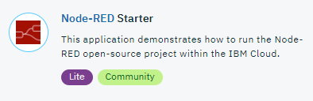
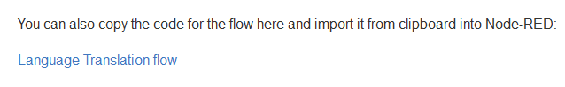
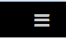
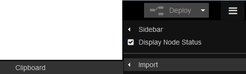
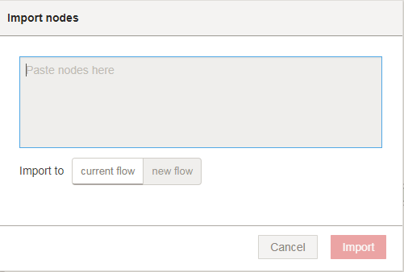
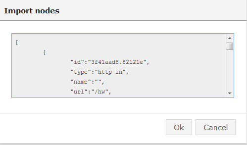
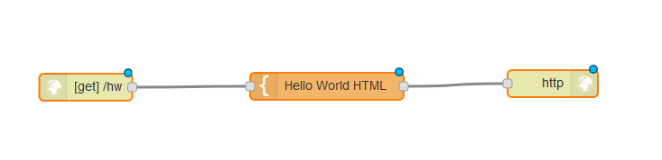
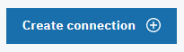
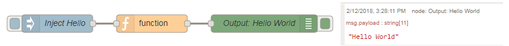
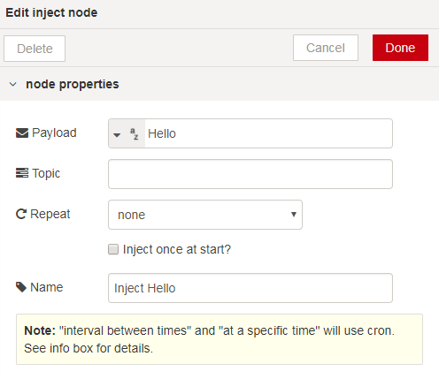

# Welcome to Node-RED

## Introduction

[Node-RED](http://nodered.org) is a visual tool for wiring the Internet of Things. It is easy to connect devices, data and api’s (services). It can also be used for other types of applications to quickly assemble flows of services. Node-RED is available as open source and has been implemented by the IBM Emerging Technology organization.
Node-RED provides a browser-based flow editor that makes it easy to wire together flows using the wide range of nodes in the palette. Flows can be then deployed to the runtime in a single-click.
While Node-Red is based on Node.js, JavaScript functions can be created within the editor using a rich text editor.
A built-in library allows you to save useful functions, templates or flows for re-use.

Node-RED is included in the Node-RED starter application in [IBM Cloud](http://ibm.biz/bluemixnl) (IBM Cloud is IBM’s Platform as a Service, free of charge) but you can also deploy it as a stand alone Node.js application.
Node-RED can not only be used for IoT applications, but it is a generic event-processing engine. For example, you can use it to listen to events from http, websockets, tcp, Twitter (and more!) and store this data in databases without having to program much, if at all. You can also use it to implement simple REST APIs. You can find many other sample flows on the [Node-RED website](http://flows.nodered.org).

In the labs, which can be found [here](/basic_examples/README.md), we focus on applications which make use of IBM Watson’s capabilities.

We have created labs on how to use the different Watson nodes in Node-RED.
Nodes are blocks that represent components of a larger system, in Node-RED's case usually the devices, software platforms and web services that are to be connected. Further blocks can be placed in between these components to represent software functions that wrangle and transform the data in transit.

## Getting Started

There are two ways of using Node-RED
-	Node-RED stand alone
-	Node-RED on [IBM Cloud](http://ibm.biz/bluemixnl) (IBM Cloud is IBM’s Platform as a Service)

Both ways are described in this article, but to save time for these labs it is recommended to use Node-RED on IBM Cloud.

Note that Node-RED in IBM Cloud will behave slightly differently than Node-RED stand-alone:

- The sets of available nodes differ, IBM Cloud has extra nodes for DB access, but does not expose the File nodes.
- Node-RED in IBM Cloud stores its persistent data (flows, libraries, credentials) in the co-installed Cloudant database named nodered. When using a Cloudant node with Node-RED on IBM Cloud, the list of available instances is automatically listed.
- Node-RED in IBM Cloud has built-in credential management, so you don't have to worry about exposing your services authentication data, they will be filled-in automatically from the services' credentials defined for the application in IBM Cloud.

### Installation and running Node-RED

These are the instructions for installing Node-Red in the stand-alone way of working. If you are using Node-RED in IBM Cloud, skip this part as nothing has to be installed, instead you need to deploy a Node-RED boilerplate.

#### Deploy Node-RED stand alone

When you have Node.js installed, run:

For Linux/OS X

    $ sudo npm install -g node-red

For Windows

    npm install -g node-red

Note: you need to run in a command shell as Administrator,

The default instance of Node-RED does not contain the IBM Watson services which we need in the labs, so the next step is to install these services:

You simply execute this command:

    npm install node-red-bluemix-nodes

When finished start Node-RED:

For Linux/OS X:

    $ node-red

For Windows

    node node_modules/node-red/red.js

 Then open [http://localhost:1880](http://localhost:1880)

Check out [this page](http://nodered.org/docs/getting-started/) for full instructions on getting started with Node-RED.

### Deploy Node-RED on IBM Cloud

This is required when Node-RED is not used as stand-alone.
You need an IBM Cloud account which can be acquired [here](http://ibm.biz/bluemixnl)
- When you are logged in, go to 'Catalog' and search for 'Node-RED starter', which can be found under boilerplates.
- Click the service to create it
- Enter an app name, which must be unique.
- Choose a region, organization and space to deploy in
- Click 'Create'.
The Node-RED application will be created and deployed. This will take a few minutes. When it has finished, click on the URL which opens up your Node-RED application.

### Importing Flows

Flows have been provided for all the worked examples in this project. At the end of each example you will find a
link to a completed flow which you can select and import.   

If you want to try this now then select the sample flow below:

[Import Sample Flow flow](import_sample_flow_flow.json)

Select the flow and copy it to the clipboard (Ctrl-C). Import the flow into Node-RED using by selecting the
Node-RED menu

and select the 'import from clipboard' option.

You will be presented with a form in which you create nodes by entering json data.

Import your copied flow by pasting (Ctrl-V) from the clipboard into the the form

Place the imported flow onto your node-RED page.  

### Adding Watson services to the Node-RED application in IBM Cloud

You can do this part later, but for the labs you will need to connect the (Watson) services to your Node-RED application. If a service is not added to the Node-RED application, you will either get an error or the node will ask for credentials, depending on the type of node.

Go to IBM Cloud and open your dashboard. Once you have created your Watson service, select your Node-RED application from the dashboard and then click on 'Connections'.

Click on 'Create Connection'

And then select your service you want to connect and click 'Connect'.

In the screen that follows select 'Restage' and wait a moment whilst the application restarts.

When the application is started you can click on the URL to open Node-RED.

### Creating your first flow

We will create a Hello World flow.

This program is a very simple flow that prints the message 'Hello World' on the screen.

Here you can see Node-RED's user interface, the colored blocks on the screen are called nodes, which is a visual representation of a piece of JavaScript code to carry out a task. To build this 'Hello World' flow you need to take the following steps:

 1. Drag an 'Inject' node to the canvas
 2. Double click the node to see the options
 3. Use the drop-down in the payload field, to select 'string' as the payload
 4. Type 'Hello' in the payload field. This will inject 'Hello' into the flow when the inject node is initiated. Click done to save and close this node.

 

 5. Add a 'Function' node to the canvas, open it and add the following text onto the first line into the function: msg.payload += " World". This will add ' World' to the payload.
 The complete function should look like this: 
 6. Add a 'Debug' node to the canvas.
 7. Wire the 'Inject' node to the 'Function' node, and the function node to the 'Debug' node. Most nodes have a grey circle on their left side, which is their input port, and on their right side, which is their output port. Left clicking and dragging the output to the input port of the next node connects the two together.
 8. Click on 'Deploy'. This saves your changes to the server.

Now you have built your first Hello World flow, test it by clicking on the button to the left of the 'Inject' node. You will see some output in the debug window on the right (click on 'Debug' to change the view from info to debug).

## Nodes used in the labs

In this section several nodes will be described which will be used in the labs. The labs will use these services to create Watson applications.

### HTTP in node

This node provides an input node for HTTP requests, allowing the creation of simple web services.

The resulting message has the following properties:

    msg.req : http request
    msg.res : http response

For POST/PUT requests, the body is available under

    msg.req.body

This uses the Express bodyParser middleware to parse the content to a JSON object.

By default, this expects the body of the request to be url encoded:

    foo=bar&this=that

To send JSON encoded data to the node, the content-type header of the request must be set to application/json.

Note: This node does not send any response to the HTTP request. This should be done with a subsequent HTTP Response node.

### HTTP response node

This node can send responses back to HTTP requests received from an HTTP Input node.

The response can be customized using the following message properties:

    payload

is sent as the body of the response

    StatusCode

if set, is used as the response status code (default: 200)

    headers

if set, should be an object containing field/value pairs to be added as response headers.

### Change node

Set, change or delete properties of a message.

The node can specify multiple rules that will be applied to the message in turn.

The available operations are:

    Set

sets a property. The to property can either be a string value, or reference another message property by name, for example: msg.topic.

    Change

search & replace parts of the property. If regular expressions are enabled, the replace with property can include capture groups, for example $1

    Delete

deletes a property.

### Switch node

A simple function node to route messages based on its properties.

When a message arrives, the selected property is evaluated against each of the defined rules. The message is then sent to the output of all rules that pass.

Note: the otherwise rule applies as a "not any of" the rules preceding it.

### Template node

Creates a new message based on the provided template.

This uses the mustache format.

For example, when a template of:

    Hello {{name}}. Today is {{date}}

receives a message containing:

    {
     name: "Fred",
     date: "Monday"
     payload: ...
    }

The resulting payload will be:

    Hello Fred. Today is Monday

### mqtt in node

MQTT input node. Connects to a broker and subscribes to the specified topic. The topic may contain MQTT wildcards.

Outputs an object called msg containing

    msg.topic,
    msg.payload,
    msg.qos
    msg.retain.

msg.payload is usually a string, but can also be a binary buffer.

### mqtt out node   

Connects to a MQTT broker and publishes msg.payload either to the msg.topic or to the topic specified in the edit window. The value in the edit window has precedence.

Likewise QoS and/or retain values in the edit panel will overwrite any msg.qos and msg.retain properties. If nothing is set they default to 0 and false respectively.

If msg.payload contains an object it will be stringified before being sent.

### Conclusion
This introduction has given you an insight into Node-RED and how to create an application. Now you can continue with the next labs:

- [Introduction to the Watson nodes](/basic_examples/README.md)
- [Advanced labs](/advanced_examples/README.md) where different nodes/services are combined

There is also a course available on DeveloperWorks to help you get started with Node-RED:
<https://developer.ibm.com/courses/all/node-red-basics-bots/>
