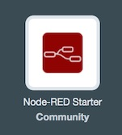
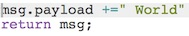

#Welcome to Node-RED

##Introduction

[Node-RED](http://nodered.org) is a visual tool for wiring the Internet of Things. It is easy to connect devices, data and api’s (services). It can also be used for other types of applications to quickly assemble flows of services. Node-RED is available as open source and has been implemented by the IBM Emerging Technology organization.
Node-RED provides a browser-based flow editor that makes it easy to wire together flows using the wide range of nodes in the palette. Flows can be then deployed to the runtime in a single-click.
While Node-Red is based on Node.js, JavaScript functions can be created within the editor using a rich text editor.
A built-in library allows you to save useful functions, templates or flows for re-use.

Node-RED is included in the Node-RED starter application in [Bluemix](http://ibm.biz/bluemixnl) (Bluemix is IBM’s Platform as a Service, free of charge) but you can also deploy it as a stand alone Node.js application. 
Node-RED can not only be used for IoT applications, but it is a generic event-processing engine. For example you can use it to listen to events from http, websockets, tcp, Twitter and more and store this data in databases without having to program much if at all. You can also use it for example to implement simple REST APIs. You can find many other sample flows on the [Node-RED website](http://flows.nodered.org).

In the labs which can be found [here](/basic_examples/README.md) we focus on applications which are making use of IBM Watson’s capabilities.

We have created some labs on how to use the different Watson nodes in Node-RED. 
Nodes are blocks that represent components of a larger system, in Node-RED's case usually the devices, software platforms and web services that are to be connected. Further blocks can be placed in between these components to represent software functions that wrangle and transform the data in transit.

##Getting Started

There are two ways of using Node-RED
-	Node-RED stand alone
-	Node-RED on [Bluemix](http://ibm.biz/bluemixnl) (Bluemix is IBM’s Platform as a Service)
Both ways are described in this article, but to save time for these labs it is recommended to use Node-RED on Bluemix.

Note that Node-RED in Bluemix will behave slightly differently than Node-RED stand-alone:

The sets of available nodes differ, Bluemix has extra nodes for DB access, but does not expose the File nodes.
Node-RED in Bluemix stores its persistent data (flows, libraries, credentials) in the co-installed Cloudant database named nodered. When using a Cloudant node with Node-RED on BlueMix, the list of available instances is automatically listed.
Node-RED in Bluemix has built-in credential management, so you don't have to worry about exposing your services authentication data, they will be filled-in automatically from the services' credentials defined for the application in Bluemix.

###Installation and running Node-RED

Here is described how to install Node-Red in the stand alone way of working, for Using Node-RED in Bluemix, nothing has to be installed. A Node-RED app has to be deployed. 

NOTE: When you are not using Node-RED stand alone but using Node-RED on Bluemix, skip this part and go to 

###Deploy Node-RED stand alone

When you have Node.js installed, run:

For Linux/OS X 

    $ sudo npm install -g node-red

For Windows

    npm install -g node-red

Note: you need to run in a command shell as Administrator,

The default instance of Node-RED does not contain the IBM Watson services which we need in the labs, so the next step is to install these services:

You simply execute this command: npm install node-red-bluemix-nodes

When finished start Node-RED:

For Linux/OS X: 

    $ node-red

For Windows

    node node_modules/node-red/red.js

 Then open [http://localhost:1880](http://localhost:1880)

Check out [this page](http://nodered.org/docs/getting_started/) for full instructions on getting started with Node-RED.

###Deploy Node-RED on Bluemix

This is required when Node-RED is not used stand alone. 
You need a Bluemix account which can be acquired [here](http://ibm.biz/bluemixnl)
When you are logged in go to 'Catalog' and click on the 'Node-RED starter' application.
On the right side of the screen you must give it a name, which must be unique. Then click 'Create'.
Right now the Node-RED application is being created and deployed. This will take a few minutes. When finished click on the URL, which opens up your Node-RED application.

###Adding Watson services to the Node-RED application in Bluemix

You can do this part later, but for the labs you need to add the (Watson) services to your application. If a service is not added to the Node-RED application, you can get an error or a node is asking for credentials depending on the type of node. 

Go to Bluemix and open the dashboard and click on your Node-RED application, then click on 'Add a Service or API'. In the screen that follows select the service you want to use, and finally click on 'Use'. Wait for a moment to restart the application. 

When the application is started you can click on the URL to open Node-RED. 

###Creating your first flow

We will create a Hello World flow.

This program is a very simple flow that prints the message 'Hello World' on the screen. 
Here you can see Node-RED's user interface, the colored blocks on the screen are called nodes, which is a visual representation of a piece of JavaScript code to carry out a task.
To build this 'Hello World' flow you need to take the following steps:

 1. Drag an 'Inject node' to the canvas
 2. Double click this node to see the options
 3. Use the drop-dwon, to select string for the payload
 4. Type 'Hello' on the second line
(this will cause to inject hello into the flow when clicked on the inject node) and click on ok, to save and close this node.
 5. Add a 'Function node' to the canvas, open it and place this on the first line into the function: . This will add 'World' to the payload. The complete function should look like this:  
 6. Add a 'Debug node' to the canvas.
 7. Wire the 'Inject node' to the 'Function node' and the function node to the 'Debug node'. Most nodes have a grey circle on their left side, which is their input port, and on their right side, which is their output port. Left clicking and dragging the output to the input port of the next node connects the two together.
 8. Press 'Deploy'.
 
Now you have build your first Hello World flow. Test it by clicking on the 'Inject node', you will see some output in the debug window on the right (click on 'Debug' to change the view from info to debug).

##Nodes used in the labs

In this section several nodes will be described which will be used in the labs. The labs will use these services to create Watson applications.

In this section several nodes will be described which will be used in the labs which can be found. The labs will use these services to create Watson applications.

### http in node

This node provides an input node for http requests, allowing the creation of simple web services.

The resulting message has the following properties:

    msg.req : http request
    msg.res : http response

For POST/PUT requests, the body is available under 

    msg.req.body
This uses the Express bodyParser middleware to parse the content to a JSON object.

By default, this expects the body of the request to be url encoded:

    foo=bar&this=that

To send JSON encoded data to the node, the content-type header of the request must be set to application/json.

Note: This node does not send any response to the http request. This should be done with a subsequent HTTP Response node.

### http response node

This node can send responses back to http requests received from an HTTP Input node.

The response can be customised using the following message properties:

    payload 
is sent as the body of the response

    StatusCode
if set, is used as the response status code (default: 200)

    headers
if set, should be an object containing field/value pairs to be added as response headers.

### change node

Set, change or delete properties of a message.

The node can specify multiple rules that will be applied to the message in turn.

The available operations are:

    Set 
sets a property. The to property can either be a string value, or reference another message property by name, for example: msg.topic.

    Change
search & replace parts of the property. If regular expressions are enabled, the replace with property can include capture groups, for example $1

    Delete
deletes a property.

### switch node

A simple function node to route messages based on its properties.

When a message arrives, the selected property is evaluated against each of the defined rules. The message is then sent to the output of all rules that pass.

Note: the otherwise rule applies as a "not any of" the rules preceding it.

### template node

Creates a new message based on the provided template.

This uses the mustache format.

For example, when a template of:

    Hello {{name}}. Today is {{date}}

receives a message containing:

    {
     name: "Fred",
     date: "Monday"
     payload: ...
    }

The resulting payload will be:

    Hello Fred. Today is Monday

### mqtt in node

MQTT input node. Connects to a broker and subscribes to the specified topic. The topic may contain MQTT wildcards.

Outputs an object called msg containing

    msg.topic, 
    msg.payload, 
    msg.qos 
    msg.retain.

msg.payload is usually a string, but can also be a binary buffer.

 
### mqtt out node   
 

Connects to a MQTT broker and publishes msg.payload either to the msg.topic or to the topic specified in the edit window. The value in the edit window has precedence.

Likewise QoS and/or retain values in the edit panel will overwrite any msg.qos and msg.retain properties. If nothing is set they default to 0 and false respectively.

If msg.payload contains an object it will be stringified before being sent.

Now you can continue with the next labs:

- [Introduction to the Watson nodes](/basic_examples/README.md)
- [Advanced labs](/advanced_examples/README.md) where different nodes/services are combined

