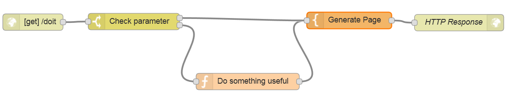

# Node-RED tips and tricks
This document lists a number of node-RED practises and tips&tricks that can be useful.

## Displaying a JSON object
JSON objects dumped to the debug log are not very easy to read.

The good news is that the Node-RED `functions` vaec access to the node.js `util` object, and so we can use the inspect() method to format JSON objects in a more readable fashion.

In a function, you would simply do:  
`node.warn(util.inspect(` **SomeJSONObject**  `));`

And to get this to an HTML output, you would:  
  1. convert to a string in a function node:  
      ```msg.myjson_str=util.inspect(` **SomeJSONObject**  `));```  
  2. in a template, output as preformatted text:  
      ```<pre>{{myjson}}</pre>```

See the [Example Inspect Object flow](example_inspect_object_flow.json) for an example of two nodes that dump the `msg.req` object.

## Basic Web request/response loop pattern
To get a visual rendering of some of the experiment you conduct with Node-RED, you can use the inject/debug node pair.

Another way is to use a simple request/response web UI pattern, where the user is first prompted for a value, which is then processed by the same flow:  


[Web request/Response pattern Flow ](example_web_req_resp_flow.json)


## Exporting flows
You can export the selected nodes in a flow from the Node-RED menu. This is reliable but somewhat cumbersome to use because the flow need to be manually copied to the clipboard, and then copied into a file that you'll create on your machine.

The Flow Exporter flow, **which works on BlueMix-deployed node-RED only**, will let you select a flow and either export it directly to file, or link directly to one of the exposed HTTP input nodes.  
This goes to the Cloudant flow storage backing DB directly to export the flows.

The flow is available at [Flow Exporter flow](flow_exporter.json). Make sure to read the `Setup instructions` notice and set the name of you BlueMix Node-RED space properly in the `Get Flows` Cloudant node.
This makes the exporter available at `/flowexp`.