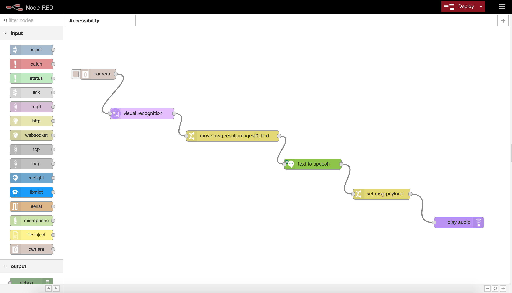

# Accessibility

## Overview

[Video Introduction]()

This Node-RED accessibility flow takes written documents and converts them to the spoken word for the visually impaired.

The flow uses the <a href="">Camera</a> and <a href="https://github.com/lorentzlasson/node-red-contrib-play-audio">Play Audio</a> nodes with the Watson <a href="https://github.com/watson-developer-cloud/node-red-node-watson/tree/master/services/visual_recognition">Visual Recognition</a> and <a href="https://github.com/watson-developer-cloud/node-red-node-watson/tree/master/services/text_to_speech">Text-to-Speech</a> services to enhance system accessibility.

Node-RED will:
* Capture an image from the device camera
* Recognise any text in the image
* Extract the interpreted text
* Convert the text to spoken word
* Play the audio output from the device's speakers

## Application flow
[Link to Flow JSON](./accessibility.json)

## Flow description

* The `camera` node will capture a still image from the device webcam when you click the button.
* The `visual recognition` service takes the buffer sent from the camera node and parses it to determine if there are any words in the image.
* Next the flow calls `move msg.result` to retrieve the string from the `visual recognition` service and set that to the `msg.payload` object required by the rest of the flow.
* Watson `Text-to-Speech` service then takes the string interpreted from the image and converts it to the spoken word
* The flow then sets the `msg.payload` object required for the `play audio` node.
* Finally the `play audio` node broadcasts the spoken word from the device's speakers

## Gotchas

* The `camera` node has a 2000ms delay to prevent slow camera driver startup causing an issue in some browsers
