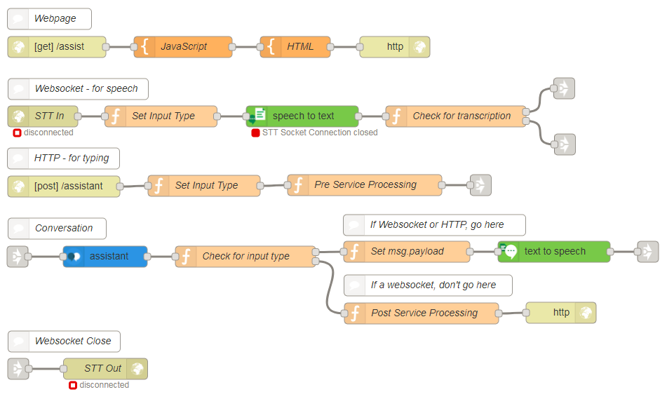

# Aide
## Overview
This starter kit flow demonstrates how to use the Watson Speech to Text service, Watson Assistant and Text to Speech service all together. This allows you to speak and receive an audio output from the chat bot, as well as type your response.

### Prerequisites
You will need to create:
- Watson Speech to Text service
- Watson Assistant service
- Watson Text to Speech service

## Application Flow

[Get the flow here](flow.json)

## Flow Description
#### Webpage Flow
- `HTTP input` - sets the webpage URL to /assist
- `JavaScript Template` - stores the JavaScript for the webpage
- `HTML Template` - stores the HTML for the webpage
- `HTTP response` - ends HTTP request

#### Websocket - for speech flow
- `STT In` - sets the websocket listener on /assist for speaking to the service
- `Set Input Type` - sets the global input type to `websocket`
- `Speech to Text` - Watson Speech to Text service, using English and BroadbandModel in streaming mode
- `Check for Transcription` - This waits until the system has final transcription to send the message into Watson Assistant

#### HTTP - for typing flow
- `HTTP input` - sets the webpage post URL to /assistant for sending typed responses to Watson Assistant
- `Set Input Type` - sets the global input to `http`
- `Pre-Service Processing` - sets the typed message to msg.payload to display in the chat window.

#### Conversation flow
- `Assistant` - Watson Assistant Service. *Input your own workspace ID.*
- `Check for input type` - Checks whether the input came from the websocket or http. If it came from the websocket, continue to the first output. If it came from http, follow both outputs.

##### If Websocket or HTTP go here flow
This section is for both types of input (spoken and typed) so that the response from Watson Assistant speaks back to you.
- `Set msg.payload` - Sets the output from Watson Assistant to msg.payload for it to successful be passed into Text to Speech
- `Text to Speech` - Watson Text to Speech service. Set language, voice and format.

##### If a Websocket, don't go here flow
This section is for HTTP (typed responses) only. As it sets the bot response to display in the chat window.
- `Post Service Processing` - builds the response, incorporating the conversation context and bot response
- `HTTP Response` - closes the HTTP flow

#### Websocket Close flow
- `STT Out` - closes websocket flow
