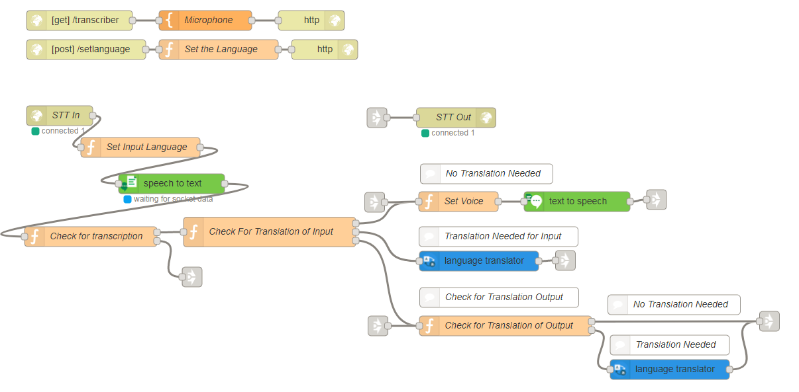

# Babelfish
## Overview
This flow allows you to select an input language to speak into and translate the input into a different language. This is done in the web browser. If the input is not in English, the flow translates the input into English. It then determines whether the English then needs to be translated into a different language to meet the output requirement of the user. If it does, the English text is converted. The input and output is displayed in the webpage. The output is also played through the speakers.

This flow makes use of the Speech to Text, Text to Speech and Language Translator services.

### Prerequisites
You will need:
- Version >=0.6.3 of node-red-node-watson installed in Node-RED.
- Microphone
- Speakers

You will also need service credentials for:
- Speech to Text
- Text to Speech
- Language Translator

## Application Flow

[Get the flow here](flow.json)

## Flow Description
#### Transcriber Flow:
- `HTTP In [get] /transcriber` - Sets HTML page to /transriber
- `Microphone Template` - Encompasses HTML code and JavaScript that sets input and output languages and plays audo through speakers.
- `HTTP Response` - Ends HTTP request

#### Set Language Flow:
- `HTTP In [post] /setlanguage` - Sets POST request to /setlanguage.
- `Set the Language` - Code to store the user preferences of their input and output language.
- `HTTP Response` - Ends HTTP request

#### STT Websocket Flow:
- `Websocket STT In` / `Websocket STT Out` - Sets the websocket listener
- `Set Input Language` - Gets the input language from the 'Set Language' flow and sets it to msg.srclang to pass through the flow as a message.
- `Speech to Text` - Converts the speech from the microphone into text.
- `Check for transcription` - This node checks whether a transcription has been passed from the Speech to Text node. It has 2 outputs. If there is a transcription, it passes the 'final transcription' through the first output into the 'Check for Translation of Input' node. Otherwise, it goes straight to the websocket out node.
- `Check For Translation of Input` - This node has 3 outputs. The first output is used when no translation is required i.e. input and output languages were both French. The second output is used when the input language is not English. The third output is used if the input is English but the output needs to be a different language.

#### No Translation Needed
This section is used when a translation isn't required. This would occur if the user selected the same language for the input and the output.
- `Set Voice` - Sets the output voice / language for the Text to Speech service.
- `Text to Speech` - Converts the text which was converted from the Speech to Text service back into speech, as assigned in the 'Set Voice' node. This will be played through the device's audio. This node links back to the websocket out node.

#### Translation Needed for Input
This section is used when a translation is required for the input.
- `Language Translator` - Translates the text from the audio into English. This then gets passed into the 'Check for Translation of Output' node via a link node. (See next section for details.)

#### Check for Translation of Output
This section is activated either after the input has already been passed through the translator (as per last section), or directly from 'Check for Translation of Input.' This would occur if the input language was English.
- `Check for Translation of Output` - This node has two outputs. If no translation is needed i.e. the output is English, it passes it straight into the 'Set Voice' node. If a translation is needed i.e. the output is not English, then it passes it into the language translator node.
- `Language Translator`- Translates the English into the output language decided by the user. This gets passed into the 'Set Voice' function node.
