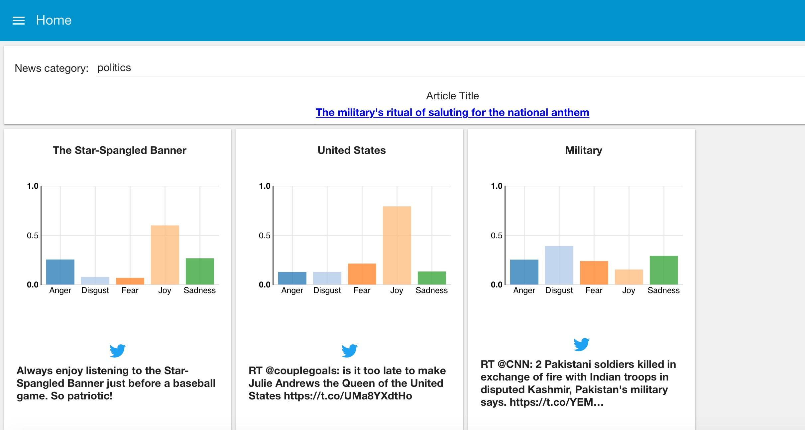

# Breaking News
**Coming Soon**
Link to video description

## Overview
Ever wanted to know how people are responding to news and events in real-time?  Well now you can!  The "Breaking News" application powered by Node-RED and Watson has a GUI which provides real-time tone analysis of tweets regarding concepts of live news headline articles.  The intent is to see how users on twitter are responding to events happening in the world.  Each tweet is assigned a score for each of 5 emotional tones (anger, disgust, fear, joy, sadness).  For example, this UI shows what people are tweeting about the military and the Star Spangled Banner in response to an article about the "military's ritual of saluting the national anthem".

First a news category is selected from the UI, then this category is passed to the Alchemy News Service, which grabs a recent headline (within the last hour) and returns the headline title along with concepts of highest relevancy to the article.  Live twitter streams start listening for tweets about those concepts and analyzing those tweets for emotional tone, which is then rendered on the UI in real-time.

Please note: This lab makes use of an enhanced twitter node with a left-side input connector.  That node should be delivered to base nodes soon, until then, grab it from [here](https://github.com/node-red/node-red-nodes/tree/master/social/twitter).

## Application flow

Click here for the [Transcription JSON](flow.json) and import it into your Node-RED.
Note: The inject nodes from the screenshot are for debug purposes and are not included in the JSON that you will import.

This flow makes use of the Alchemy News and Tone Analyzer services, so you will need to provide your credentials in the node configurations, or bind these Bluemix services to your application so that the nodes can pull from your VCAP.  You will also need to configure the 3 Twitter nodes with the credentials for your Twitter account.

## Flow description
The flow is triggered from the UI (which is loaded via web browser at http://yourapplication/ui) when a news category is selected from the dropdown.  This triggers the dropdown node to send the category as msg.payload into the "set query" function node.  The "set query" function node then constructs a query for the Alchemy News node which returns an article from the last hour based on the specified category, and also filters for "high" rank articles, which means more popular articles from established sources.  The Alchemy News node then returns the title of the article, a link to the article, and concepts extracted from that article in the payload.  If you would like more information on how Alchemy News service works and the different options, please refer to the documentation [here](http://docs.alchemyapi.com/docs).

The "extract concepts" function node splits the concepts into 3 flows which each feed into twitter nodes which begin streams to monitor for tweets on that concept.  As the tweets flow in, they go into tone analyzer nodes which analyze the tweet for the 5 different types of emotional tones.  In the "extract emotion" function node, those tones are extracted from the payload and inserted into charts along with the tweet and rendered on the UI.
