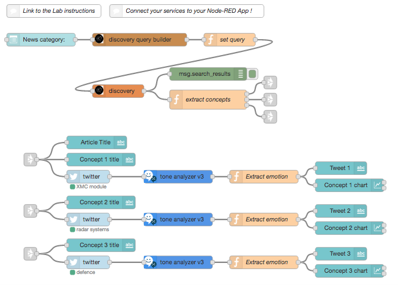

# Breaking News
## Overview
This flow allows you to select a category of news, it will then search Twitter for keywords in the news category, before displaying the tweets and an tone analysis. It will then use the built-in dashboard elements of Node-RED within a browser to display the output. It will use the Watson Discovery service to search the default American News repository, it will bring back the top item within the category and extract the 3 most relevant keywords. Then it will create searches for each of the keywords in Twitter, for each tweet that is found we will analyse the tone use the Watson Tone Analyzer service. Each tweet and it's analysis will be displayed on the dashboard.

This flow makes use of the Discovery and Tone Analyzer services.

### Prerequisites
This app was tested using Version >=0.6.6 of node-red-node-watson installed in Node-RED.

You will also need to connect the following services to your Node-RED app:
- Discovery
- Tone Analyzer

You will also require an active Twitter account to search Twitter

## Application Flow

[Get the flow here](sk_bn_flow.json)

## Flow Description
### Input Discovery Flow:
- `Dashboard Drop-down menu` - Provides the drop-down for input into the Discovery service. [Sample topics and search words](sk_bn_menu.txt)
- `Discovery query builder` - Build the basis for the query to be used by the Discovery Node
- `Set query` - complete the set-up of the query
- `Discovery node` - Search for the top article in the American news repository
- `Extract keywords` - Extract the top 3 keywords or phrases to be used in the twitter searches.

### Primary keyword Flow:
- `Article Title` - Displays the top article title on the dashboard.
- `Concept 1 title` - Displays the first keyword or phrase to be used on the dashboard.
- `Twitter node` - Search for the keyword or phrase and returns any tweets matching.
- `Tone Analyzer node` - Passes the tweet through the Tone Analyzer and passes analysis data back in a son format.
- `Extract Emotions` - Formats to data from the Tone Analyzer into the format needed to show the emotions as a bar chart on the dashboard UI.
- `Tweet 1` - Displays the tweet under the emotion bar chart on the dashboard.
- `Concept 1 chart` - Displays the emotion bar chart on the dashboard.

### Second keyword Flow:
- `Concept 2 title` - Displays the second keyword or phrase to be used on the dashboard.
- `Twitter node` - Search for the keyword or phrase and returns any tweets matching.
- `Tone Analyzer node` - Passes the tweet through the Tone Analyzer and passes analysis data back in a son format.
- `Extract Emotions` - Formats to data from the Tone Analyzer into the format needed to show the emotions as a bar chart on the dashboard UI.
- `Tweet 2` - Displays the tweet under the emotion bar chart on the dashboard.
- `Concept 2 chart` - Displays the emotion bar chart on the dashboard.

### Third keyword Flow:
- `Concept 3 title` - Displays the third keyword or phrase to be used on the dashboard.
- `Twitter node` - Search for the keyword or phrase and returns any tweets matching.
- `Tone Analyzer node` - Passes the tweet through the Tone Analyzer and passes analysis data back in a son format.
- `Extract Emotions` - Formats to data from the Tone Analyzer into the format needed to show the emotions as a bar chart on the dashboard UI.
- `Tweet 3` - Displays the tweet under the emotion bar chart on the dashboard.
- `Concept 3 chart` - Displays the emotion bar chart on the dashboard.

## UI Dashboard
Here is a sample output from the starter kit
[Dashboard](sk_bn_ui.jpg)
