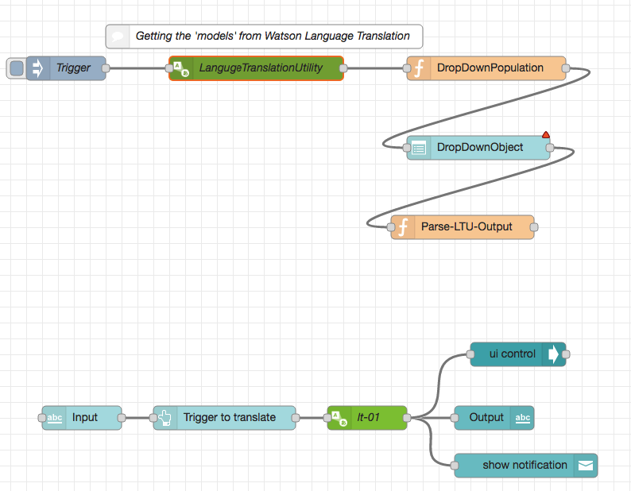

# Dashboard Translation

To be posted!

## Overview

Uses the 'Language Translation Util', 'Language Translation', 'Dashboard DropDown', 'Dashboard Text Input' and 'Dashboard Text Output' nodes to create a user friendly interface for the language translation.

The UI allows a user to enter a text and chose the translation options and obtain the translated text.

Node-RED will:
* Let you input some text
* Offer to chose translation modes
* Send back and display the translated text based upon the chosen options

## Application flow
[dashboard-translation-node.json](./dashboard-translation-node.json)

[dashboard-translation.png](./dashboard-translation.png)

## Flow description

1.The flow is triggered with a timestamp input injection at the beginning.

2.The language translation utility fetches the language translation mode, and exposes the following objects as global variables;
  - msg.model_id (eg: en-fr-conversational),
  - msg.domain (eg: conversational),
  - msg.source (eg: english),
  - msg.target (eg: french),

3.A function flow sends the msg.payload to the dashboard dropdown objects.

4.The dropdown listbox displays the values fetched from the language translation.

5.A function node puts the four msg attributes in global variables.

6.A dashboard text input field gets the input form the user.

7.Then translation text based upon the choice of the dropdown will show up in a static text display field. The translation is done either live of by triggering a dashboard button which could optionally be used to refresh the screen.
