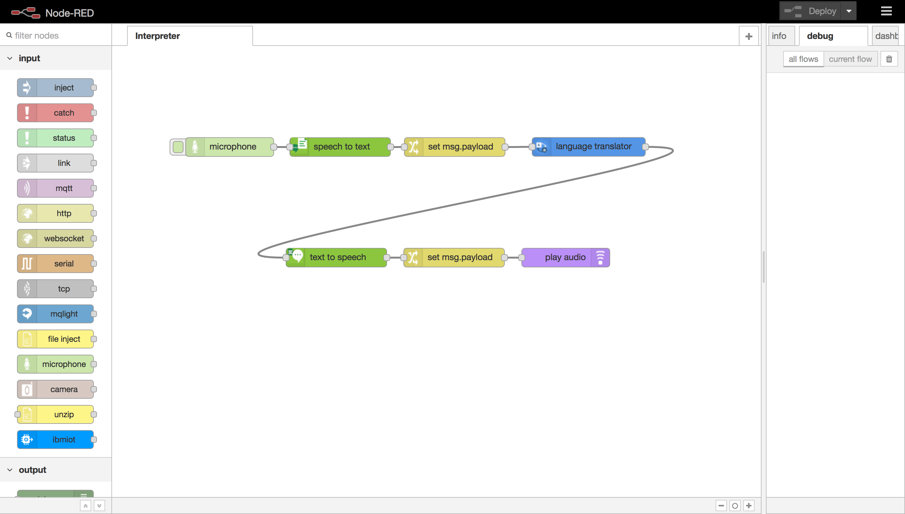

# Interpreter
[Video Introduction](https://www.youtube.com/watch?v=uI-kBSnyvuQ&feature=youtu.be)

## Overview
This Node-RED flow translates audio recorded by the microphone into a variety of languages directly from the flow itself.

The flow uses the <a href="https://github.com/ibm-early-programs/node-red-contrib-browser-utils/tree/master/microphone">Microphone</a> and <a href="https://github.com/lorentzlasson/node-red-contrib-play-audio">Play Audio</a> nodes with the Watson <a href="https://github.com/watson-developer-cloud/node-red-node-watson/tree/master/services/speech_to_text">Speech-to-Text</a>, <a href="https://github.com/watson-developer-cloud/node-red-node-watson/tree/master/services/language_translation">Language Translation</a> and <a href="https://github.com/watson-developer-cloud/node-red-node-watson/tree/master/services/text_to_speech">Text-to-Speech</a> to perform the role of an interpreter.

Node-RED will:
* Record audio from the device microphone
* Convert the audio to a string using Speech-to-Text
* Translate the string into a different language using the Language Translation service
* Convert the text response back to spoken word using Text-to-Speech
* Output the resulting audio via the device speakers

## Application flow
[Link to Flow JSON](./interpreter.json)

## Flow description

* `microphone` clicking the button toggles recording, the node sends a buffer of the recorded audio as the `msg.payload` object.
* `speech to text` converts the buffer into text using the Watson Speech-to-Text services.
* `set msg.payload` moves the string output of speech to text to the `msg.payload`object as required by the subsequent nodes.
* `language translation` translates the string into a different language using the `Language Translation` service.
* `text to speech` converts the string into spoken word using the Watson Text-to-Speech services.
* `set msg.payload` moves the audio output of the previous node to the `msg.payload`object as required by the subsequent node.
* `play audio` plays the translated audio buffer from the device's speakers

## Gotchas

* The microphone node requires an `HTTPS` connection
