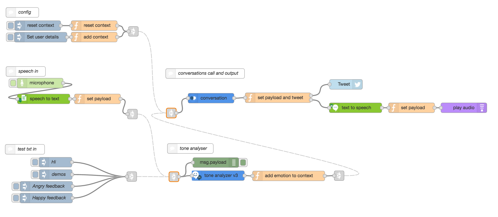

# OK Watson
[Video Introduction](https://www.youtube.com/watch?v=4L3CjH_f58I)

## Overview

This starter kit flow demonstrates usage of the new version of the <a href="">Watson Conversation</a> node, which simplifies the persistence of the conversation context. (See <a href="https://www.ibm.com/watson/developercloud/doc/conversation/advanced_overview.shtml#advanced_context">here</a> for more detail on Conversation context).
The flow shows two examples of how conversation context can be set and manipulated to create more complex conversation behaviour.
* <b>Pre-processing</b> the user input to enrich the user question with additional data, such as for example the emotion detected by the <a href="">Tone-Analyser</a> node, and then using that data to direct the conversation dialog path.
*  <b>Post-processing</b> of the response provided by Conversations by using set context variables (in this case user preferences) and string processing, for example to allow certain Conversations paths to trigger the sending of a tweet in parallel with providing an answer as normal.

The flow also illustrates the use of the new <a href="">microphone</a> node in conjunction with <a href="">Watson Speech-to-Text</a> and <a href="">Watson Text-to-Speech</a> to test verbal interaction with Watson Conversations directly from within Node-RED.

## Application flow

[OK Watson Flow JSON](ok-watson-starter-flow.json)
 &nbsp;   |  &nbsp;  [Starter Conversation JSON](ok-watson-starter-conversation.json)

## Setup Documentation
***Setup of the starter conversation in Watson Conversations***

1. Download and save the [OK Watson Starter Conversation JSON](ok-watson-starter-conversation.json).  

2. Add the Watson Conversations Service to your Blumix and note your service credentials.

3. Launch the Watson Conversations GUI. You can  import the OK Watson Starter Conversation workspace by selecting  and navigating to the JSON file saved in 1. above.

4. Make a note of the workspace ID, which can be accessed under "View details" from the menu on the workspace tile:   
&nbsp;

5. (*Optional*) To modify the conversation flow, refer to the documentation for the Watson Conversation GUI <a href="https://www.ibm.com/watson/developercloud/doc/conversation/index.shtml">here</a>.

 
***Node-RED Flow Setup***

1. Import the [OK Watson Flow](ok-watson-starter-flow.json) via the clipboard import functionality in Node-RED.

2. In the  node on the flow, configure your Watson Conversation Service credentials and Workspace ID as noted above.

3. Set up the  node with twitter credentials. This will be the account that the OK Watson flow will tweet from. Note that if you want to be able to receive direct messages from this account (see ***set user details*** in the flow description above), you need to follow it first.

4. Obtain Tone-Analyser credentials by adding the service to your bluemix, and configure these in the  node.

5. In the same way, obtain credentials for Text-to-Speech and Speech-to-Text and configure the respective nodes.

## Demo scripts
Once configured, follow these steps to test the flow:

**Emotion-directed conversation**

1. trigger the 'Angry feedback' or 'Happy feedback' node.

2. the debug will show that the emotion is captured in the context and the response will be differentiated according to the emotion.

**Conversation-triggered tweeting**

1. trigger the 'demos' node in the <b>test txt in</b> group

2. set the demo user's twitter handle in the 'add context' node in the config group on the top left. Make sure not to include the '@'

3. if the demo user already follows the account that is configured in the flow tweet node, the direct messaging preference can optionally be set to true.
  

4. trigger the 'demos' node again. You should receive both an audio response and a tweet to the account configured in 2.

5. to reset the context (e.g. for the next user), trigger the 'reset context' node in the 'config' group on the top left of the flow.

## Flow description

*Note that there are link nodes (  ) used in this flow that hide wires. Click on a link node to see where the flow continues.*

***config group***
* <b>reset context</b>: trigger the resetting of the saved context variables
* <b>set user details</b>:
Description of the flow process. (to follow)

***speech in group***
* <b>microphone</b>: click right-hand handle once to start recording, click again to stop. On stop, the recording is sent onwards.
* <b>Speech-to-Text</b>: converts spoken input. Performs better on longer sections.
* <b>set payload</b>: simple re-mapping of Speech-to-Text node output to the msg.payload.

***test txt in group***
* set of triggers pre-configured with demo text to send into the flow.

***tone analyser group***
* <b>Tone anlyser</b>: configured in this case to only extract the 'emotion' tone of the input text, and with sentences set to 'false'.
* <b>add emotion to context</b>: finds the emotion with the highest score, and if this is above a threshold (here set to 0.5) sets a new context variable 'emotion' in the conversation context, via msg.additional_context. If the emotion score is below the threshold, this variable is set to 'neutral'.

***conversation call and output group***
* <b>Conversation</b>: Watson Conversation node configured with a starter conversation workspace, with the new option to save context selected.

* <b>set payload and tweet</b>: Post-processing of conversation output. This demo uses both context variables (the set user details) and text extracted from the conversation response to construct a tweet to the user with text (and optionally a link) that can be configured from within the Watson Conversations workspace. Where triggered from Conversations, the flow then splits and sends both the tweet and returns the normal conversation response.
* <b>Tweet</b>: configured with a twitter account that the flow will tweet from.
* <b>Text-to-Speech</b>: converts conversation output to voice
* <b>set payload</b>: simple mapping of Text-to-Speech output to msg.payload
* <b>play audio</b>: plays conversation response.
