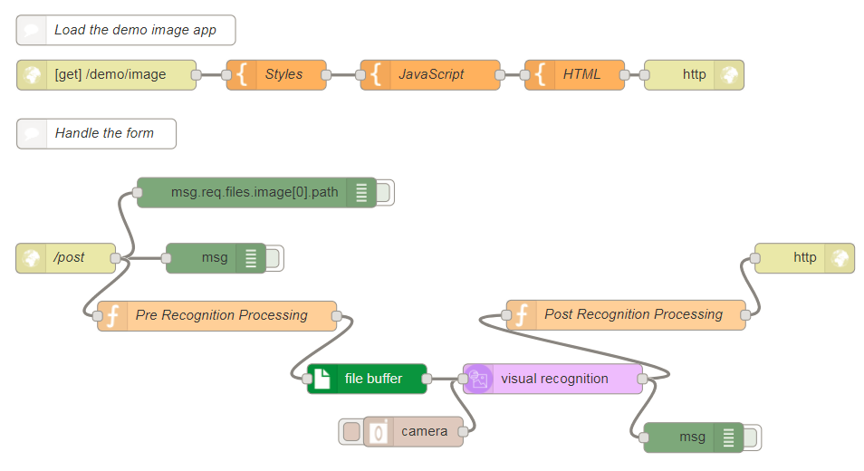

# Selfie Description
## Overview
This starter kit flow demonstrates how to capture a static image from a video in a client side application and post it into Node-RED using FormData and Fetch. The image is then analyzed with Watson Visual Recognition and the result is displayed on the webpage.

### Prerequisites
For this starter kit to work, you need to install the following node from the Node-RED 'Manage Palette':
- node-red-contrib-file-buffer

## Application Flow

[Get the flow here](flow.json)

## Flow Description
Demo Image App:
- `HTTP [get] /demo/image` - sets the app URL as a GET on xxxxx.mybluemix.net/demo/image
- `Styles` -  CSS styles for the webpage
- `JavaScript` - JavaScript for the webpage
- `HTML` - HTML for the webpage
- `HTTP Response` - ends HTTP request

Handle the Form:
- `HTTP /post` - sets the HTTP POST call and adds 'image' as a field
- `Pre Recognition Processing` - sets msg.payload to the path the image will be sent on
- `File buffer` - puts the image file into a buffer so it able to be passed into Visual Recognition
- `Visual Recognition` - anaylzes an image to identify built in classes and a confidence score
- `Post Recognition Processing` - sets msg.payload as image classes to pass back into webpage
- `HTTP response` - ends HTTP call
