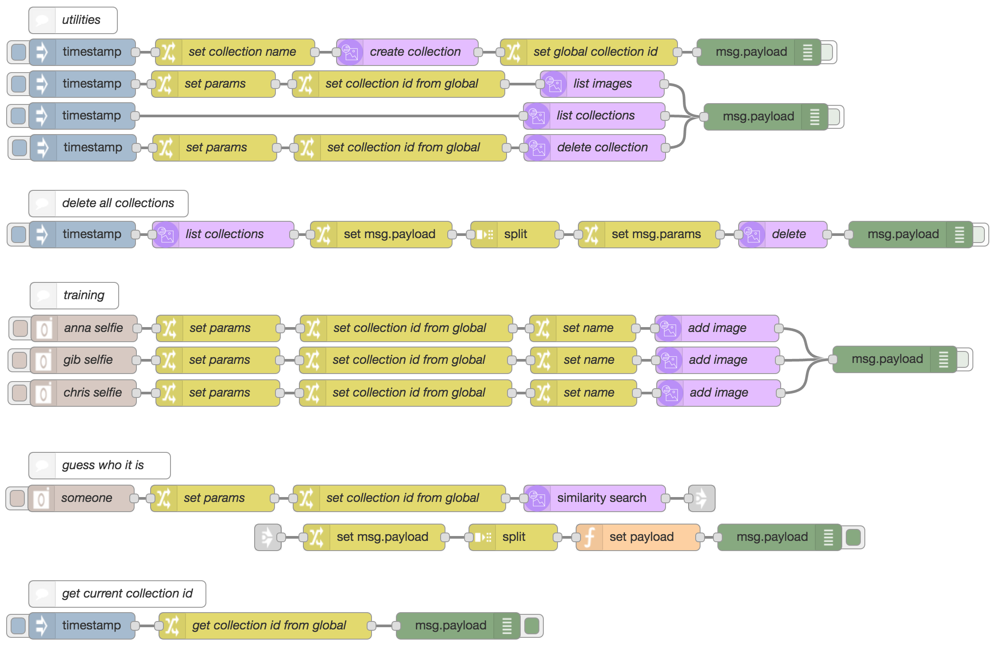

# Selfie Training

Link to [video description](https://youtu.be/f4atHS0El2k)

## Overview

This demo uses Watson <a href="https://github.com/watson-developer-cloud/node-red-node-watson">Similarity Search</a> to determine who a selfie depicts.

A user can take pictures using their webcam to train Similarity Search on different users.

Then a picture can be taken of one of the users and the service will return the percentage similarity to each of the users in the training data.

This could also be used to perform Similarity Search on other objects.

## Application flow

[Selfie Training JSON](selfie_training.json)

## Flow description

**Utilities**

* **Create Collection**: Create new collection prefixed by `selfie`, saves the collection id to `global.collection_id` so it can be used in other flows
* **List Images**: List the images in the current collection
* **List Collections**: List all collections in service
* **Delete Collection**: Delete current collection
* **Delete All Collections**: Delete all collections in service

**Training**

* **`PERSON` selfie**: A camera inject node takes a picture of a person using the webcam and adds this to the collection with metadata including the name

To add more training users, copy a training flow and edit the names in the `camera` and `change` nodes.

**Testing**

* **`PERSON` selfie**: A camera inject node takes a picture and will return the similarity to each of the images existing in the collection using the image names defined in the metadata

**Get current collection id**

* Simple flow to get global variable where collection id is set for testing purposes
