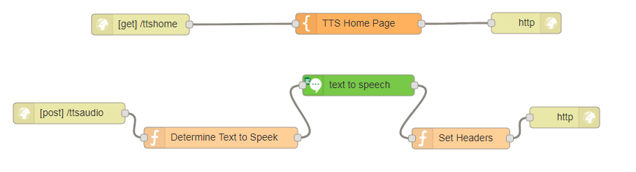

# Automatic playing of the Text to Speech service on a webpage

## Overview
This starter kit flow demonstrates usage of the Watson Text-to-Speech service, which plays audio automatically through the web browser.  

Node-RED will:
- Convert the text input to spoken words
- Automatically play the audio output from the browser instead of Node-RED

## Application Flow

[Get the flow here](flow.json)

## Flow Description
Part One:
- HTTP [get] /ttshome - sets the app URL as a GET on xxxxx.mybluemix.net/ttshome
- TTS Home Page  - HTML and JavaScript for webpage.
- HTTP response - ends HTTP call

Part Two:
- HTTP [post] /ttsaudio - sets the HTTP POST call
- Determine Text to Speak - Checks for rtext input and sets to msg.payload. If no input, then the app outputs 'I did not receive any input'
- Text to Speech - converts the string into spoken words using the Watson Text-to-Speech service. The format is a WEBM file (used in HTML5)
- Set headers - sets the audio out content type as WEBM.
- HTTP Response - ends HTTP call
