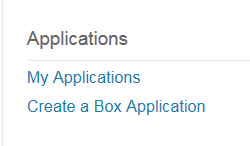
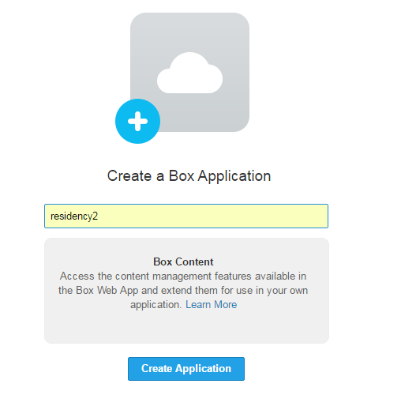
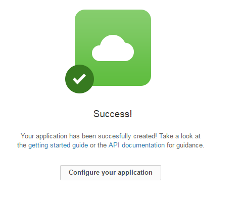
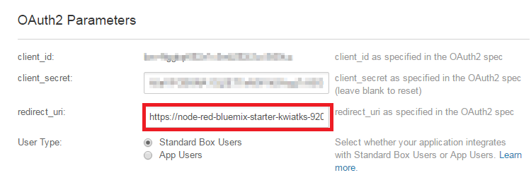

# Box setup

For some of the Watson Labs the Box Node-RED nodes are used.  The information in this section describes how to create a Box account and what artifacts are needed to obtain files from the repositories.  IBMers - you should NOT use your internal IBM Box account, you must use the external Box website.

##Setup

Go to [https://app.box.com](https://app.box.com) and create an account.  Login to the account, click your name and then Apps.  Scroll to the bottom of the webpage and to where it says "Are You a Developer?"

Click on 'developers site'.  You might have to create an account also on this site.

Click on My Apps and then "create a Box Application"

Enter an App name of your choice and click Create Application

Click on Configure your Application

**IMPORTANT** : go to your Bluemix App and your Node-RED flow Editor

Change the URL to have https:// at the front

Then go to the place in the Node-RED palette where the Box node is being used (or where you have dragged it to).  

Double-click the Box node and pick the "Add new box-credentials..." and then click the pencil icon to configure the node

Copy the the whole https:// line and go back to the Box web site where you are configuring your Box App

At this point copy the client_id and client_secret values - you will use them in the Node-RED Box node

Scroll to bottom of the Box App page and click "Save Application"

Go back to the Box config node in Node-RED and enter the client_id and client_secret values 

Click Authenticate with Box button

Box will show you an option of "Grant access to Box" 

C:\$watson_node_red_Labs_April2016_github\node-red-labs\utilities\box_setup\images\box_developer_node_red_auth_box.png

Click on the "Grant access to Box" button

C:\$watson_node_red_Labs_April2016_github\node-red-labs\utilities\box_setup\images\box_developer_node_red_authorised.png

Your Node-RED Box node should now be configured and the only field shown is your Box user name 

C:\$watson_node_red_Labs_April2016_github\node-red-labs\utilities\box_setup\images\box_developer_node_red_configured.png

Click Add

box_developer_node_red_filename.png

You are now ready to enter a filename which is saved in your Box account.  Click Cancel and move onto the section to load your files into Box.

##Loading files

Go to [https://app.box.com/files](https://app.box.com/files) and login if you haven't already

Click the Upload button and upload the files needed for various labs.  This github has he following files you can use :

