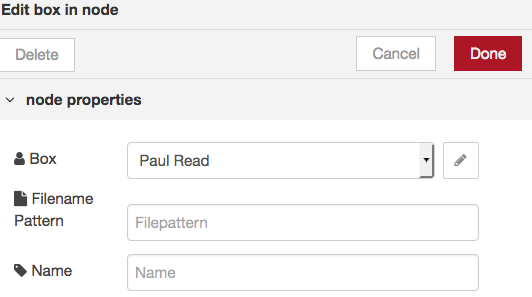

# Box setup

The Box Node-RED nodes are used for some of the Watson Labs.  The information in this section describes where to get a box account, how to use it and what artefacts are needed to obtain files from the repositories.  
**IBMers - you should _NOT_ use your internal IBM Box account, you must use the external Box website.**

## Setup

1. Go to [https://app.box.com](https://app.box.com) and create an account.  

2. Details for a custom app can be found on the [Box developer site](https://developer.box.com/v2.0/reference). 

3. Once the app has been created leave browser open, as you will need to set the URL for the app and set Client ID & secret in the Box node.

**IMPORTANT** : go to your IBM Cloud App and your Node-RED flow Editor. If you have not secured your Node-RED app you need to change the URL to https.

4. Change the URL to have https:// at the front

5. Then go to the Node-RED palette where the Box node is being used.  Double-click the Box node and pick the "Add new box-credentials..." and then click the pencil icon to configure the node

6. Copy the the whole "https://" line 

7. Return to the Box web site where you are configuring your Box App to add the URL to the Redirect URI

At this point copy the client_id and client_secret values - you will use them in the Node-RED Box node. Click "Save Changes"

8. Return to the Box config node in Node-RED and enter the client_id and client_secret values 

Click "Authenticate with Box" button

9. Box will show you an option of "Grant access to Box" 

Click on the "Grant access to Box" button

10. Your Node-RED Box node should now be configured and the only field shown is your Box user name 

Click Add

You are now ready to enter a filename which is saved in your Box account.  Click Cancel and move onto the section to load your files into Box.

## Loading files

Go to [https://app.box.com/files](https://app.box.com/files) and login if you haven't already

Click the Upload button and upload the files needed for various labs.  This github has the following files you may use in one of the other Labs :

conversational-agent-application-starter-kit.csv

Exercise_8_end.xml

glossary.tmx

SpaceShuttle.wav

tone_analyser_sample.txt

weatherdatatrain.csv

