# Box setup

The Box Node-RED nodes are needed for some of the Watson Labs.  The information in this section describes how to use a Box account and what artifacts are needed to obtain files from the repositories.  
**IBMers - you should _NOT_ use your internal IBM Box account, you must use the external Box website.**

## Setup

Go to [https://app.box.com](https://app.box.com) and create an account.  

Login to the account, click the account icon your name and then Apps.  

Scroll to where it says "Are You a Developer?"

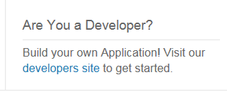

Click on 'developers site'.  You might have to create an account also on this site.

Click on the Dashboard button. 

If this is your first time you will see                alternatively you will standard Dashboard

  

click on the "Create New App" button

When creating a new app you must first choose the type of app required, select "Custom" and click "Next"

Now you should set the Authentication Method for the App, select "Standard OAuth 2.0" and click "Next"

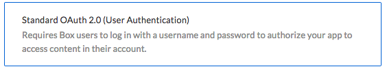

Finally you must name your App, provide a unique name for your app and click "Create App" button.

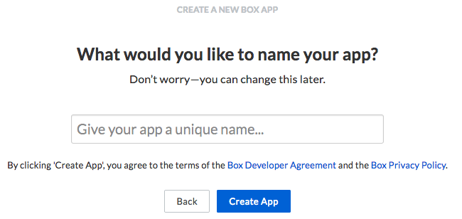

Once the app has been created you will see the app has been created then click the "View App" button.

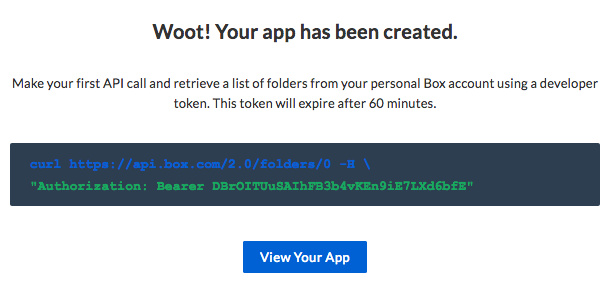

**IMPORTANT** : go to your IBM Cloud App and your Node-RED flow Editor. If you have not secured your Node-RED app you need to change the URL

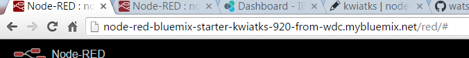

Change the URL to have https:// at the front

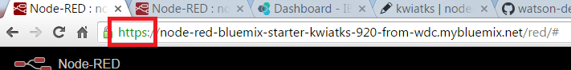

Then go to the place in the Node-RED palette where the Box node is being used (or where you have dragged it to).  

Double-click the Box node and pick the "Add new box-credentials..." and then click the pencil icon to configure the node

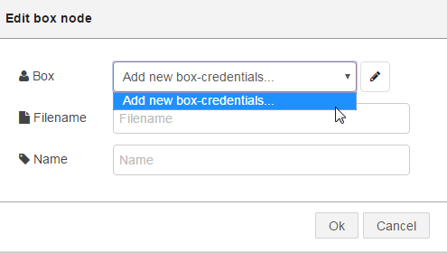

Copy the the whole "https://" line 

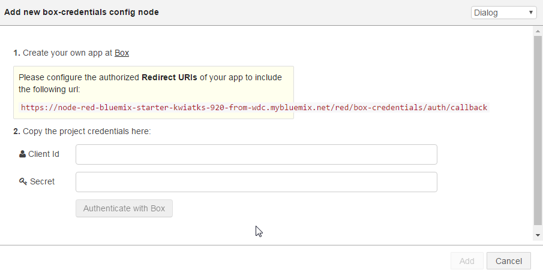

Go back to the Box web site where you are configuring your Box App to add the URL to the Redirect URI

At this point copy the client_id and client_secret values - you will use them in the Node-RED Box node

Click "Save Changes"

Go back to the Box config node in Node-RED and enter the client_id and client_secret values 

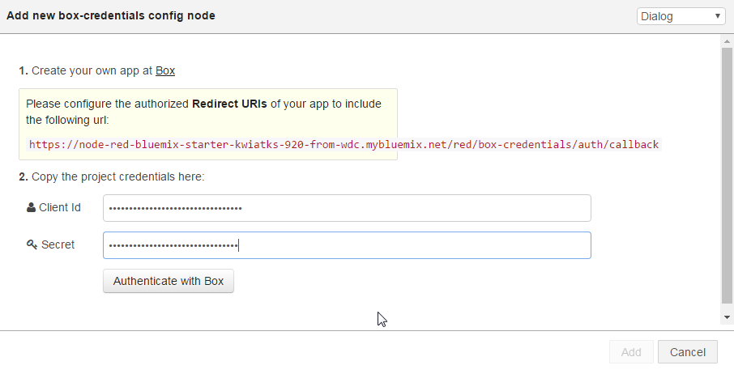

Click "Authenticate with Box" button

Box will show you an option of "Grant access to Box" 

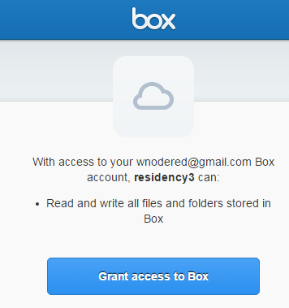

Click on the "Grant access to Box" button

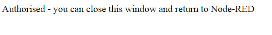

Your Node-RED Box node should now be configured and the only field shown is your Box user name 

Click Add

box_developer_node_red_filename.png

You are now ready to enter a filename which is saved in your Box account.  Click Cancel and move onto the section to load your files into Box.

## Loading files

Go to [https://app.box.com/files](https://app.box.com/files) and login if you haven't already

Click the Upload button and upload the files needed for various labs.  This github has the following files you may use in one of the other Labs :

conversational-agent-application-starter-kit.csv

Exercise_8_end.xml

glossary.tmx

SpaceShuttle.wav

tone_analyser_sample.txt

weatherdatatrain.csv

