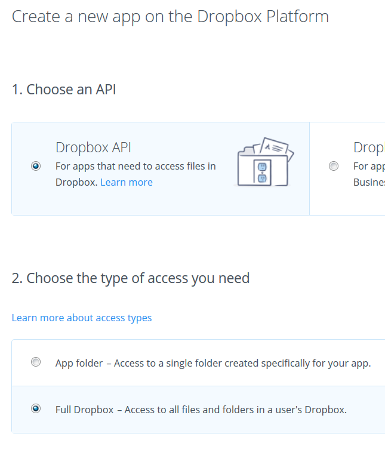

# Dropbox setup

For many of the Watson Labs the Dropbox node is used.  The information in this section describes how to create a Dropbox account and what artifacts are needed to obtain files from the repositories.

## Setup

Go to[http://dropbox.com](http://dropbox.com) and create an account.

Go to the Home location and then scroll to the bottom of the page until you see '...' and 'Privacy' together.

Click on the ellipses and select 'Developers'.

Select 'Create your app'.

Under 'Choose an API', select 'Dropbox API'
Then under 'Choose the type of access you need' select 'Full Dropbox'
And give the app a name, then click 'Create App'.

Under the 'Settings' page, scroll down until you see 'Generate access token'.

Click on the Generate button. Record the token value - you will use this later.

## Loading files

Open another browser. Download and save the following files to your local system.
- [Exercise_8_end.xml](Exercise_8_end.xml)
- [glossary.tmx](glossary.tmx)
- [SpaceShuttle.wav](SpaceShuttle.wav)
- [tone_analyser_sample.txt](tone_analyser_sample.txt)
- [weatherdatatrain.csv](weatherdatatrain.csv)

In Dropbox, go to the Home page and Upload the files

## Using the Dropbox node in Node-RED

Full documentation for the dropbox node is [here](http://flows.nodered.org/node/node-red-node-dropbox)

When in Node-RED, drag the dropbox node onto the canvas and double click to configure it.

Click the pencil button - you will be presented with the 'Add new dropbox-config' config node

Fill in the access token with the one you saved earlier in this description.

Click 'Add' and 'Done'.

You will now be able to access your Dropbox account from within Node-RED on IBM Cloud for any of the Labs. If you use a Dropbox node in different tabs of Node-RED, then you only need to configure one of them and all Dropbox nodes will share the configuration.

NOTE: If you delete a Dropbox node from one tab of Node-RED then you will lose the config for all dropbox nodes!!
