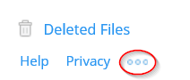
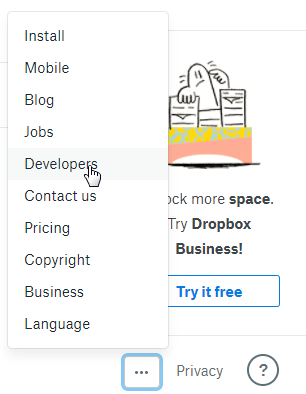
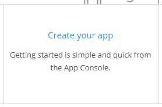
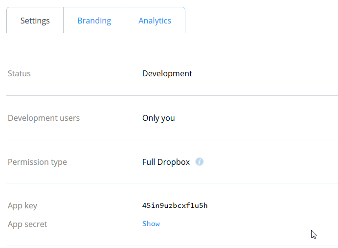
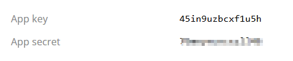
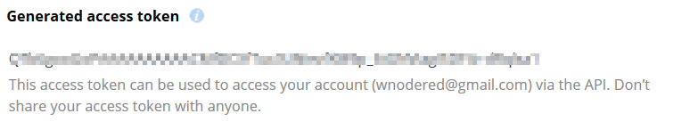
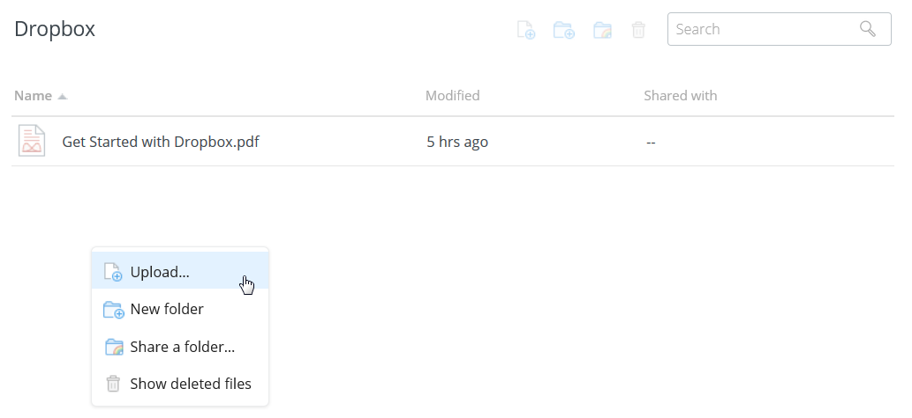
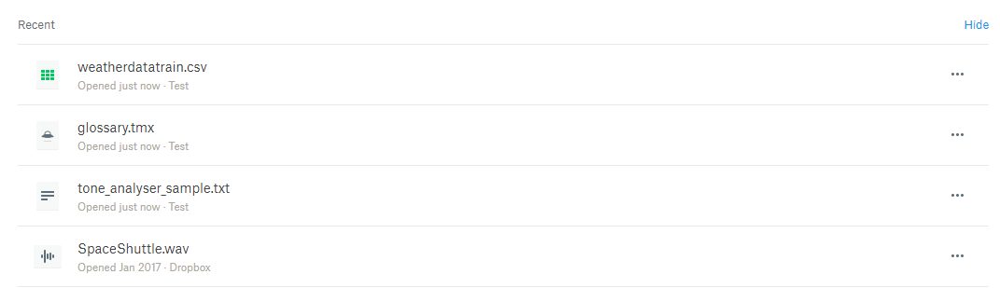
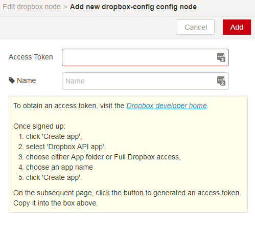

# Dropbox setup

For many of the Watson Labs the Dropbox node is used.  The information in this section describes how to create a Dropbox account and what artifacts are needed to obtain files from the repositories.

##Setup

Go to[ http://dropbox.com]( http://dropbox.com) and create an account

Go to the Home location and then scroll to the bottom of the page until you see the Help Privacy together 

Click on the ellipses

Click on 'Create your app'

In 'Choose an API' select 'Dropbox API'
In 'Choose the type of access you need' select 'Full Dropbox'

Accept the terms and Click Submit - you should be presented another window 

Click on Show option

Record the 'App key' and 'App secret' values - you will need these in other Labs.

Scroll down until you see 'Generate access token', click on the Generate button

Record the token value - again you will use this in combination with the 'App key' and 'App secret' values.

##Loading files

Open another browser and download and save to your local system the files in this github 

In Dropbox go to the Home page and then right click and pick Upload and upload the files

 

The list of files for various Labs are listed below and are in this github :
Exercise_8_end.xml

glossary.tmx

SpaceShuttle.wav

tone_analyser_sample.txt

weatherdatatrain.csv

##Using the Dropbox node in Node-RED

Full documentation is [here](http://flows.nodered.org/node/node-red-node-dropbox)

When in Node-RED, drag the dropbox node to the palette and double click it - you will be presented with the Edit popup

Click the pencil button - you will be presented with the "Add new dropbox-config" config node

Fill in the App Key, App Secret and Token with the ones you saved earlier in this description - you will now be able to access your dropbox account from within Node-RED on IBM Cloud for any of the Labs.  Click Add.  NOTE : if you use a dropbox node in different Tabs of Node-RED then you only need to configure one of them and all dropbox nodes will share the configuration. 

NOTE : if you delete a dropbox node from one Tab of Node-RED then you will lose the config for all dropbox nodes !!

