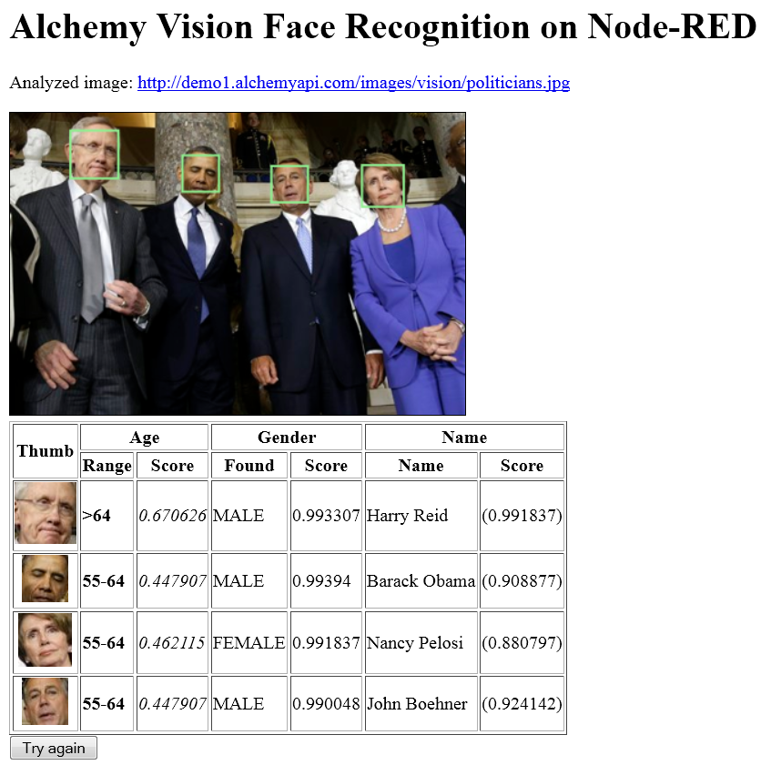

#  Node-RED Alchemy Vision (Image Analysis) Lab
## Overview
The Alchemy Vision service allows to analyse the contents of an image and extract features from it. The Face Detection service is able to identify multiple faces within the image, and determine their gender and age with a confidence score, and identify celebrities.

### Node-RED Alchemy Image Analysis (Vision) node
The Node-RED  node provides a very easy wrapper node that takes an image URL or binary stream as input, and produces a array of detected faces , age, bounding box, gender and name.

## Basic Alchemy Image Analysis Flow
### Flow overview
In this exercise, we will show how to simply generate the face recognition data from an image URL. The structure of the flow is very similar to the Watson Visual Recognition flow.  
The flow will present a simple Web page with a text field where to input the image's URL, then submit it to Alchemy Image Analysis, and output the faces that have been found on the reply Web page.  
  

### Building the flow
The nodes required to build this flow are:  
  - A  node, configured with a `/alchvision` URL  
  - A  node which will test for the presence of the `imageurl` query parameter:  
   
  - A first  node, configured to output an HTML input field and suggest a few selected images taken from official sources:
```HTML
<h1>Welcome to the Alchemy Vision Face Detection Demo on Node-RED</h1>
<H2>Select an image</H2>
<form  action="{{req._parsedUrl.pathname}}">
    
    
    
        <br/>Copy above image location URL or enter any image URL:<br/>
    Image URL: <input type="text" name="imageurl"/>
    <input type="submit" value="Analyze"/>
</form>
```


  - A  node to extract the `imageurl` query parameter from the web request and assign it to the payload to be provided as input to the Alchemy Image Analysis node:  
 

  - The  node. Make sure that you have installed and bound an instance of the `Alchemy API`  service to your Node-RED application in bluemix. Otherwise, you can edit the Alchemy Image Analysis node to provide an `apikey`.  
 
  - And a final   node linked to the  output node. The template will format the output returned from the Image Analysis node into an HTML table for easier reading:  
```HTML
    <h1>Alchemy Image Analysis</h1>
    <p>Analyzed image: {{payload}}<br/></p>
    {{^result}}
        <P>No Face detected</P>
    {{/result}}
    <table border='1'>
        <thead><tr><th>Age Range</th><th>Score</th><th>Gender</th><th>Score</th><th>Name</th></tr></thead>
        {{#result}}<tr>
            <td><b>{{age.ageRange}}</b></td><td><i>{{age.score}}</i></td>
            <td>{{gender.gender}}</td><td>{{gender.score}}</td>
            {{#identity}}<td>{{identity.name}} ({{identity.score}})</td>{{/identity}}
        </tr>{{/result}}
    </table>
    <form  action="{{req._parsedUrl.pathname}}">
        <input type="submit" value="Try again"/>
    </form>
```


### Testing the flow
To run the web page, point your browser to  `/http://xxxx.mybluemix.net/alchvision` and enter the URL of some  image. The URL of the listed images can be copied to clipboard and pasted into the text field.  
The complete flow is available at [AlchVis-Lab-WebPage](AlchVis-Lab-WebPage.json).

## Extended Alchemy Vision Face Detection Lab:
The Alchemy Vision API also yields the bounding rectangle for the detected faces, so we can enhance  the HTML page with some JavaScript and HTML5 Canvas to highlight these.  
The HTML page code for the 'Report Faces' template can be updated with the following snippet:  
```HTML
<!DOCTYPE html>
<html>
<head>
    <title>Node-RED Alchemy Vision Face Recognition</title>
<script>
    // This function draws the main canvas
    function drawCanvas(img,ctx,cv_w,cv_h) {    
        // draw the image, resized to fit the canvas
        ctx.drawImage(img,0,0,cv_w,cv_h);
    }

    // This function draws a single thumbnail face on the mains
    // canvas context and then on the individual canvas
    function drawThumb(img,ctx,cv_w,cv_h,thumbX,thumbY,thumbW,thumbH,color,cvTh) {
        ctx.beginPath();
        // adjust thinkness of box depending on size vs canvas
        if(thumbW>=cv_w/12 || thumbH>=cv_w/12) {
            ctx.lineWidth="2";
        } else {
            ctx.lineWidth="1";
        }
        ctx.strokeStyle=color;
        ctx.rect(thumbX*cv_w/img.naturalWidth,
                 thumbY*cv_h/img.naturalHeight,
                 thumbW*cv_w/img.naturalWidth,
                 thumbH*cv_h/img.naturalHeight);
        ctx.stroke();
        
        // handle the thumb canvas
        var ctxTh = cvTh.getContext("2d");
        ctxTh.drawImage(img,thumbX,thumbY,thumbW,thumbH,
                        0,0,cvTh.width,cvTh.height);
    }

    function drawThumbs(img,ctx,cv_w,cv_h) {
        var cths=document.getElementsByClassName("cv_thumbs");
        var iTh=0;
        var color;
        {{#result}}
            color="lightgreen";
            {{^identity}}
            color="red";
            {{/identity}}
            drawThumb(img,ctx,cv_w,cv_h,{{positionX}},{{positionY}},{{width}},{{height}},color,cths[iTh++]);
        {{/result}}        
    }
    
    function drawAll() {
        // Find the image tag
        var img = document.getElementById("alchemy_image");
    
        // get canvas
        var c = document.getElementById("imageCanvas");
        var cv_w=c.width;
        var cv_h=c.height;

        // Adjust canvas size for correct aspect ratio
        if(img.naturalHeight>img.naturalWidth) {
            cv_w=cv_w*img.naturalWidth/img.naturalHeight;
            c.width=cv_w;
        } else {
            cv_h=cv_h*img.naturalHeight/img.naturalWidth;
            c.height=cv_h;
        }
        
        var ctx = c.getContext("2d");
        drawCanvas(img,ctx,cv_w,cv_h);
        drawThumbs(img,ctx,cv_w,cv_h);
    }
</script>
</head>
<body>
<h1>Alchemy Vision Face Recognition on Node-RED</h1>
<p>Analyzed image: <a href="{{payload}}" target='_blank'>{{payload}}</a><br/>
</p>
{{^result}}
<P>No Face detected</P>
{{/result}}
<canvas id="imageCanvas" width="400" height="400" style="border:1px solid #000000;">
    <p>Sorry, HTML5 Canvas not supported in your browser</p>
</canvas>
<table border='1'>
    <col align="center">
    <tr><th rowspan='2'>Thumb</th><th colspan='2'>Age</th><th colspan='2'>Gender</th><th colspan='2'>Name</th></tr>
    <tr><th>Range</th><th>Score</th><th>Found</th><th>Score</th><th>Name</th><th>Score</th></tr>
    {{#result}}
    <tr>
        <td style="text-align: center;"><canvas class="cv_thumbs" width='{{width}}' height='{{height}}'></canvas></td>
        <td><b>{{age.ageRange}}</b></td>
        <td><i>{{age.score}}</i></td>
        <td>{{gender.gender}}</td>
        <td>{{gender.score}}</td>
        {{#identity}}
        <td>{{identity.name}}</td><td>({{identity.score}})</td>
        {{/identity}}
    </tr>
    {{/result}}
</table>

<form  action="{{req._parsedUrl.pathname}}">
    <input type="submit" value="Try again"/>
</form>
</body>
</html>
```  
What this page does is to have an extra column appended up front, with a canvas where the rectangle of the face recognition will be drawn. In addition, the faces rectangles will be drawn on the group photo.  
This flow is deployed at the `/alchthumbs` URL, which will yield a page similar as this one:  


The flow export is available at:  
[AlchVis-Lab-WebFacesThumbs](AlchVis-Lab-WebFacesThumbs.json).